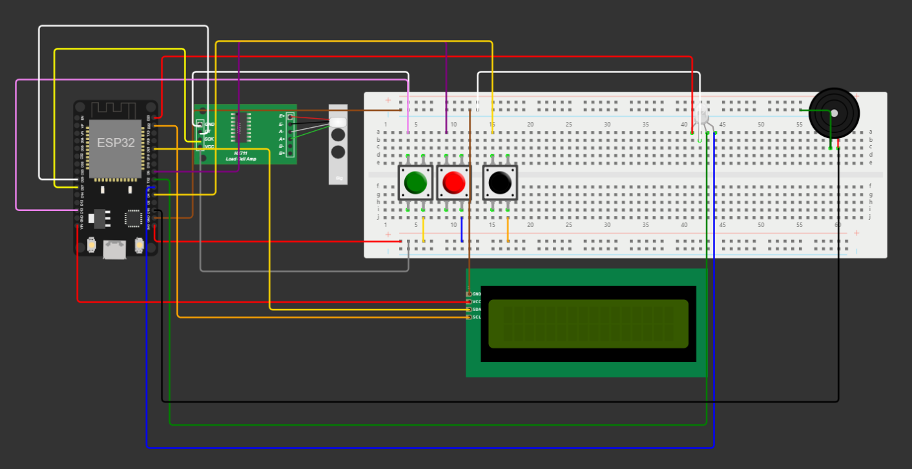

# Documentação IoTDoc - Módulo 4 - Inteli

## Fender

#### (Beatriz Amorim Monsanto, Guilherme Ferreira Linhares, Paulo Octavio de Paula , Rafaella Bianca Cavalcante, Tommy Ken Ishimatsu Goto, Yan Mendonça Coutinho)

## Sumário

[1. Introdução](#c1)

[2. Metodologia](#c2)

[3. Desenvolvimento e Resultados](#c3)

[4. Possibilidades de Descarte](#c4)

[5. Conclusões e Recomendações](#c5)

[6. Referências](#c6)

 

# 1. Introdução

&emsp; Este documento descreve um projeto estratégico que tem como foco aprimorar o uso do recurso financeiro da empresa IPT - _Instituto de Pesquisas Tecnológicas_ -, mais especificamente a SOC -_Seção de Obras Civis_. Como parceiro de negócios, o projeto tem como objetivo abordar uma questão crítica que a SOC enfrenta em sua operação de monitoramento de obras civis. Para compreender plenamente a relevância e a abordagem desse projeto, é fundamental entender o contexto em que a SOC do IPT está inserida atualmente.  
&emsp; Fundado há 124 anos, o IPT é um dos maiores institutos de pesquisa do Brasil, com sede na cidade de São Paulo, na Cidade Universitária. O IPT é reconhecido por suas contribuições significativas para o desenvolvimento tecnológico do país. A SOC do IPT se concentra na área de obras civis e construção, sendo uma parte vital da missão do IPT de fornecer soluções de ponta, desempenhando um papel fundamental no setor de infraestrutura, além de trabalhar para melhorar a competitividade das empresas e os investimentos governamentais. A SOC é composta por uma equipe altamente especializada de técnicos e engenheiros que colaboram em diversas áreas, incluindo transportes, energia, saneamento, habitação e mineração, com foco em segurança, desempenho e durabilidade de obras civis.[1] 
&emsp; Entretanto, a SOC enfrenta obstáculos substanciais na sua missão de monitorar obras de construção. Isso se deve à necessidade de adquirir dados das Células de Carga, um componente fundamental nesse processo. A obtenção desses dados requer investimentos em equipamentos caros, bem como a conexão a Strain Gauges, que por sua vez envolve o uso de cabos de alta complexidade. Esses cabos estão suscetíveis a problemas de influência térmica, eletromagnética e ruídos, o que torna o monitoramento desafiador. Além disso, a operação exige a presença de um computador para visualização e armazenamento dos dados.[2] 
&emsp; Embora esses equipamentos sejam vitais para a supervisão de obras, como edifícios, pontes, viadutos, túneis e muros de contenção, há uma série de obstáculos a serem superados. Primeiramente, o custo geralmente elevado, em torno de 100 mil reais, representa um investimento significativo. Além disso, a operação desses dispositivos implica em desafios adicionais, como o fornecimento constante de energia, a necessidade de estender cabos por longas distâncias, bem como garantir a segurança e proteção contra intempéries. Esses desafios ilustram a complexidade do monitoramento de obras civis e a necessidade de inovação para superar tais obstáculos.  
&emsp; O projeto visa, portanto, abordar esse desafio central, criando soluções que otimizem o monitoramento de obras civis, permitindo à SOC do IPT reduzir custos financeiros sem comprometer a qualidade e a eficácia de suas operações. Esse projeto é fundamental não apenas para a SOC, mas também para a segurança e integridade das estruturas civis no país, representando um passo significativo em direção à eficiência, custos reduzidos e maior acessibilidade no monitoramento de obras.  

## 1.1 Objetivos

&emsp; Para a realização do projeto, é necessário ter conhecimento dos objetivos gerais e específicos do parceiro. Dessa forma, a partir da leitura da TAPI[2], o objetivo principal do IPT é reduzir substancialmente os custos dos equipamentos utilizados no monitoramento de obras civis, enquanto simplifica o processo de instalação por meio da implementação de comunicação sem fio entre os dispositivos de monitoramento. Como consequência, isso facilitará a coleta dos dados, reduzindo a necessidade de funcionários no local de medição. Com isso, para atingir o objetivo geral, o IPT possui objetivos específicos:
[2]
* Projetar e construir um protótipo funcional que seja capaz de adquirir dados de Células de Carga em configuração de ponte completa.
* Implementar um sistema de armazenamento de dados local e transmissão de dados para uma plataforma de armazenamento em nuvem.
* Aplicação para visualização em tempo real dos dados coletados.
* Assegurar um suprimento constante de energia ao protótipo.
* Proteção adequada para os equipamentos contra fenômenos climáticos.
* Converter os sinais enviados pela célula de carga para Newtons.

## 1.2 Proposta da solução

&emsp; O projeto desenvolvido, visa a criação de um condicionador de sinal para células de carga. Dessa forma, o condicionador, recebe os dados da célula, os interpreta, converte-os na unidade de medida necessária e, em seguida, envia essas informações para os computadores do IPT, por meio de uma plataforma baseada na nuvem.  
&emsp; As células de carga, medem a força ou a carga aplicada a ela e quando uma carga é aplicada, ela gera um sinal elétrico proporcional à força aplicada. Sendo assim, com auxílio de um ESP32, esses sinais serão transofrmados para unidade de medida em Newtons(N). Caso o local não tenha conexão a internet, os valores convertidos serão armazenados localmente, a partir de um cartão de memória e quando houver conexão, serão transmitidos para uma plataforma de armazenamento em nuvem. 
&emsp; A plataforma de armazenamento em nuvem, será responsável por armazenar os dados coletados, além de disponibilizar uma aplicação para visualização em tempo real dos dados coletados. Dessa forma, os dados poderão ser acessados de qualquer lugar, desde que haja conexão com a internet.[2] 

## 1.3 Justificativa

&emsp; O projeto é de grande importância para o IPT, pois, além de reduzir os custos dos equipamentos utilizados no monitoramento de obras civis, simplifica o processo de instalação por meio da implementação de comunicação sem fio entre os dispositivos de monitoramento. Como consequência, isso facilitará a coleta dos dados, reduzindo a necessidade de funcionários no local de medição. Com isso, o projeto contribui para a redução de custos financeiros, sem comprometer a qualidade e a eficácia das operações da SOC.  

# 2. Metodologia

&emsp; O Modelo de Referência para Processamento Distribuído Aberto (RM-ODP) é uma estrutura conceitual robusta que desempenha um papel fundamental no projeto de sistemas complexos. Em essência, um sistema complexo consiste em elementos interconectados e interdependentes cujo comportamento global é emergente e não facilmente deduzido a partir das partes individuais isoladas. No âmbito do processamento distribuído, esse tipo de sistema envolve a interação de múltiplos componentes de hardware e software distribuídos em uma rede. [29]

&emsp; O processamento distribuído refere-se à abordagem de utilização de vários recursos computacionais que trabalham cooperativamente para executar tarefas, distribuindo cargas de trabalho, compartilhando dados e recursos. Essa metodologia oferece vantagens significativas, como aumento da eficiência, escalabilidade e confiabilidade do sistema. [37]

&emsp; Com sua base em princípios arquitetônicos sólidos, o RM-ODP fornece uma estrutura organizada que orienta o desenvolvimento desses sistemas complexos de processamento distribuído. Ele é composto por cinco visões, ou viewpoints, inter-relacionadas, nomeadamente: Enterprise, Information, Computational, Engineering e Technology. Cada um desses pontos de vista aborda aspectos específicos do sistema, oferecendo perspectivas únicas e complementares. Esta abordagem visa garantir uma compreensão abrangente e coerente do projeto, desde sua concepção até a implementação e manutenção. [38]

### Visão Empresarial (Enterprise Viewpoint):

&emsp; A Visão Empresarial no contexto da RM-ODP desempenha um papel crucial na compreensão e na modelagem de sistemas distribuídos em organizações. Ela é um componente essencial para o sucesso das estratégias empresariais e o desenvolvimento de arquiteturas eficientes. Esta abordagem visa aprofundar a compreensão dos princípios e elementos que compõem a Visão Empresarial dentro do RM-ODP, destacando sua importância na garantia de que os sistemas distribuídos atendam às metas e necessidades estratégicas da organização, o que implica as seguintes razões para sua importância:  [40]

1. **Definição de Objetivos e Propósito**:
    - Esse tópico envolve a identificação e descrição dos objetivos de negócios ou metas que a organização ou sistema deseja alcançar. Esses objetivos podem ser relacionados à finalidade de um projeto, mas geralmente se relacionam com as metas de negócios, como aumentar a eficiência, melhorar a qualidade dos serviços ou expandir para novos mercados, no contexto do projeto elaborado pelo grupo Fender, esses são citados na seção *1.1 Objetivos*. A definição de objetivos ajuda a alinhar o sistema de informações com os objetivos estratégicos da organização. O propósito descreve o motivo pelo qual a organização ou sistema existe. Ele define a razão fundamental para a sua criação e operação. Compreender o propósito é crucial para orientar o desenvolvimento e a evolução do sistema, garantindo que ele atenda às necessidades e expectativas da organização. [39]
    - A fundamentação teórica para esta etapa está enraizada nos princípios da RM-ODP, que enfatizam a importância de alinhar o sistema distribuído com os objetivos estratégicos da organização. [29]
2. **Escopo e Limites do Sistema**:
    - O escopo refere-se à extensão e à abrangência do sistema distribuído. Isso envolve a definição clara das funcionalidades, componentes e processos que fazem parte do sistema. O escopo determina o que está dentro dos limites do sistema e o que está fora. O projeto estratégico para aprimorar o monitoramento de obras civis na SOC do IPT tem seu escopo definido pela TAPI, ela descreve as capacidades e serviços que o sistema oferecerá, bem como os principais objetivos que deve alcançar. [2]
    - A definição clara do escopo e limites do sistema é fundamental para evitar confusões, garantir que as expectativas sejam gerenciadas e que o sistema atenda às necessidades e requisitos da organização de forma adequada. Isso também ajuda na identificação de áreas de responsabilidade e integração com outros sistemas dentro da empresa ou entre diferentes organizações.  [37]
3. **Políticas Organizacionais e Requisitos de Negócios**:
    - As políticas organizacionais são diretrizes estabelecidas pela empresa que definem como as atividades de negócios devem ser conduzidas. Elas podem abranger uma variedade de áreas, como segurança, conformidade regulatória, privacidade, governança de dados, padrões de qualidade e práticas de negócios. Na Visão Empresarial, é importante identificar e documentar essas políticas para garantir que o sistema distribuído seja projetado e implementado de acordo com as regras e diretrizes estabelecidas pela organização. Os requisitos de negócios são as necessidades e expectativas da organização em relação ao sistema distribuído. Isso pode incluir funcionalidades específicas, metas de desempenho, integração com sistemas existentes, restrições orçamentárias e prazos. A integração das políticas organizacionais e requisitos de negócios é respaldada pela RM-ODP, que reconhece a importância do projeto estar alinhado aos sistemas distribuídos em conformidade com as diretrizes e expectativas do Instituto de Pesquisas Tecnológicas. [29]
    - As políticas organizacionais estabelecem as regras e diretrizes que o sistema deve seguir, enquanto os requisitos de negócios definem as necessidades e expectativas da organização em relação ao sistema distribuído. Ambos desempenham um papel crítico na definição e no desenvolvimento bem-sucedido do sistema para atender às metas e diretrizes da empresa. [40]
4. **Alinhamento com a Estratégia de Negócios**:
    - Primeiro, é necessário entender as metas, objetivos e estratégias de negócios da organização. Isso inclui a compreensão das prioridades, dos desafios e das oportunidades que a empresa busca alcançar. Com base na compreensão da estratégia de negócios, a arquitetura de sistemas distribuídos é projetada de forma a suportar e contribuir para a realização desses objetivos estratégicos. Isso envolve a definição de funcionalidades, capacidades e integrações que ajudem a empresa, no caso o IPT, a atingir suas metas. Os sistemas distribuídos são então implementados e monitorados para garantir que continuem alinhados com a estratégia de negócios. Isso inclui a adaptação das tecnologias e dos processos à medida que a estratégia da empresa evolui.  [39]
    - O alinhamento com a estratégia de negócios é fundamental para garantir que os recursos de tecnologia sejam usados de maneira eficaz para impulsionar o sucesso da empresa. Quando os sistemas distribuídos estão alinhados com a estratégia de negócios, eles podem contribuir para o crescimento, a eficiência e a vantagem competitiva da organização.  [37]

&emsp; Essas etapas, ancoradas nos princípios do RM-ODP, formam uma base sólida para o desenvolvimento de sistemas distribuídos. A Visão Empresarial não é apenas uma fase inicial, mas um guia contínuo ao longo do ciclo de vida do sistema, garantindo a coesão entre a tecnologia implementada e os objetivos estratégicos da organização. Com respaldo na metodologia RM-ODP, esse enfoque promove uma governança eficaz e possibilita a adaptação ágil a mudanças, capacitando as empresas a prosperar e evoluir em um ambiente empresarial competitivo. [29]

&emsp; Ao alinhar estratégia, políticas organizacionais, requisitos de negócios e arquitetura, a Visão Empresarial na RM-ODP possibilita uma governança eficaz, promovendo a adaptação ágil às mudanças do mercado e às necessidades organizacionais. Através dessa abordagem, as empresas e, no caso do projeto, o IPT, podem construir sistemas tecnologicamente robustos e alinhar suas operações com sucesso à sua visão e objetivos de negócios, permitindo assim a prosperidade e a evolução no ambiente empresarial competitivo de hoje.

&emsp; O grupo Fender concluiu a implementação da Visão Empresarial no projeto por meio de uma análise abrangente do mercado em que o Instituto de Pesquisas Tecnológicas está inserido. Esta abordagem meticulosa considerou as forças e fraquezas internas do IPT, bem como as ameaças e oportunidades presentes no ambiente externo.

&emsp; Diversos modelos de análise reconhecidos, como as 5 Forças de Porter (*3.1.1.1 5 Forças de Porter*), a Análise SWOT (Strengths, Weaknesses, Opportunities, Threats - Forças, Fraquezas, Oportunidades e Ameaças) (*3.1.2. Análise SWOT*) e a Matriz de Riscos (*3.1.5. Matriz de Riscos*), foram utilizados para obter uma compreensão aprofundada do mercado. Essas metodologias permitiram examinar a competitividade do setor, identificar pontos fortes e fracos da organização, bem como oportunidades emergentes e desafios a serem enfrentados.

&emsp; A combinação dessas ferramentas analíticas possibilitou a avaliação da viabilidade da implementação do MVP (Minimum Viable Product - Produto Mínimo Viável) no contexto do IPT. Essa análise detalhada foi crucial para embasar a decisão estratégica, proporcionando uma visão holística e fundamentada sobre como a solução proposta se alinha com as necessidades do mercado, demandas dos clientes e objetivos estratégicos da organização.

&emsp; Como resultado, obteve-se uma compreensão aprofundada do ambiente competitivo do IPT, facilitando uma tomada de decisão informada e estratégica para a implementação bem-sucedida do MVP. Essa análise abrangente foi essencial para garantir que a solução estivesse alinhada com as expectativas e necessidades reais da empresa, permitindo um impacto positivo e uma adaptação eficaz ao mercado em constante evolução. [39]

### Visão de Informação (Information Viewpoint):

&emsp; A Visão de Informação no contexto da RM-ODP desempenha um papel central na concepção, gestão e uso eficaz de informações em sistemas distribuídos. Essa perspectiva abrange desde a modelagem de dados até a segurança da informação, permitindo que as organizações aproveitem o poder dos dados para apoiar processos de negócios, tomada de decisões e interações em ambientes distribuídos complexos. Esta exploração visa destacar a importância da Visão de Informação e seus diversos aspectos na criação e manutenção de sistemas distribuídos eficazes. A seguir, podemos analizar motivos que a tornam essencial: [29]

1. **Modelagem de Dados**:
    - A Modelagem de Dados envolve a criação de modelos que descrevem como os dados são estruturados, organizados e relacionados em um sistema distribuído. Isso inclui a definição de entidades, atributos, relacionamentos e restrições que governam o armazenamento e a recuperação de informações. Os modelos de dados ajudam a garantir a consistência e a integridade dos dados, bem como a facilitar o acesso e a manipulação dos mesmos. Eles desempenham um papel fundamental na definição de esquemas de banco de dados, na representação de informações e na garantia de que os sistemas distribuídos possam compartilhar e acessar dados de maneira eficaz. [38]
    - Através da modelagem de dados na Visão de Informação da RM-ODP, o IPT pode gerenciar seus ativos de informação de forma eficiente e eficaz, garantindo que os dados sejam usados de maneira consistente e alinhada com as necessidades do negócio. Isso é essencial para o sucesso das operações do projeto, pois, dessa forma, os dados coletados a partir dos relatórios gerados diariamente podem ser utilizados de maneira confiável, prática e útil. [40]
2. **Interoperabilidade**:
    - A interoperabilidade refere-se à capacidade de sistemas distribuídos distintos e heterogêneos trabalharem juntos de maneira eficaz e eficiente, compartilhando informações e recursos de forma transparente, o que ocorre na aplicação realizada na plataforma Ubidots com o sensor de peso no protótipo desenvolvido. Isso envolve a capacidade de diferentes sistemas de informação compreenderem e se comunicarem uns com os outros, mesmo que tenham origens diferentes, utilizem tecnologias diversas e possuam estruturas de dados variadas. [37]
    - Para alcançar a interoperabilidade na Visão de Informação, foram utilizados padrões, protocolos de comunicação, formatos de dados comuns e interfaces bem definidas. Isso permite que os sistemas distribuídos troquem informações de maneira compreensível e coordenem suas ações, independentemente das diferenças técnicas subjacentes. A interoperabilidade é fundamental para que o IPT integre os sistemas do projeto, compartilhe informações e atinja seus objetivos de negócios em um ambiente de tecnologia diversificado e distribuído. [38]
3. **Suporte à Tomada de Decisão**:
    - O suporte à tomada de decisão refere-se à capacidade de sistemas de informação distribuídos fornecerem informações relevantes e oportunas para apoiar o processo de tomada de decisões nas organizações. Isso envolve a coleta, o armazenamento, a análise e a entrega de dados e informações para os tomadores de decisão, a fim de auxiliá-los a tomar decisões informadas e estratégicas. [37]
    - Em resumo, o suporte à tomada de decisão na RM-ODP é fundamental para garantir que as organizações tenham acesso a informações precisas e relevantes, o que permite que seus líderes tomem decisões bem embasadas e estratégicas em um ambiente distribuído e em constante mudança. [29]
4. **Segurança de Dados**:
    - A segurança de dados se refere à implementação de medidas e práticas destinadas a proteger a confidencialidade, integridade, disponibilidade e autenticidade dos dados em sistemas distribuídos. Isso envolve a implementação do uso de mecanismos de criptografia, controles de acesso, políticas de segurança e procedimentos de gerenciamento de identidade no projeto para garantir que os dados sejam protegidos contra acesso não autorizado, alterações indevidas e indisponibilidade. Isto é aplicado no sistema de login do site de acesso às dashboards desenvolvido pela equipe na plataforma Ubidots. [29]
    - Esse tópico é essencial para proteger informações sensíveis, como informações financeiras, pessoais e empresariais, garantindo que apenas pessoas autorizadas tenham acesso aos dados gerados pelo protótipo. Além disso, ajuda a evitar a perda de dados e as ameaças à integridade dos mesmos, bem como a garantir que os sistemas distribuídos permaneçam operacionais mesmo diante de tentativas maliciosas de interrupção. [40]
    - A segurança de dados na RM-ODP é uma preocupação fundamental para garantir a confiabilidade e a proteção das informações em ambientes distribuídos, permitindo o funcionamento seguro dos sistemas e a conformidade com regulamentações de privacidade e segurança. [40]

&emsp; No contexto do projeto desenvolvido pelo IPT, a aplicação da Visão de Informação da RM-ODP desempenha um papel crucial na garantia do sucesso e eficiência do sistema distribuído proposto. Ao considerar aspectos como modelagem de dados, interoperabilidade, suporte à tomada de decisão e segurança de dados, a equipe foi capaz de criar e implementar um sistema que aproveita ao máximo o poder dos dados. [37]

&emsp; A modelagem de dados permitiu uma gestão eficaz dos ativos de informação do IPT, garantindo que os dados fossem usados de maneira consistente e alinhados com as necessidades do negócio. Essa abordagem foi essencial para o uso confiável dos dados coletados nos relatórios gerados diariamente, fornecendo informações práticas e úteis para as operações do projeto.

&emsp; Além disso, a aplicação dos princípios de interoperabilidade permitiu a integração bem-sucedida do sensor de peso do protótipo com a plataforma Ubidots. Essa integração foi crucial para que diferentes sistemas pudessem compreender e se comunicar de forma eficaz, demonstrando a importância da interoperabilidade na troca transparente de informações em um ambiente distribuído.

&emsp; A visão de informação também contribuiu para o suporte à tomada de decisão, fornecendo dados relevantes e oportunamente para auxiliar os tomadores de decisão do IPT. Isso resultou em decisões informadas e estratégicas que impulsionaram o sucesso do projeto.

&emsp; Por fim, a preocupação com a segurança de dados demonstrou ser vital para proteger informações sensíveis geradas pelo protótipo. A implementação de mecanismos de de controle de acesso na plataforma Ubidots garantiu a confidencialidade, integridade e disponibilidade dos dados, prevenindo acessos não autorizados e mantendo a operacionalidade do sistema.

&emsp; Portanto, ao aplicar os princípios da Visão de Informação da RM-ODP, o projeto foi capaz de gerenciar, utilizar e proteger os dados de maneira eficaz, refletindo a importância dessa visão na concepção e operação bem-sucedida de sistemas distribuídos como o desenvolvido pelo IPT. Essa abordagem abrangente e estruturada foi fundamental para o sucesso do projeto, garantindo que as informações fossem utilizadas de maneira confiável, segura e estratégica, alinhando-se às necessidades reais do negócio e dos usuários finais. [29]

### Visão Computacional (Computational Viewpoint):

&emsp; A Visão Computacional no contexto da RM-ODP representa uma abordagem fundamental para o projeto e o desenvolvimento de sistemas de software distribuídos. Esta perspectiva abrange desde a concepção de arquiteturas até a implementação de sistemas distribuídos, garantindo que os princípios de projeto sejam seguidos para atender às complexas necessidades de ambientes distribuídos. Nossa exploração visa destacar a importância da Visão Computacional na criação de sistemas distribuídos eficazes e robustos. A visão computacional é um componente fundamental no contexto do framework RM-ODP, e sua importância está relacionada a várias razões: [29]

1. **Design de Baixo e Alto Nível**:
    -O Design de Baixo Nível nessa perspectiva refere-se à etapa do processo de desenvolvimento em que o grupo cria representações detalhadas e específicas do sistema. Neste nível, os componentes individuais do sistema são elaborados em detalhes, incluindo algoritmos, estruturas de dados e implementações específicas. O foco está na tradução das abstrações de alto nível em componentes concretos e funcionais. Já o Design de Alto Nível envolve a concepção de uma estrutura mais ampla do sistema, abordando aspectos mais genéricos e globais. Ele se concentra na arquitetura do sistema, na definição de módulos, na determinação de como esses módulos se interligam e na organização geral do sistema. Além disso, nesta fase, as decisões estratégicas relacionadas a tecnologias, escolha de plataformas, padrões de design e considerações de escalabilidade são estabelecidas.. Além disso, é nessa fase que as decisões importantes relacionadas a tecnologias específicas, linguagens de programação e padrões de design são tomadas. [37]
    - Eles desempenham um papel fundamental na tradução de conceitos abstratos em soluções viáveis, permitindo a implementação eficaz de sistemas distribuídos. [40]
2. **Definição de Componentes de Software**:
    - A definição de componentes de software refere-se ao processo de identificar, descrever e especificar os componentes de aplicação que estão sendo utilizados. No contexto do projeto, nosso principal software é a plataforma Ubidots, que está em uso em combinação com o servidor MQTT e o protocolo de comunicação de hardware I2C. [37]
    - Essa abordagem modular de definir componentes de software ajuda a melhorar a reutilização, a manutenção e a escalabilidade do sistema, permitindo que os desenvolvedores construam sistemas distribuídos de forma mais eficiente e flexível. [29]
3. **Arquitetura de Solução**:
    - A arquitetura de solução refere-se à estrutura e organização do sistema de software em um ambiente distribuído, que está no tópico *3.3.4. Arquitetura da Solução*. Ela abrange a definição de componentes de software, suas interações, responsabilidades e interfaces, bem como a alocação de tarefas e recursos. Uma arquitetura de software bem projetada fornece uma visão abstrata do sistema e ajuda a garantir a eficiência, escalabilidade, flexibilidade e manutenibilidade do software. Isso permite que os desenvolvedores compreendam como os diversos elementos do sistema se relacionam e cooperam para atender às necessidades de negócios e tecnológicas. [29]
    - Ela é essencial para o planejamento e a organização de sistemas de software em ambientes distribuídos, garantindo que atendam aos requisitos de negócios de maneira eficaz e escalável. [39]
4. **Design de Sistemas**:
    - Criação de planos detalhados para a implementação de sistemas de software distribuídos. Isso inclui a definição de estruturas, componentes, interações, protocolos de comunicação e alocação de recursos específicos que traduzem a arquitetura de alto nível em soluções técnicas. O design de sistemas visa detalhar como os componentes de software se relacionam, como as informações são trocadas, como as tarefas são distribuídas e como o sistema funciona em nível prático. Nesta documentação, o Design de Sistemas se faz presente no tópico *3.2.4.1 Desenho Esquemático*. Ele é essencial para transformar conceitos abstratos em código real, garantindo que o sistema atenda efetivamente às necessidades e requisitos do ambiente distribuído em que opera.  [39]
    - Etapa crítica no desenvolvimento de sistemas distribuídos, pois cria a base para a implementação e a operação bem-sucedida desses sistemas em ambientes complexos e heterogêneos. [29]
5. **Abstração e Complexidade**:
    - A abstração refere-se à capacidade de representar conceitos ou entidades complexas de forma mais simples e de alto nível. Isso envolve criar modelos ou representações que escondem detalhes desnecessários, permitindo que os desenvolvedores compreendam e interajam com sistemas de forma mais fácil e eficaz. A complexidade, por outro lado, refere-se à presença de elementos complicados, interações e características que tornam um sistema difícil de entender, manter e modificar. Em sistemas distribuídos, a complexidade pode surgir devido à variedade de componentes, protocolos, interações e requisitos envolvidos. [40]
    - Abstração é uma técnica usada para gerenciar a complexidade, simplificando a representação de sistemas complexos. Ao criar abstrações, os desenvolvedores podem se concentrar nos aspectos mais relevantes e de alto nível do sistema, facilitando a compreensão, o desenvolvimento e a manutenção de sistemas distribuídos. Em resumo, a abstração é usada para lidar com a complexidade, tornando sistemas distribuídos mais acessíveis e gerenciáveis. [38]

&emsp; A Visão Computacional, quando aplicada no contexto da RM-ODP, revela-se como um elemento crucial para o desenvolvimento de sistemas distribuídos eficazes e robustos, como o projeto em execução. Seus diferentes aspectos, desde o design de baixo e alto nível até a abstração e gerenciamento de complexidade, desempenham papéis vitais na criação e na operação de sistemas distribuídos. [29]

&emsp; Os conceitos abordados na Visão Computacional, especialmente no projeto para o IPT, estão intimamente alinhados com a realidade operacional do sistema em desenvolvimento. A concepção de arquiteturas, o design de sistemas e a definição de componentes de software refletem diretamente nas escolhas técnicas adotadas, como a integração da plataforma Ubidots com o servidor MQTT e o protocolo de comunicação I2C.

&emsp; O detalhamento do design de baixo e alto nível foi essencial na definição da estrutura do sistema, permitindo traduzir requisitos de sistema em implementação viável. Além disso, a preocupação em abstrair a complexidade proporcionou uma compreensão mais clara e prática do sistema, simplificando sua gestão e manutenção.

&emsp; A arquitetura de solução delineada para o projeto seguiu os princípios da Visão Computacional, resultando em uma organização eficaz e funcional do sistema distribuído em ambientes heterogêneos. Por meio desses conceitos, o grupo Fender pode criar um plano detalhado para a implementação do sistema, como evidenciado no tópico do Desenho Esquemático.

&emsp; Assim, a Visão Computacional não apenas forneceu uma estrutura teórica, mas também se mostrou altamente aplicável e relevante para as decisões de design e implementação no projeto IPT. Através da incorporação desses princípios, foi possível construir um sistema distribuído que atende de forma eficaz e eficiente às necessidades do ambiente em que opera, demonstrando a importância da Visão Computacional na construção de sistemas de software distribuídos bem-sucedidos. [29]

### Visão de Engenharia (Engineering Viewpoint):

&emsp; A Visão de Engenharia, no âmbito da RM-ODP, desempenha um papel fundamental na construção, operação e manutenção de sistemas distribuídos. Neste contexto, a engenharia abrange desde a seleção de tecnologias até a implementação física de sistemas complexos que operam em ambientes distribuídos. Esta exploração visa destacar a importância da Visão de Engenharia e seus diversos aspectos para o sucesso na criação de sistemas distribuídos eficazes. A visão de engenharia dentro do framework RM-ODP desempenha um papel essencial devido a várias razões: [38]

1. **Implementação Física**:
    - A implementação física refere-se à etapa do processo em que os elementos de software e hardware necessários para executar um sistema distribuído são configurados e implantados na infraestrutura física. Isso inclui a instalação de servidores, redes, dispositivos de armazenamento e a configuração de sistemas operacionais. A implementação física transforma os modelos conceituais e lógicos do sistema em uma realidade operacional. Ela envolve a alocação de recursos, a distribuição de componentes de software, a definição de políticas de segurança e gerenciamento, e a configuração de interfaces de rede. O objetivo é criar um ambiente onde o sistema distribuído possa ser executado de forma eficaz e confiável, atendendo aos requisitos de desempenho e disponibilidade, o que temos exemplificado no tópico *3.4.2. Protótipo Físico do Projeto*. [37]
    - Ela é crucial para tornar o sistema distribuído operacional, garantindo que ele funcione conforme o planejado e atenda às necessidades da organização em um ambiente físico real. [29]
2. **Integração de Componentes**:
    - A integração de componentes refere-se ao processo de combinar e fazer funcionar em conjunto os diversos elementos de software e hardware que compõem um sistema distribuído. Isso inclui a conexão e a coordenação de componentes de software, hardware e outros recursos para que possam colaborar eficazmente na realização das funcionalidades do sistema. A integração de componentes envolve a configuração, a comunicação, a sincronização e o gerenciamento de interações entre os elementos do sistema, garantindo que eles trabalhem de maneira harmoniosa, o que se dá pela conexão entre a plataforma Ubidots, anteriormente mencionada, e o protótipo físico. Essa integração é fundamental para assegurar que o sistema distribuído opere conforme o planejado, atendendo às expectativas de desempenho, segurança e confiabilidade. [29]
    - A integração de componentes é um processo crítico para garantir a operacionalização eficaz de sistemas distribuídos, unindo diferentes partes em um sistema coeso e funcional. [37]
3. **Seleção de Plataformas**:
    - A seleção de plataformas refere-se ao processo de escolher os recursos de hardware e software que melhor atendem às necessidades e requisitos de um sistema distribuído. Isso inclui a avaliação e a decisão sobre quais sistemas operacionais, servidores, protocolos de rede e linguagens de programação serão utilizados para a implementação do sistema. A seleção de plataformas visa garantir que a infraestrutura escolhida seja capaz de oferecer o desempenho, a escalabilidade, a segurança e a confiabilidade necessários para a operação do sistema distribuído. Além disso, ela considera fatores como custo, disponibilidade de recursos humanos qualificados e compatibilidade com tecnologias existentes. No projeto em discussão, a equipe do Inteli tomou a frente na elaboração da maioria das escolhas de plataformas, visando principalmente um ambiente propício para a aprendizagem dos alunos. [37]
    - Em resumo, a seleção de plataformas na Visão da Engenharia da RM-ODP é fundamental para a definição da base tecnológica que sustentará o sistema distribuído, permitindo que ele funcione de forma eficaz e atenda às necessidades da organização. [38]
4. **Garantia de Qualidade e Desempenho**:
    - A garantia de qualidade visa identificar e corrigir defeitos e problemas de forma proativa durante o ciclo de desenvolvimento, garantindo que o sistema final seja confiável, seguro e atenda às expectativas dos usuários, já a garantia de desempenho diz respeito à otimização do sistema para garantir que ele atenda às expectativas de desempenho, como velocidade de processamento, tempo de resposta e escalabilidade. Isso envolve o monitoramento contínuo do sistema para identificar gargalos de desempenho e ajustar a arquitetura ou o hardware conforme necessário para garantir que o sistema funcione de maneira eficaz. [39]
    - Elas são fundamentais para a construção de sistemas distribuídos que sejam confiáveis, seguros e que atendam às demandas de desempenho, garantindo assim a satisfação do usuário e o sucesso do sistema. [29]

&emsp; A aplicação prática dos conceitos abordados na Visão de Engenharia foi fundamental para orientar e concretizar o sucesso do projeto em desenvolvimento. Os exemplos evidenciados, como a implementação física detalhada no tópico *3.4.2. Protótipo Físico do Projeto*, representaram a configuração meticulosa e a instalação eficaz dos elementos de hardware e software essenciais. Essa etapa proporcionou um ambiente operacional onde o sistema distribuído pôde ser executado de maneira confiável, atendendo aos requisitos de desempenho e disponibilidade necessários. [40]

&emsp; A integração de componentes, ilustrada pela interação entre a plataforma Ubidots e o protótipo físico, desempenhou um papel crucial. Essa integração bem-sucedida permitiu uma comunicação fluida e eficiente entre os sistemas, destacando a importância de unificar os diferentes elementos de um sistema distribuído para alcançar uma operação coesa e eficaz.

&emsp; Além disso, a seleção estratégica de plataformas, liderada pela equipe do Inteli, foi realizada com foco na maximização do aprendizado dos alunos. Essa abordagem proporcionou um ambiente propício para a exploração prática dos conceitos, tecnologias e ferramentas relevantes ao projeto, evidenciando o compromisso em criar um espaço que facilitasse a absorção de conhecimento de maneira prática e eficaz.

&emsp; Esses exemplos concretos refletem como a aplicação dos princípios da Visão de Engenharia foi essencial para alcançar o sucesso do projeto em um contexto distribuído. Por meio da implementação física estruturada, da integração eficiente de componentes e da escolha criteriosa de plataformas, foi possível criar um ambiente propício ao desenvolvimento de sistemas distribuídos eficazes e alinhados com os objetivos educacionais estabelecidos. Assim, a Visão de Engenharia permanece como alicerce fundamental para o sucesso de sistemas distribuídos em um mundo cada vez mais interconectado e tecnologicamente avançado. [29]

### Visão de Tecnologia (Technology Viewpoint):

&emsp; A Visão de Tecnologia, no contexto da RM-ODP (Reference Model for Open Distributed Processing), desempenha um papel essencial na determinação das ferramentas, padrões e infraestruturas tecnológicas que sustentam sistemas distribuídos. Essa perspectiva abrange desde a escolha de tecnologias apropriadas até a garantia de conformidade com regulamentos e padrões da indústria. Nossa exploração destaca a importância da Visão de Tecnologia e suas implicações para a construção de sistemas distribuídos de sucesso. A visão de tecnologia é um componente essencial no framework RM-ODP e continua sendo relevante mesmo quando não é aplicada diretamente em um projeto específico. Isso ocorre por várias razões: [38]

1. **Escolha de Padrões e Tecnologias**:
    - A seleção de padrões e tecnologias, um aspecto vital na Visão de Tecnologia da RM-ODP, foi cuidadosamente conduzida pelo Inteli durante o projeto. Essa escolha criteriosa visou garantir a interoperabilidade, eficiência e segurança dos sistemas distribuídos, alinhando-se aos requisitos específicos do ambiente operacional. Ao definir protocolos de comunicação, formatos de dados, linguagens de programação e estruturas de software, o Inteli assegurou que os sistemas fossem compatíveis, eficazes e capazes de atender às demandas do projeto e às expectativas do IPT, garantindo o aprendizado dos estudantes. Essa abordagem estratégica na escolha de padrões e tecnologias contribuiu significativamente para a robustez e eficácia do projeto de sistemas distribuídos. [29]
    - A escolha de padrões e tecnologias na Visão de Tecnologia da RM-ODP é crucial para garantir a interoperabilidade e o desempenho eficaz de sistemas distribuídos, bem como para atender aos requisitos e às expectativas da organização. [39]
2. **Plataformas de Comunicação**:
    - As plataformas de comunicação referem-se às tecnologias e infraestruturas que permitem a troca de informações e a comunicação entre os componentes de sistemas distribuídos. Isso inclui protocolos de rede, serviços de mensagens e outras tecnologias que facilitam a transmissão e a recepção de dados entre os elementos de um sistema distribuído. As plataformas de comunicação desempenham um papel essencial na garantia da conectividade e da interoperabilidade entre os componentes distribuídos, permitindo que eles cooperem e compartilhem informações de maneira eficaz. A escolha e a configuração adequadas das plataformas de comunicação são fundamentais para o desempenho, a segurança e a confiabilidade do sistema distribuído. [39]
    - No contexto do projeto, as plataformas incluem o protocolo I2C (Inter-Integrated Circuit), que facilita a comunicação entre o microcontrolador ESP32 e os dispositivos periféricos, possibilitando a transmissão eficiente de dados. Além disso, o protocolo MQTT (Message Queuing Telemetry Transport) é empregado para a comunicação assíncrona entre os dispositivos conectados, permitindo a troca de mensagens em tempo real e garantindo a interação entre dispositivos IoT e servidores. Essas plataformas são essenciais para assegurar a conectividade, a eficiência e a integração adequada entre os componentes do sistema, garantindo seu funcionamento confiável e eficaz. [29]
3. **Integração de Tecnologia**:
    - A integração de tecnologia refere-se ao processo de incorporar e combinar diferentes tecnologias e componentes de software e hardware em um sistema distribuído coeso e funcional. Isso envolve a criação de uma infraestrutura tecnológica que permite a comunicação, a colaboração e a interação entre os diversos elementos do sistema. A integração de tecnologia visa garantir que as tecnologias escolhidas para implementar o sistema distribuído funcionem de forma harmoniosa e eficaz, permitindo que os componentes se comuniquem e cooperem. Isso inclui a definição de padrões de comunicação, a configuração de interfaces, a interoperabilidade entre sistemas heterogêneos e a garantia de que a tecnologia seja usada de maneira eficiente para atender aos objetivos do sistema. [40]
    - No contexto deste projeto, a integração entre a plataforma Ubidots e o protótipo desenvolvido com o ESP32 é fundamental para a criação de dashboards interativos e informativos. A plataforma Ubidots oferece um ambiente prático para a visualização e análise dos dados coletados pelos dispositivos IoT. A integração entre o protótipo e o Ubidots permite a transferência e exibição de dados em tempo real por meio de dashboards personalizados. Essa integração possibilita o monitoramento remoto dos dispositivos, oferecendo insights valiosos sobre o desempenho, comportamento e dados coletados pelo sistema distribuído, contribuindo assim para a eficácia e operação otimizada do projeto. [29]
4. **Considerações de Segurança**:
    - As considerações de segurança referem-se à análise, ao planejamento e à implementação de medidas de segurança destinadas a proteger sistemas distribuídos contra ameaças e vulnerabilidades. Isso envolve a identificação de potenciais riscos de segurança, o estabelecimento de políticas de segurança, a implementação de controles de acesso, criptografia, auditoria e outras práticas para garantir a integridade, confidencialidade e disponibilidade dos dados e serviços. As considerações de segurança são cruciais para garantir que os sistemas distribuídos operem de maneira segura e confiável, especialmente em ambientes onde a troca de informações e o acesso a recursos podem ser alvos de ameaças cibernéticas ou outros tipos de riscos. A segurança é um elemento crítico para a proteção dos ativos de informação e a garantia de conformidade com regulamentações e políticas de segurança. [40]
    - Dentro da plataforma web desenvolvida em conjunto com o Ubidots, foi implementado um sistema de login para acessar os dashboards e funcionalidades disponíveis. Atualmente, é utilizado um único login para os usuários, mas há a perspectiva de permitir que o IPT crie múltiplos logins no futuro. Esta medida visa fornecer acesso controlado aos diferentes painéis e informações, oferecendo maior flexibilidade na gestão de permissões e garantindo a segurança e privacidade dos dados gerenciados pela plataforma. [40]

&emsp; A Visão de Tecnologia na RM-ODP desempenha um papel crítico na construção de sistemas distribuídos eficazes e seguros. Os exemplos abordados, como a cuidadosa seleção de padrões e tecnologias, a integração das plataformas de comunicação como o protocolo I2C e MQTT, a interligação entre o protótipo e a plataforma Ubidots para a criação de dashboards informativos, bem como a implementação de medidas de segurança como o sistema de login na plataforma web, ilustram a importância de considerações tecnológicas específicas para o projeto em desenvolvimento. Essas escolhas estratégicas e implementações técnicas não apenas fortalecem a base dos sistemas distribuídos, mas também demonstram como a Visão de Tecnologia continua sendo um elemento crucial para a excelência na implementação de sistemas distribuídos modernos, adaptados e seguros. Assim, a adoção criteriosa e eficaz de tecnologias e práticas é fundamental para o sucesso e a eficácia de projetos dessa natureza. [29]

### Conclusão

&emsp; O Modelo de Referência para Processamento Distribuído Aberto (RM-ODP) oferece uma estrutura conceitual robusta e abrangente para orientar o desenvolvimento de sistemas complexos de processamento distribuído. A essência desses sistemas reside na interconexão e interdependência de elementos, cujo comportamento global emerge da interação entre as partes individuais. O processamento distribuído, abraçando a cooperação entre recursos computacionais, tem-se destacado como uma abordagem que impulsiona a eficiência, escalabilidade e confiabilidade dos sistemas. [29]

&emsp; O RM-ODP se fundamenta em cinco viewpoints inter-relacionados, abrangendo as perspectivas de Enterprise, Information, Computational, Engineering e Technology. Cada um desses viewpoints oferece uma visão única e complementar, abordando aspectos específicos do sistema. No contexto do desenvolvimento de sistemas distribuídos, a aplicação dessas visões é essencial para garantir uma compreensão integral do projeto, desde sua concepção até a implementação e manutenção. [37]

&emsp; No projeto em questão, a aplicação dos viewpoints do RM-ODP foi crucial para a construção de um sistema distribuído eficaz. A Visão de Enterprise permitiu a compreensão dos requisitos e necessidades do ambiente onde o sistema operaria. A Visão de Information proporcionou uma estrutura para a organização e gestão dos dados gerados pelo sistema. A Visão Computational possibilitou a modelagem e a compreensão do comportamento do sistema. A Visão de Engineering foi vital para a implementação física e integração de componentes do sistema. Por fim, a Visão de Technology direcionou a seleção de tecnologias e plataformas adequadas para garantir a conectividade, segurança e desempenho do sistema distribuído. [40]

&emsp; Dessa forma, o RM-ODP demonstrou sua utilidade como um modelo guia, fornecendo uma abordagem abrangente e estruturada para o desenvolvimento de sistemas distribuídos. Ao aplicar os viewpoints dentro deste modelo, o projeto foi capaz de alcançar um sistema distribuído que atendesse às demandas complexas do ambiente operacional, oferecendo um exemplo tangível do valor prático e da aplicabilidade do RM-ODP na concepção de sistemas distribuídos modernos e eficientes. [37]
# 3. Desenvolvimento e Resultados 

## 3.1. Domínio de Fundamentos de Negócio

### 3.1.1. Contexto da Indústria

&emsp; No dinâmico cenário da indústria de pesquisa e desenvolvimento tecnológico no Brasil, o Instituto de Pesquisas Tecnológicas (IPT) se destaca como uma instituição vital para o avanço da engenharia civil e para o fomento da inovação em diversas áreas. O IPT se engaja em atividades críticas que vão desde a caracterização de materiais e investigação geofísica até a exploração de tendências tecnológicas emergentes e colaborações com profissionais renomados do setor. Este documento visa explorar o contexto no qual o IPT opera, delineando sua contribuição para a indústria, a concorrência que enfrenta, seu modelo de negócios inovador, e as tendências que moldam o futuro do setor.

#### Setor Da Indústria	

&emsp; Caracterização de Materiais: O IPT trabalha com a caracterização de maciços rochosos e terrosos para projetos de engenharia civil, contribuindo para a segurança e eficácia das estruturas construídas​.

&emsp; Investigação Geofísica: Inclui a investigação geofísica de ambientes submersos e planos de gestão de riscos geológico-geotécnicos, auxiliando na mitigação de riscos associados a desastres naturais e outros perigos geotécnicos​​.

&emsp; Tendências Tecnológicas: O IPT também explora as perspectivas tecnológicas e a tendência de crescimento da construção civil no Brasil, o que é vital para manter o setor atualizado com as inovações mais recentes​.

&emsp; Colaborações com Profissionais Renomados: O IPT colabora com grandes nomes da engenharia, evidenciando sua integração com a comunidade profissional e acadêmica da engenharia civil no Brasil​[9].

&emsp; Inspeção e Diagnóstico: Em conjunto com os laboratórios de construção civil, o IPT atua na inspeção de estruturas como píeres, casas populares, viadutos e edificações em geral, diagnosticando o estado das armaduras e elaborando soluções para prolongar a vida útil dessas estruturas​​.

#### Concorrência:

&emsp; O Instituto de Pesquisas Tecnológicas (IPT) enfrenta uma concorrência dinâmica no setor de pesquisa e desenvolvimento tecnológico. Dentre os competidores diretos e entidades similares, destacam-se três organizações-chave:

&emsp; Institutos Nacionais de Ciência e Tecnologia (INCTs): Com 101 centros de pesquisa multicêntricos distribuídos em áreas estratégicas como Biotecnologia, Nanotecnologia e Tecnologias da Informação e Comunicação, os INCTs buscam criar patentes e desenvolver pesquisas para o país[10].

&emsp; Instituto Nacional de Tecnologia (INT): Vinculado ao Ministério da Ciência, Tecnologia e Inovações, o INT concentra-se no desenvolvimento sustentável do Brasil por meio da pesquisa tecnológica, transferência de conhecimento e promoção da inovação[10].

#### Setor da Indústria

&emsp; O IPT opera em áreas fundamentais para o avanço da engenharia civil e o fomento da inovação. Suas atividades abrangem desde a caracterização de materiais e investigação geofísica até a exploração de tendências tecnológicas emergentes. Isso contribui significativamente para a segurança estrutural, prevenção de riscos geotécnicos e aprimoramento contínuo das práticas no setor.

#### Modelo de Negócios

O modelo de negócios do IPT é versátil e inovador, indo além da geração de receita para abraçar a inovação aberta e a aceleração tecnológica. A instituição não apenas mapeia linhas de fomento, mas também conecta desafios a Instituições Científicas e Tecnológicas (ICTs) e universidades. Adicionalmente, estabelece colaborações com empresas, como no setor de cosméticos, para pesquisas avançadas em nanotecnologia. Explora, ainda, parcerias com o setor privado por meio do programa IPT Open, promovendo um ambiente interdisciplinar para o avanço tecnológico[12].

#### Tendências

O setor de pesquisa e desenvolvimento tecnológico no Brasil está em constante evolução, alinhado às tendências globais. Para os próximos anos, destacam-se tendências como tecnologias educacionais e de desenvolvimento da força de trabalho, aplicações com blockchain, Internet das Coisas e aparelhos conectados, energia solar integrada em gadgets e gestão de segurança, cyber seguranda e e-commerce e comércio eletrônico. Essas tendências refletem a crescente integração da tecnologia nas operações organizacionais e na vida cotidiana, ressaltando a importância da pesquisa e inovação contínuas para resolver desafios emergentes e manter a competitividade. [55] 

#### Modelo de Negócios:

&emsp; O modelo de negócio do IPT é multifacetado e moderno, abrangendo programas de inovação aberta e de aceleração tecnológica. Eles atendem desde startups até grandes corporações, ajudando no mapeamento de linhas de fomento e conectando desafios com Instituições Científicas e Tecnológicas (ICTs) e universidades​. Adicionalmente, o IPT tem se envolvido em projetos cooperativos com empresas, como no setor de cosméticos, para pesquisas avançadas em nanotecnologia​​. O IPT também está explorando parcerias do setor privado por meio do programa IPT Open, que visa promover a inovação tecnológica edesenvolvimento em conjunto com empresas e instituições privadas, com um investimento médio de R$ 380 milhões, formando um ambiente interdisciplinar e inovador para o avanço tecnológico​[12]​[15].

#### Tendências:
&emsp; O setor de pesquisa e desenvolvimento tecnológico no Brasil está em constante evolução, acompanhando tendências globais. Entre as principais tendências para 2023, destacam-se a Inteligência Artificial (IA), especialmente a IA sem código, que facilitará a criação de produtos e serviços por empresas de diversos tamanhos​. A tecnologia quântica também é um dos destaques, prometendo transformar a inovação tecnológica e a transformação digital​[11]​. Além disso, outras tendências como a realidade aumentada, energia solar integrada em gadgets e gestão de segurança, risco e confiança de IA estão ganhando destaque​​. Estas tendências refletem uma crescente integração da tecnologia nas operações diárias das organizações e na vida cotidiana, além de ressaltar a importância da pesquisa e inovação contínuas para manter a competitividade e resolver desafios emergentes.

&emsp; Em resumo, o Instituto de Pesquisas Tecnológicas (IPT) desempenha um papel crucial no ecossistema de pesquisa e desenvolvimento tecnológico do Brasil, contribuindo significativamente para a segurança e inovação na engenharia civil e em diversos outros setores. Seu compromisso com a caracterização de materiais, investigação geofísica, e a exploração de tendências tecnológicas posiciona o IPT como uma instituição de vanguarda, sempre alinhada com as necessidades emergentes da indústria e da sociedade. Ao mesmo tempo, enfrenta uma concorrência robusta de outros institutos e associações que também buscam impulsionar a inovação e o desenvolvimento tecnológico no país. O modelo de negócios do IPT, que engloba desde programas de inovação aberta até parcerias com empresas e instituições privadas, reflete uma abordagem moderna e multifacetada, garantindo sua relevância e capacidade de adaptação em um cenário em constante evolução. Concluindo, o IPT não só fortalece a infraestrutura de pesquisa e desenvolvimento do Brasil, mas também impulsiona a inovação e a competitividade em um mundo cada vez mais dominado por avanços tecnológicos e transformações digitais.[15]
 

#### 3.1.1.1 5 Forças de Porter:

&emsp; A análise das 5 Forças de Porter é uma ferramenta valiosa para compreender a dinâmica competitiva de um setor ou mercado. Neste contexto, examinamos as 5 Forças de Porter aplicadas ao cenário brasileiro de pesquisa e desenvolvimento tecnológico, destacando os principais elementos que moldam a rivalidade entre concorrentes, a ameaça de novos entrantes, o poder de negociação do cliente, o poder de negociação do fornecedor e a ameaça de produtos substitutos. Este exame detalhado proporciona uma visão aprofundada das complexas interações que caracterizam o ambiente de inovação e pesquisa tecnológica no Brasil.[13]

<figure>
  <figcaption style="text-align: center;">Figura 1 - 5 Forças de Porter </figcaption>
  
  <figcaption style="text-align: center;">Fonte: Autoria própria.</figcaption>
</figure>

#### Rivalidade entre concorrentes

&emsp; _Impacto_ (**Alto**) : Instituições acadêmicas renomadas e IPTs no Brasil, como USP, UNICAMP, UNESP, Fiocruz, INPE, Butantan, EMBRAPA, ITA, e FAPESP, são centrais na criação e transferência de conhecimento tecnológico e competem intensamente em diversas áreas. A menção ao Sistema Nacional de Inovação sugere que há um ambiente complexo de colaboração e competição, intensificando a rivalidade.

&emsp; A rivalidade entre instituições acadêmicas renomadas e Institutos de Pesquisa Tecnológica (IPTs) no Brasil pode ser vista sob a ótica da competição e colaboração no cenário de inovação e pesquisa tecnológica. Aqui está uma análise mais detalhada, baseada nas informações coletadas:

&emsp; 1.1 Centros Universitários e Incubadoras[18]:

Contribuições para a Sociedade: Universidades como a USP, UNICAMP e UNESP não apenas fornecem educação, mas também são centrais na criação e transferência de conhecimento tecnológico. Elas têm evoluído para o modelo de "universidades empreendedoras", onde a interação com a indústria, o patenteamento e licenciamento de pesquisas, e o empreendedorismo acadêmico são enfatizados​.

&emsp; Papel nas Incubadoras: Incubadoras, muitas vezes associadas a universidades, fornecem suporte para transformar projetos em empresas prontas para o mercado, oferecendo espaços de trabalho, consultorias, e outras facilidades necessárias para o desenvolvimento de startups​​.

&emsp; Efeitos Regionais: A contribuição das universidades para os ecossistemas de inovação pode ser geograficamente limitada, dependendo das infraestruturas regionais e das interações entre universidades, institutos de pesquisa, empresas e outras instituições​.

&emsp; 1.2 Outras Instituições Nacionais: Instituições como a Fiocruz têm desempenhado papéis cruciais em áreas como saúde, colaborando internacionalmente em projetos importantes, como o desenvolvimento de vacinas​​.[19]

&emsp; Desafios Burocráticos: Apesar do apoio de universidades e instituições de pesquisa, a burocracia, a limitação no licenciamento de patentes e a falta de competição entre empresas brasileiras podem ser barreiras para melhorar a interação entre academia e indústria​. 

&emsp; Sistema Nacional de Inovação: O conceito de Sistema Nacional de Inovação destaca a importância das interações entre universidades, IPTs, e a indústria para o avanço tecnológico.Existem diversas organizações de pesquisa no Brasil como o Instituto Nacional de Pesquisas Espaciais (INPE), Instituto Butantan, Fundação Oswaldo Cruz (Fiocruz), Empresa Brasileira de Pesquisa Agropecuária (EMBRAPA), Instituto Tecnológico de Aeronáutica (ITA) e Fundação de Amparo à Pesquisa do Estado de São Paulo (FAPESP). Cada uma destas instituições tem focos de pesquisa específicos e podem competir com outros IPTs em determinadas áreas de especialização, potencializando a rivalidade no âmbito da pesquisa e desenvolvimento tecnológico.

#### Ameaça de novos entrantes

&emsp; _Impacto_ (**Médio**) : A presença de instituições globais como Fraunhofer e CSIRO expande a competição para além das fronteiras nacionais. No entanto, a penetração de novos entrantes estrangeiros pode ser limitada por fatores como burocracia, regulamentações e características específicas do ecossistema local. Startups também trazem inovação, mas muitas ainda dependem de instituições já estabelecidas para suporte.

&emsp; O cenário globalizado atual apresenta novas dinâmicas no que diz respeito à entrada estrangeira em áreas de pesquisa e desenvolvimento (P&D) no Brasil. Instituições renomadas como o Fraunhofer na Alemanha e o CSIRO na Austrália são exemplos de entidades que exemplificam como a concorrência transcende as fronteiras locais, engajando em desafios globais e colaborando com empresas para promover inovação e impacto na sociedade​.

&emsp; 2.1 Competição Global [20]:
A globalização permitiu que instituições de pesquisa estabelecidas internacionalmente, como Fraunhofer e CSIRO, desempenhassem papéis significativos nos sistemas nacionais de inovação dos países industrializados. Por exemplo, o Fraunhofer, sendo a maior organização de pesquisa aplicada na Alemanha, tem uma interação projetual com empresas, influenciando a performance e a orientação estratégica destas, enquanto o CSIRO na Austrália adota uma abordagem de gestão de impacto para entender o valor da pesquisa, monitorando o processo pelo qual a pesquisa se traduz em benefícios no mundo real​​.

&emsp; A presença dessas instituições globais expande a competição no campo da pesquisa, pois elas abordam desafios globais e promovem a busca de soluções, muitas vezes em colaboração com entidades locais. Isso amplia a rivalidade para além das fronteiras locais, pois as instituições e as empresas locais agora enfrentam competição de entidades bem estabelecidas e renomadas globalmente​​.

&emsp; 2.2 Startups[21]:
O avanço tecnológico e a ascensão do ecossistema de startups introduziram novos competidores no mercado, muitas vezes superando instituições tradicionais em termos de inovação. As startups, impulsionadas pelo espírito empreendedor inovador, têm sido vitais para a transformação digital da economia global, o que lhes confere um papel excepcional na promoção do crescimento econômico e social​​.

&emsp; Além disso, a necessidade de entender a dinâmica do mercado e a competição tem levado as startups a investirem em P&D, permitindo-lhes não apenas inovar, mas também compreender e responder eficazmente às tendências e padrões do mercado​​. Em economias emergentes como a Índia, o ecossistema de startups robusto tem atraído investimentos significativos, mostrando o potencial de startups em contribuir para a inovação e a competitividade no espaço de P&D​​.

#### Poder de negociação do cliente

&emsp; _Impacto_ (**Médio-Alto**) : Grandes corporações e entidades governamentais têm poder de negociação significativo quando se trata de contratar serviços do IPT. A magnitude dos contratos e a estruturação de parcerias de pesquisa são indicativos desse poder. No entanto, a necessidade de pesquisa especializada e a especificidade do conhecimento dao IPT balanceiam esse poder.

&emsp; A análise do poder de negociação de grandes corporações e entidades governamentais, no contexto brasileiro, ao contratar serviços de Instituições de Pesquisas Tecnológicas (IPT) como o Instituto de Pesquisas Tecnológicas do Estado de São Paulo (IPT), revela uma dinâmica complexa influenciada por múltiplos fatores.

&emsp; 3.1 Grandes Corporações[22]: Empresas de grande porte, tais como Lotus e DSA MRV, detêm um poder de barganha significativo ao negociar contratos com Instituições de Pesquisas Tecnológicas (IPT) para a execução de pesquisas específicas. Este poder de negociação é amplificado pelo volume substancial de negócios que essas corporações podem representar, além da possibilidade de estabelecerem centros de pesquisa em campus de IPT, como demonstrado em programas específicos onde grandes corporações e startups focadas em soluções deep/hard tech podem estabelecer seus centros de pesquisa no campus do IPT, com um portfólio de P&D robusto e significativos investimentos em infraestrutura​.

&emsp; 3.2 Governos[23]: No contexto brasileiro, entidades governamentais exercem um papel crucial ao financiar ou contratar serviços do IPT. As negociações nesse cenário refletem as estratégias de cooperação entre universidades, governos e o setor produtivo, sendo moldadas pelas políticas públicas e modelos do Sistema Nacional de Inovação​2​​3​. O governo, através de diversos mecanismos, engaja-se em parcerias que promovem o desenvolvimento tecnológico e econômico, como exemplificado em grandes programas de pesquisa cooperativa​4​. A Lei 12.846/13, também conhecida como "Lei Anticorrupção", ressalta a necessidade de transparência nas negociações entre empresas e governo, fortalecendo assim a integridade e a conformidade nas relações contratuais​​. A elaboração acima demonstra uma compreensão mais técnica e detalhada do poder de negociação exercido por grandes corporações e entidades governamentais ao interagir com Instituições de Pesquisas Tecnológicas (IPT) no Brasil

#### Poder de negociação do fornecedor

&emsp; _Impacto_ (**Alto**) : Fornecedores como HBK e Kratos, que oferecem equipamentos especializados e produtos exclusivos, possuem alto poder de negociação. A exclusividade dos produtos, a dificuldade de mudança por parte dos compradores e a dependência de equipamentos de precisão elevam o poder desses fornecedores.

&emsp; 4.1 Empresas de Equipamentos [24]: Fornecedores Especializados[24]: Empresas como a HBK e a Kratos, que são especializadas em equipamentos de pesquisa de alta precisão, possuem uma posição forte no mercado. A HBK, por exemplo, é conhecida por seus amplificadores de alta precisão que possibilitam a aquisição de dados precisa, sendo uma líder no setor de produtos de teste e mediçãO​. A Kratos, por outro lado, recentemente adquiriu a divisão de engenharia da Southern Research, ampliando assim suas capacidades em fornecer soluções de segurança nacional e, através da Kratos Industries, é especializada na fabricação de equipamentos de controle e de fornecimento de energia, que são cruciais para infraestruturas críticas​.

&emsp; Exclusividade de Produtos: A exclusividade dos produtos oferecidos por essas empresas contribui significativamente para seu poder de negociação. Produtos ou serviços únicos e em alta demanda podem proporcionar mais poder de barganha aos fornecedores ao negociar termos de exclusividade​. A oferta de produtos exclusivos pode também criar lealdade entre os clientes, pois sabem que só podem obter determinado produto através dessas empresas específicas​​.

&emsp; Poder de Negociação Elevado: O poder de negociação dos fornecedores é influenciado por vários fatores, incluindo o número de fornecedores em relação aos compradores, o custo de mudança para os compradores, a disponibilidade de fornecedores para compra imediata, e a possibilidade de integração vertical pelos fornecedores. O poder de negociação elevado desses fornecedores pode ser atribuído à sua capacidade de oferecer produtos de alta precisão e exclusivos que são cruciais para as operações dos compradores, principalmente em setores onde a precisão e a confiabilidade são imperativas.

&emsp; Fatores que Influenciam o Poder de Negociação: A relação entre o número de fornecedores e compradores no mercado, o custo associado à mudança de fornecedores para os compradores, a disponibilidade de fornecedores para entrega imediata, e a possibilidade de integração vertical pelos fornecedores são fatores chave que impactam o poder de negociação. Por exemplo, a exclusividade dos produtos oferecidos por HBK e Kratos pode limitar as opções dos compradores, aumentando assim o custo de mudança. Além disso, a prontidão dos fornecedores em atender às demandas dos compradores e a possibilidade de oferecer soluções integradas elevam o nível de dependência dos compradores, reforçando o poder de negociação dos fornecedores.

&emsp; A conjuntura destes elementos molda um ambiente de negócio onde fornecedores como HBK e Kratos podem exercer um poder de negociação substancial, assegurando uma posição forte no mercado e a continuidade de seus relacionamentos comerciais com os compradores.

#### Ameaça de produtos substitutos

&emsp; _Impacto_ (**Alto**) : Softwares avançados, como os da ANSYS, estão começando a suplantar a necessidade de experimentos físicos em algumas áreas, representando uma ameaça real. Empresas de análise de dados como a Palantir também estão alterando a maneira tradicional de conduzir pesquisas. Embora esses softwares sejam revolucionários, não substituem completamente a necessidade de experimentos físicos e pesquisa prática em todas as situações.

&emsp; 5.1 Softwares de Simulação[25]: Com o advento de softwares de simulação avançada como os fornecidos pela ANSYS, agora é possível realizar simulações complexas que podem, em certas situações, suplantar a necessidade de experimentos físicos tradicionais.
 
&emsp; Estes softwares são dotados de um nível de precisão elevado que permite aos usuários engendrar produtos de próxima geração e resolver desafios intricados. Um dos grandes atrativos desses softwares é a possibilidade de acelerar o processo de desenvolvimento de produtos e reduzir custos quando comparados aos métodos tradicionais​​.

&emsp; Por exemplo, o software de simulação da ANSYS tem sido utilizado para design de ferramentas e instrumentos, tornando a execução de tarefas de manuseio de componentes grandes mais segura, eficiente e produtiva​​. Além disso, os softwares ANSYS têm sido eficazes em simulações de impacto, ajudando a entender a integridade do produto e identificar regiões críticas em montagens através de simulações de impacto e queda​.

&emsp; 5.2 Empresas de Análise de Dados[26]: O avanço tecnológico em big data e machine learning facilitou o surgimento de empresas especializadas em análise de dados, como a Palantir. Tais empresas estão revolucionando a forma como a pesquisa e análise de dados são conduzidas. A Palantir, por exemplo, tem ajudado parceiros na área da saúde a avançar na descoberta científica através da pesquisa acadêmica e publicações revisadas por pares, evidenciando um progresso significativo na pesquisa científica impulsionada por software.
Uma agência governamental utilizou o software da Palantir para integrar ensaios clínicos de todas as aplicações de drogas oncológicas submetidas para revisão regulatória, proporcionando uma plataforma unificada para novas pesquisas, como estudos relacionados a questões cardíacas em tratamentos oncológicos​

&emsp; Além disso, a plataforma Foundry da Palantir tem auxiliado organizações a acelera a tomada de decisões baseada em dados ao integrar, analisar e interpretar grandes volumes de dados de diferentes fontes. A capacidade de analisar dados em tempo real ou quase real tem se mostrado crucial para várias indústrias, incluindo finanças, saúde, e segurança nacional. Ademais, a expertise em análise de dados tem permitido a estas empresas identificar padrões e tendências emergentes que podem ser cruciais para a estratégia e operações de negócios.

&emsp; A evolução dos softwares de simulação e das empresas de análise de dados representam uma ameaça significativa para os métodos tradicionais de experimentação e análise. As simulações computacionais podem reproduzir cenários complexos com alta fidelidade e a um custo menor, enquanto a análise avançada de dados pode descobrir insights 
valiosos que antes exigiriam pesquisas extensas e demoradas. Dessa maneira, a competição no mercado tem se intensificado com a presença desses substitutos tecnológicos, exigindo que empresas e instituições que dependem de métodos tradicionais de pesquisa e desenvolvimento busquem inovar para manter sua relevância e competitividade.

#### Conclusão:

&emsp; A análise das 5 Forças de Porter no contexto da pesquisa e desenvolvimento tecnológico no Brasil revela um cenário dinâmico e multifacetado. Instituições acadêmicas renomadas, institutos de pesquisa tecnológica, empresas e entidades governamentais desempenham papéis cruciais nesse ecossistema. A rivalidade entre essas entidades, a ameaça de entrantes globais, o poder de negociação dos clientes e fornecedores, bem como a ascensão de produtos substitutos baseados em software, são elementos que moldam a competitividade e a inovação.[13]

&emsp; O Brasil enfrenta desafios e oportunidades únicos no campo da pesquisa e desenvolvimento tecnológico. A colaboração entre academia e indústria, a superação de barreiras burocráticas e a busca contínua por inovação são essenciais para o progresso nesse cenário altamente competitivo. À medida que a globalização e a tecnologia transformam o panorama da pesquisa, a capacidade de adaptar-se e abraçar novas abordagens se torna fundamental para manter a relevância e a competitividade no mercado de P&D brasileiro.

### 3.1.2. Análise SWOT

### 3.1.2.1 Introdução:

&emsp; A análise _SWOT_ é uma ferramenta de planejamento estratégico que permite a identificação de forças, fraquezas, oportunidades e ameaças de um projeto ou negócio [6]. Neste contexto, a análise _SWOT_ é aplicada ao contexto do Instituto de Pesqusias Tecnológicas (IPT), permitindo uma compreensão mais profunda do cenário atual e das perspectivas futuras. A análise SWOT, originada do termo em inglês "Strengths, Weaknesses, Opportunities, and Threats, esta ferramenta auxilia os gestores a terem uma visão mais ampla e objetiva sobre o ambiente em que estão inseridos, possibilitando a criação de planos de ação mais alinhados com a realidade da organização. No contexto do Instituto de Pesquisas Tecnológicas (IPT), a análise SWOT pode fornecer insights valiosos sobre sua atual situação e perspectivas futuras.

<figure>
  <figcaption style="text-align: center;">Figura 2 - Análise SWOT </figcaption>
  
  <figcaption style="text-align: center;">Fonte: Autoria própria.</figcaption>
</figure>

### 3.1.2.2 Análise SWOT,Strengths (Forças):

&emsp; **Estrutura pequena e organizada:** A agilidade na tomada de decisões e a capacidade de se adaptar rapidamente às mudanças do mercado são potencializadas por uma estrutura organizacional enxuta. Isso assegura que os recursos sejam utilizados da maneira mais eficiente possível, resultando em uma operação mais ágil e responsiva.

&emsp; **Dividida em presidente, diretorias técnicas e unidades técnicas:** A clareza nas funções e responsabilidades de cada divisão contribui para uma gestão mais eficaz e uma execução mais precisa das atividades. Isso assegura que todos estejam alinhados com os objetivos estratégicos da instituição, promovendo uma maior coesão interna e melhor desempenho.

&emsp; **Confiança dos órgãos públicos e instituições privadas:** A construção de uma reputação sólida e confiável junto a órgãos públicos e instituições privadas é fundamental para estabelecer parcerias estratégicas e obter apoio em diferentes frentes. Essa confiança é um ativo intangível que fortalece a posição do instituto no mercado.

&emsp; **Alta especialidade dos pesquisadores:** O capital intelectual representado pelos pesquisadores especializados constitui uma vantagem competitiva significativa. A expertise e o conhecimento técnico desses profissionais asseguram a entrega de projetos e pesquisas de alta qualidade, reforçando a reputação do instituto e atraindo mais oportunidades de negócios.

### 3.1.2.3 Análise SWOT,Weaknesses (Fraquezas):

&emsp; **Pesquisador trabalha em todas as fases do projeto:** Embora a participação ativa dos pesquisadores em todas as etapas do projeto possa assegurar uma alta qualidade e coesão nos resultados, isso também pode resultar em sobrecarga de trabalho. Isso pode diminuir a eficiência e a produtividade, além de aumentar o risco de burnout entre os profissionais.

&emsp; **Dificuldade em vender novos projetos:** A incapacidade de comercializar efetivamente novos projetos e inovações pode representar um obstáculo significativo para o crescimento e a expansão do instituto. Isso pode limitar o acesso a novas fontes de receita e impedir o pleno aproveitamento do potencial de mercado.

### 3.1.2.4 Análise SWOT,Opportunities (Oportunidades):

&emsp; **Desenvolvimentos de cidades inteligentes:** O movimento global em direção a cidades mais inteligentes e conectadas representa uma grande oportunidade para institutos de pesquisa e desenvolvimento tecnológico. Isso abre um leque de possibilidades para inovação, desenvolvimento de novas soluções e participação em projetos transformadores.

&emsp; **Isentados de concorrência:** A ocupação de uma posição única e diferenciada no mercado pode proporcionar uma vantagem competitiva robusta. Isso pode facilitar a captação de recursos, a atração de talentos e a conquista de posições de liderança em áreas estratégicas.

&emsp; **Investimento para avanço nas pesquisas:** A constante busca por inovação e excelência pode atrair mais investimentos, tanto públicos quanto privados. Isso pode proporcionar os recursos necessários para avançar nas pesquisas, desenvolver novas tecnologias e ampliar a influência e o impacto do instituto.

&emsp; **Alta demanda:** A crescente demanda por soluções tecnológicas inovadoras e eficazes coloca o instituto em uma posição favorável. Isso gera uma grande quantidade de oportunidades para participar de projetos de alto impacto, colaborar com outras instituições e contribuir para o avanço tecnológico em diversas áreas.

### 3.1.2.5 Análise SWOT,Threats (Ameaças):

&emsp; **Dependência do governo:** A forte dependência de financiamento e apoio governamental pode tornar o instituto vulnerável a mudanças políticas e variações orçamentárias. Isso pode afetar a estabilidade financeira e a capacidade de manter e iniciar novos projetos.

&emsp; **Alto custo de equipamentos:** A necessidade de equipamentos tecnológicos avançados e de alto custo pode representar um desafio significativo, especialmente em cenários de restrição orçamentária. Isso pode limitar a capacidade de inovação e a eficácia das pesquisas.

&emsp; **Redução de verba:** Cortes orçamentários e restrições financeiras podem impactar diretamente a capacidade operacional do instituto, afetando tanto os projetos em andamento quanto a capacidade de iniciar novas iniciativas.

&emsp; **Corte de pesquisadores:** A perda de profissionais especializados, seja por cortes orçamentários ou outros fatores, pode afetar negativamente a qualidade das pesquisas, a inovação e o prestígio do instituto. Manter uma equipe qualificada e motivada é essencial para sustentar a excelência e o impacto das atividades de pesquisa.

### 3.1.2.6 Conclusão:

&emsp; A análise _SWOT_ é a chave para o crescimento de um negócio. Esta é essencial para planejar estratégias para o seu desenvolvimento e enfrentar possíveis impasses. Ela ajuda na avaliação da empresa internamente e externamente, também examinando criticamente sua posição no mercado [7]. A análise SWOT do Instituto de Pesquisas Tecnológicas destaca os principais pontos que o instituto deve considerar em sua estratégia de crescimento e desenvolvimento. As forças e oportunidades identificadas são alicerces que devem ser consolidados e ampliados. Já as fraquezas e ameaças representam áreas que necessitam de atenção, ajustes e possivelmente mudanças estratégicas. Ao se debruçar sobre esses quatro pilares, o IPT estará mais preparado para enfrentar desafios, aproveitar oportunidades e solidificar sua posição no mercado tecnológico.

### 3.1.3. Descrição da Solução a ser Desenvolvida

#### 3.1.3.1 Qual é o problema a ser resolvido

&emsp; A sessão de obras civis do Instituto de Pesquisas Tecnológicas, possui a necessidade de monitorar pontes,viadutos, túneis, edifícios e outras, de forma eficaz, ecônomica e acessível. No entanto, o monitoramento atual dessas estruturas requer o uso de equipamentos extremamente caros (geralmente em torno de 100 mil reais) e complexos, incluindo células de carga que se conectam a essas estruturas por meio de cabos extensos. Esse processo requer um grande investimento, com fontes de energia confiáveis, cabos longos e segurança adicional para proteger os equipamentos. Além disso, o sistema atual, é necessário o trabalho manual de um técnico presente no local, para monitorar e enviar os dados aos computadores do IPT.

#### 3.1.3.2 Qual a solução proposta (visão de negócios)

&emsp; Tendo em vista a seção anterior(3.1.3.2), a solução proposta é um protótipo de monitoramento contínuo de estruturas civis utilizando IoT, que permite a coleta de dados, seu armazenamento e acesso remoto de qualquer local. Sendo assim, os custos seriam substancialmente diminuídos, uma vez que os equipamentos atualmente utilizados custam em torno de 100 mil reais.

&emsp; O dispositivo desenvolvido elimina a necessidade de cabos de comunicação e energia, além de simplificar a instalação. Com isso, a necessidade de técnicos no local para supervisionar e controlar os equipamentos será reduzida, de forma que uma aplicação em nuvem, contendo gráficos das estruturas, possibilitará o monitoramento remoto, independente da localização do usuário. Como consequência, a solução permitirá ao IPT oferecer novos serviços de monitoramento de obras civis. Isso pode incluir contratos de manutenção, serviços de consultoria e relatórios de monitoramento contínuo.[2]

#### 3.1.3.3 Como a solução proposta deverá ser utilizada

&emsp; A solução desenvolvida será utilizada para o monitoramento contínuo de obras civis, com foco principal na supervisão de pontes. Dessa forma, a solução será aplicada da seguinte maneira:
[2]
1. **Instalação:** O dispositivo desenvolvido será instalado nas estruturas a serem monitoradas, com a assistência de um técnico especializado. O especialista deve identificar os melhores locais para instalação dos sensores e configurá-los para o funcionamento adequado.
2. **Coleta de dados:** O ESP32 coletará os dados provenientes da célula de carga, que serão interpretados e convertidos em Newtons.
3. **Armazenamento:** Os dados coletados serão armazenados internamente no dispositivo e também poderão ser transmitidos para uma plataforma de armazenamento em nuvem.
4. **Visualização e Análise:** Com os dados coletados e armazenados, os engenheiros do IPT poderão, por meio de um aplicativo, visualizar gráficos que mostram a variação de força ao longo do tempo.
5. **Monitoramento remoto:** Os dados armazenados na plataforma em nuvem permitirão o acesso remoto às estruturas monitoradas, independentemente da localização do usuário.

&emsp; Em resumo, a solução desenvolvida para o monitoramento contínuo de obras civis, com foco na supervisão de pontes, segue um processo abrangente. Começa com a instalação dos dispositivos nas estruturas, seguida pela coleta precisa de dados, armazenamento local e em nuvem e, finalmente, a disponibilização de informações para engenheiros e técnicos. O acesso remoto às informações, independentemente da localização, oferece uma flexibilidade valiosa na gestão e manutenção de pontes e outras estruturas, contribuindo para a segurança e eficiência das operações civis. Esta solução representa um avanço significativo no campo da engenharia civil, melhorando a capacidade de supervisão e tomada de decisões baseadas em dados reais, fortalecendo a infraestrutura e a segurança em obras civis.

#### 3.1.3.4 Quais os benefícios trazidos pela solução proposta
O projeto realizado traz uma série de benefícios significativos:

1.  **Redução dos custos:** A substituição dos equipamentos atuais, pelo protótipo desenvolvido a partir de um ESP32, juntamente com a redução da necessidade de especialistas nos locais devido à possibilidade de acesso remoto, resulta em uma considerável diminuição dos custos.
2.  **Armazenamento em nuvem:** A possibilidade de coletar e armazenar os dados em uma aplicação em nuvem,  permite o acesso remoto para os engenheiros do IPT, possibilitando um suporte mais ágil e tomada de decisões eficazes.
3. **Facilidade na instalação:** A abordagem IoT do projeto, elimina a necessidade de cabos físicos para a conexão entre os sensores e o computador, simplificando o processo de instalação e economizando tempo e recursos.
4.  **Gráficos:** Os dados coletados serão interpretados e convertidos para a unidade de medida desejada e assim, gráficos de força em relação o tempo serão disponibilizados aos usuários.
5.  **Ampla aplicalidade:** Além do monitoramento de células de carga, a solução pode ser ampliada para outros tipos de sensores, como temperatura, umidade e acelerômetro, ampliando sua utilidade.
6.  **Incremento na receita:**  A implementação dessas melhorias e inovações permitirá a comercialização de novos serviços de monitoramento contínuo de obras civis, criando oportunidades de negócios adicionais.

&emsp; Por isso, a solução proposta neste projeto oferece uma gama de benefícios significativos. Primeiramente, destaca-se a redução de custos, resultante da substituição de equipamentos por um protótipo baseado em ESP32 e da capacidade de acesso remoto, que reduz a necessidade de especialistas in loco. Além disso, o armazenamento em nuvem possibilita o acesso remoto aos dados, permitindo um suporte mais ágil e tomada de decisões eficazes por parte dos engenheiros do IPT.

&emsp; Outro ponto positivo é a facilidade na instalação, uma vez que a abordagem IoT elimina a necessidade de cabos físicos, simplificando o processo e economizando tempo e recursos. A disponibilização de gráficos interpreta os dados coletados, tornando-os mais acessíveis e compreensíveis para os usuários. Além disso, a solução possui ampla aplicabilidade, podendo ser estendida para monitorar outros tipos de sensores, como temperatura, umidade e acelerômetro, aumentando sua utilidade.

&emsp; Por fim, a implementação dessas melhorias e inovações não apenas beneficia o projeto em si, mas também cria oportunidades de negócios adicionais ao IPT, possibilitando a comercialização de novos serviços de monitoramento contínuo de obras civis e contribuindo para um incremento na receita.
   
#### 3.1.3.5 Qual será o critério de sucesso e qual medida será utilizada para o avaliar

&emsp; Neste projeto de monitoramento de Células de Carga, a **precisão**, o **erro de lineariade** e a **repetibilidade** desempenham papéis cruciais na obtenção de medições confiáveis. A precisão garante que as medições estejam próximas do valor real, o erro de linearidade é minimizado para reduzir qualquer discrepância na relação linear das medições, e a repetibilidade garante que as medições sejam consistentes ao longo do tempo.

&emsp; Dessa forma, a partir da leitura da TAPI [2], o critério de sucesso seria a entrega de um MVP (Mínimo Produto Viável), atingindo as seguintes métricas e requisitos:

* Precisão de $10^{-5}$ de casas decimais na leitura da célula de carga;
* Erro de linearidade não superior a $0,01$%;
* Repetibilidade dos resultados;
* Medição em configurações de ponte completa (arranjo que permite medições sensíveis de mudanças na resistência de um sensor, como uma célula de carga);

### 3.1.4. Value Proposition Canvas

&emsp; O Canvas de Proposta de Valor é uma ferramenta de gerenciamento estratégico que permite desenvolver e esboçar modelos de negócio novos ou existentes. É um mapa visual pré-formatado contendo nove blocos do modelo de negócios [8]. O _Value Proposition Canvas_ é uma ferramenta útil para desenvolver uma Proposta de Valor que se destaque no mercado, tendo como seus principais benefícios a criação de uma proposta que se conecte com os clientes, a identificação de áreas de melhoria no negócio atual e uma visibilidade maior no mercado.

&emsp; No contexto do projeto, o Canvas de Proposta de Valor foi utilizado para identificar os principais problemas dos clientes e as soluções que o produto oferece. A partir disso, foi possível identificar os benefícios que o produto traz para os clientes e como ele se diferencia dos concorrentes. A seguir, é apresentado o Canvas de Proposta de Valor do projeto:

<figure>
  <figcaption style="text-align: center;">Figura 3 - Canvas de Proposta de Valor</figcaption>
  
  <figcaption style="text-align: center;">Fonte: Autoria própria.</figcaption>
</figure>

#### Proposição de Valor Aprimorada (Value Proposition)

##### Produtos e Serviços (Products & Services):

&emsp; Mediante uma análise minuciosa dos produtos e serviços disponibilizados, é possível elucidar com maior precisão os elementos chave:

- **Coleta de Dados de Alta Eficiência**: A estratégia é centrada em maximizar a eficácia da coleta de dados, fazendo uso de tecnologias de ponta que promovem uma otimização significativa do processo. Investe-se incessantemente em pesquisa e desenvolvimento para assegurar que os sistemas estejam sempre na vanguarda da inovação, garantindo precisão e velocidade incomparáveis.

- **Transmissão de Informações sem Fio e de Alta Performance**: Opta-se pela implementação de tecnologias sem fio de última geração para a transmissão de dados em tempo real, assegurando uma performance robusta e confiável mesmo nas condições mais adversas. As soluções são projetadas para serem altamente adaptáveis, garantindo compatibilidade e integração fluida em diversos ambientes operacionais.

- **Interpretação e Transformação de Dados**: O sistema não apenas coleta dados, mas também os transforma em informações estratégicas e compreensíveis. Utilizam-se ferramentas analíticas avançadas, algoritmos de aprendizado de máquina e inteligência artificial para processar e interpretar os dados brutos, convertendo-os em insights valiosos para a tomada de decisão.

- **Medição Precisa com Células de Carga**: A utilização de células de carga de altíssima precisão é um pilar fundamental das soluções, especialmente em aplicações que demandam níveis críticos de acurácia. Essas células são calibradas e testadas rigorosamente para assegurar medições confiáveis e precisas, proporcionando uma base sólida para análises e avaliações.

- **Fornecimento Ininterrupto de Energia para Equipamentos**: Compreende-se a importância da continuidade operacional, por isso implementam-se soluções robustas de backup de energia e fontes alternativas, garantindo que os equipamentos permaneçam operacionais mesmo diante de interrupções no fornecimento de energia.

##### Criadores de Ganho (Gain Creators):

&emsp; Oferece-se uma gama ampliada de benefícios adicionais aos usuários:

- **Armazenamento de Dados Otimizado e Acesso Ágil**: As soluções promovem uma gestão eficiente dos dados, facilitando o armazenamento seguro e possibilitando a recuperação rápida das informações quando necessário. Utilizam-se tanto plataformas baseadas em nuvem quanto soluções locais, proporcionando flexibilidade e escalabilidade.

- **Segurança e Vigilância Avançadas para Equipamentos**: Implementam-se sistemas de segurança de ponta para proteger os equipamentos contra ameaças externas, incluindo roubo, vandalismo e outros riscos potenciais. As soluções são projetadas para oferecer uma vigilância constante e confiável, assegurando a integridade dos ativos.

- **Proteção Superior dos Equipamentos contra Intempéries**: A durabilidade é um aspecto crucial nas soluções. Equipam-se os dispositivos com materiais de alta resistência e designs que resistem às condições climáticas mais severas, incluindo água e poeira, garantindo um desempenho consistente e prolongado.

- **Conectividade Robusta em Locais Monitorados**: Entende-se que uma conexão de rede estável e contínua é vital para o monitoramento em tempo real. Por isso, as soluções são projetadas para assegurar uma conectividade ininterrupta, mesmo nas áreas mais remotas ou desafiadoras.

##### Aliviadores de Dor (Pain Relievers):

&emsp; Apresentam-se soluções estratégicas para as problemáticas mais comuns do usuário:

- **Substituição Econômica de Equipamentos Antigos ou Caros**: A abordagem se concentra em oferecer alternativas modernas e financeiramente viáveis em substituição a equipamentos obsoletos ou excessivamente caros. Busca-se proporcionar um melhor custo-benefício, sem comprometer a qualidade ou a performance.

- **Expansão e Inovação em Serviços de Monitoramento Contínuo**: Está-se constantemente expandindo o portfólio de serviços, com o objetivo de atender às necessidades em constante evolução do mercado. Introduzem-se inovações e melhorias contínuas nos serviços de monitoramento, visando otimizar as operações de obras e assegurar resultados mais precisos e confiáveis.

#### Segmento de Cliente (Customer Segment)

##### Ganhos (Gains):

&emsp; Proporcionam-se uma série de vantagens estratégicas para o segmento de cliente:

- **Acesso Detalhado a Dados de Células de Carga**: Oferecem-se soluções que permitem aos usuários acessar e analisar dados detalhados provenientes das células de carga, o que é crucial para realizações de avaliações aprofundadas e fundamentadas.

- **Visualização em Tempo Real e Análise Avançada dos Dados**: As interfaces são projetadas para serem intuitivas e repletas de funcionalidades, permitindo que os usuários visualizem e analisem os dados em tempo real, com ferramentas avançadas para extração de insights e tomada de decisão.

##### Dores (Pains):

&emsp; Abordam-se de maneira proativa os desafios enfrentados pelo segmento de cliente:

- **Redução do Custo Total de Propriedade para Equipamentos**: Entende-se que o investimento inicial em tecnologia de ponta pode ser um obstáculo significativo. Por isso, foca-se em oferecer soluções que, além de avançadas, são acessíveis e apresentam um excelente retorno sobre o investimento a longo prazo.

- **Superação de Barreiras para Monitoramento de Obras em Diferentes Regiões**: Reconhece-se que existem desafios únicos associados ao monitoramento de obras em diferentes partes do país, incluindo regulamentações e infraestrutura. As soluções são cuidadosamente adaptadas para superar essas barreiras, assegurando eficácia e conformidade em todas as regiões.

##### Trabalhos do Cliente (Customer Jobs):
&emsp; Entender e mapear os trabalhos que os clientes estão tentando realizar é vital para otimizar as soluções:

- **Monitoramento Preciso de Obras**: Os clientes buscam monitorar suas obras com a maior precisão possível. As soluções são centradas em proporcionar medições e análises extremamente precisas, garantindo um controle rigoroso e otimizado das operações.

- **Análise e Relatório de Dados**: Além do monitoramento, os clientes necessitam analisar os dados coletados e gerar relatórios detalhados. As ferramentas e interfaces são desenvolvidas para facilitar essas tarefas, transformando dados brutos em relatórios compreensíveis e ação.

- **Gestão e Manutenção de Equipamentos**: Manter os equipamentos em perfeito estado de funcionamento é uma tarefa crucial. As soluções incluem funcionalidades de diagnóstico e alertas proativos para manutenção, auxiliando na prevenção de falhas e na extensão da vida útil dos dispositivos.

- **Garantia de Conformidade com Regulamentações**: As regulamentações podem variar significativamente de uma região para outra. As soluções são desenhadas para assegurar a conformidade total com todas as regulamentações locais, estaduais e nacionais, minimizando riscos e evitando penalidades.

- **Otimização do Tempo e Recursos**: Tempo é um recurso valioso em qualquer obra. Concentra-se em soluções que otimizam o uso do tempo e dos recursos, aumentando a eficiência operacional e reduzindo custos desnecessários.

### Conclusão
&emsp; A estratégia proposta busca alinhar de maneira holística os produtos e serviços oferecidos, os benefícios proporcionados e as necessidades específicas do segmento de cliente. Com um foco incisivo na inovação, precisão e adaptabilidade, a proposta de valor é robustamente fortalecida, visando não apenas atender, mas superar as expectativas do mercado.

### 3.1.5. Matriz de Riscos

&emsp; A matriz de riscos e oportunidades é uma ferramenta de gerenciamento de riscos que realiza análises probabilísticas visando antecipar eventuais dificuldades e oportunidades que uma empresa possa enfrentar. Ela é representada visualmente através de quadrantes relacionando suas duas colunas, “Impacto” e “Probabilidade”, medidos por uma escala que pode começar de “muito baixo” e ir até “muito alto”. [3]

&emsp; A matriz de riscos e oportunidades representa um elemento vital na gestão de projetos e na tomada de decisões estratégicas. Esta ferramenta analítica oferece uma visão clara e quantitativa dos potenciais desafios e vantagens que um projeto ou iniciativa pode encontrar, facilitando a identificação e o endereçamento proativo de riscos, ao mesmo tempo em que maximiza as oportunidades.

#### **Fundamentação da Matriz de Riscos e Oportunidades:**

&emsp; A matriz é estruturada com base em duas dimensões críticas:
1. **Impacto**: Refere-se às consequências potenciais que um risco ou oportunidade específico pode trazer para o projeto. Um alto impacto indica um efeito significativo que requer atenção imediata.
2. **Probabilidade**: Avalia a chance de um risco ou oportunidade específico ocorrer. Um valor de probabilidade elevado sinaliza uma maior certeza de ocorrência.

&emsp; Ao visualizar os riscos e oportunidades em um plano cartesiano com essas duas dimensões, os gestores podem priorizar e alocar recursos de forma mais eficaz, antecipando desafios e alavancando possíveis vantagens.

#### **Aplicação Prática da Matriz:**

&emsp; Esta ferramenta é extremamente versátil e pode ser empregada em uma variedade de contextos corporativos. Não só é crucial para o gerenciamento eficaz de projetos, mas também serve como um instrumento de avaliação para:
- Estudos de viabilidade
- Planejamento estratégico
- Análise de investimentos
- Avaliação de mercado

Independentemente da escala ou da duração do projeto, a matriz oferece insights valiosos que podem direcionar decisões, desde pequenas iniciativas até projetos de longo prazo.

<figure>
  <figcaption style="text-align: center;">Figura 4 - Matriz de Risco e Oportunidades</figcaption>
  
  <figcaption style="text-align: center;">Fonte: Autoria própria.</figcaption>
</figure>

#### **Conclusão sobre a Matriz de Riscos e Oportunidades:**

&emsp; A matriz de riscos e oportunidades se estabelece como uma ferramenta indispensável no arsenal da gestão de projetos e estratégia corporativa. Ao proporcionar uma análise detalhada e multidimensional dos potenciais desafios e vantagens associados a um projeto ou iniciativa, ela habilita os líderes e gestores a navegarem pelo complexo terreno dos negócios com maior segurança e eficácia.

&emsp; A precisão na avaliação do impacto e da probabilidade dos riscos e oportunidades não só fortalece a capacidade de resposta diante de adversidades, como também potencializa a capacidade de capitalizar em momentos oportunos. Esta ferramenta, portanto, não é apenas um mecanismo de prevenção e mitigação, mas também um catalisador para a inovação e o crescimento estratégico.

&emsp; No dinâmico ambiente corporativo contemporâneo, onde a incerteza e a volatilidade são constantes, a matriz de riscos e oportunidades emerge como um farol de orientação, assegurando que as decisões sejam tomadas com base em uma compreensão aprofundada e criteriosa dos elementos em jogo. Assim, ela não apenas contribui para a resiliência e sustentabilidade do projeto, mas também fortalece a posição competitiva e a capacidade estratégica da organização como um todo.

&emsp; Em última análise, a adoção e aprimoramento contínuo desta ferramenta são passos essenciais para qualquer organização que busque não apenas sobreviver, mas prosperar em um mundo em constante mudança, transformando incertezas em caminhos claros para o sucesso e a excelência.

### 3.1.6. Política de Privacidade de acordo com a LGPD

&emsp; A Lei Geral de Proteção de Dados (LGPD), Lei nº 13.709/2018, é a legislação brasileira que regula as atividades de tratamento de dados pessoais [4]. A LGPD tem como objetivo proteger os direitos fundamentais de liberdade e de privacidade e o livre desenvolvimento da personalidade da pessoa natural. Ela aplica-se a qualquer operação de tratamento realizada por pessoa natural ou por pessoa jurídica de direito público ou privado, independentemente do meio, do país de sua sede ou do país onde estejam localizados os dados, desde que: a) a operação de tratamento seja realizada no território nacional; b) a atividade de tratamento tenha por objetivo a oferta ou o fornecimento de bens ou serviços ou o tratamento de dados de indivíduos localizados no território nacional; ou c) os dados pessoais objeto do tratamento tenham sido coletados no território nacional.

#### 3.1.6.1 Informações gerais sobre a empresa / organização

&emsp; O Instituto de Pesquisas Tecnológicas do Estado de São Paulo S/A - IPT, pessoa jurídica de direito privado, com sede na Av. Prof. Almeida Prado 532, São Paulo, SP, 05508-070, inscrito no CNPJ/MF sob o nº 60.633.674/0001-55 (“IPT” ou “nós”) leva a sua privacidade a sério e zela pela segurança e proteção de dados de todos os seus clientes, parceiros, fornecedores e usuários (“Usuários” ou “você”).

#### 3.1.6.2 Informações sobre o tratamento de dados

&emsp; Esta Política de Privacidade (“Política de Privacidade”) destina-se a informá-lo sobre o modo como nós utilizamos as informações coletadas por este projeto.

&emsp; Esta Política de Privacidade fornece uma visão geral de nossas práticas de privacidade e das escolhas que você pode fazer, bem como direitos que você pode exercer em relação aos Dados Pessoais tratados por nós. Se você tiver alguma dúvida sobre o uso de Dados Pessoais, entre em contato com ipt@ipt.br.

&emsp; Além disso, a Política de Privacidade não se aplica a quaisquer aplicativos, produtos, serviços, site ou recursos de mídia social de terceiros que possam ser oferecidos ou acessados por meio do projeto em questão. O acesso a esses links fará com que você deixe as plataformas oficiais como o Ubidots e o Lan de Zepellin e possa resultar na coleta ou compartilhamento de informações sobre você por terceiros. Nós não controlamos, endossamos ou fazemos quaisquer representações sobre esses sites de terceiros ou suas práticas de privacidade, que podem ser diferentes das nossas. Recomendamos que você revise a política de privacidade de qualquer site com o qual você interaja antes de permitir a coleta e o uso de seus Dados Pessoais.

&emsp; Caso você nos envie Dados Pessoais referentes a outras pessoas físicas, você declara ter a competência para fazê-lo e declara ter obtido o consentimento necessário para autorizar o uso de tais informações nos termos desta Política de Privacidade.

**Definições**

&emsp; Para os fins desta Política de Privacidade:

•	“Dados Pessoais” significa qualquer informação que, direta ou indiretamente, identifique ou possa identificar uma pessoa natural, como por exemplo, nome, CPF, data de nascimento, endereço IP, dentre outros;

•	“Dados Pessoais Sensíveis” significa qualquer informação que revele, em relação a uma pessoa natural, origem racial ou étnica, convicção religiosa, opinião política, filiação a sindicato ou a organização de caráter religioso, filosófico ou político, dado referente à saúde ou à vida sexual, dado genético ou biométrico;

•	“Tratamento de Dados Pessoais” significa qualquer operação efetuada no âmbito dos Dados Pessoais, por meio de meios automáticos ou não, tal como a recolha, gravação, organização, estruturação, armazenamento, adaptação ou alteração, recuperação, consulta, utilização, divulgação por transmissão, disseminação ou, alternativamente, disponibilização, harmonização ou associação, restrição, eliminação ou destruição. Também é considerado Tratamento de Dados Pessoais qualquer outra operação prevista nos termos da legislação aplicável;

•	“Leis de Proteção de Dados” significa todas as disposições legais que regulem o Tratamento de Dados Pessoais, incluindo, porém sem se limitar, a Lei nº 13.709/18, Lei Geral de Proteção de Dados Pessoais (“LGPD”).

#### 3.1.6.3 Quais são os dados coletados

&emsp; Os dados coletados vão desde a coleta e o envio da medição de temperatura, umidade e força, efetuada por sensores presentes no dispositivo, até o seu tratamento para a elaboração de dashboards na plataforma Ubidots e o armazenamento dos mesmos em um cartão de memória presente no hardware.

#### 3.1.6.4 Onde os dados são coletados

&emsp; Os dados são coletados através do sensores presentes no dispositivo.

#### 3.1.6.5 Para quais finalidades os dados serão utilizadas

&emsp; Os dados coletados serão empregados na criação de dashboards na plataforma Ubidots. Esses dados são destinados ao uso interno, visando o monitoramento de obras civis pelo IPT, bem como por outras empresas, instituições ou entidades para as quais o IPT queira compartilhar e/ou prestar serviços.

#### 3.1.6.6 Onde os dados ficam armazenados 

&emsp; Os dados serão enviados em tempo real para a plataforma Ubidots e, paralelamente, armazenandos em um cartão de memória presente no dispositivo.

#### 3.1.6.7 Qual o período de armazenamento dos dados (retenção)

&emsp; Os dados serão armazenados por um período de 6 meses pelo cartão de memória e por período de até 1 ano pela plataforma Ubidots, além de armazenamento por período indeterminado pela parte do IPT.

#### 3.1.6.8 Com quem esses dados são compartilhados (parceiros, fornecedores, subcontratados)

&emsp; Os dados poderão ser compatilhados:

•	Com a(s) empresa(s) parceira(s) do IPT que pode optar em compartilhar os dados, bem como com provedores de serviços ou parceiros para gerenciar ou suportar certos aspectos das operaçõe em nome do IPT;

•	Com terceiros, com o objetivo de nos ajudar a gerenciar obras civis; e

•	Com terceiros, caso ocorra qualquer reorganização, fusão, venda, joint venture, cessão, transmissão ou transferência de toda ou parte do IPT, ativo ou capital (incluindo os relativos à falência ou processos semelhantes).

**Transferências internacionais de Dados**

&emsp; Dados Pessoais e informações de outras naturezas coletadas podem ser transferidos ou acessados por entidades pertencentes ao grupo corporativo das empresas parceiras em todo o mundo de acordo com esta Política de Privacidade.

#### 3.1.6.9 Informações sobre medidas de segurança adotadas pela empresa

&emsp; No projeto, foi feita a adoção de protocolos de segurança durante o compartilhamento de dados entre os sensores e a plataforma Ubidots, como o uso do protocolo MQTT.

#### 3.1.6.10 Orientações sobre como a empresa/organização atende aos direitos dos usuários

**Direitos do Usuário**

&emsp; Você pode, a qualquer momento, requerer: (i) confirmação de que seus Dados Pessoais estão sendo tratados; (ii) acesso aos seus Dados Pessoais; (iii) correções a dados incompletos, inexatos ou desatualizados; (iv) anonimização, bloqueio ou eliminação de dados desnecessários, excessivos ou tratados em desconformidade com o disposto em lei; (v) portabilidade de Dados Pessoais a outro prestador de serviços, contanto que isso não afete nossos segredos industriais e comerciais; (vi) eliminação de Dados Pessoais tratados com seu consentimento, na medida do permitido em lei; (vii) informações sobre as entidades às quais seus Dados Pessoais tenham sido compartilhados; (viii) informações sobre a possibilidade de não fornecer o consentimento e sobre as consequências da negativa; e (ix) revogação do consentimento. Os seus pedidos serão tratados com especial cuidado de forma a que possamos assegurar a eficácia dos seus direitos. Poderá lhe ser pedido que faça prova da sua identidade de modo a assegurar que a partilha dos Dados Pessoais é apenas feita com o seu titular.

&emsp; Você deverá ter em mente que, em certos casos (por exemplo, devido a requisitos legais), o seu pedido poderá não ser imediatamente satisfeito, além de que nós poderemos não conseguir atendê-lo por conta de cumprimento de obrigações legais.

#### 3.1.6.11 Informações sobre como o titular de dados pode solicitar e exercer os seus direitos

&emsp; Caso pretenda exercer qualquer um dos direitos previstos nesta Política de Privacidade e/ou nas Leis de Proteção de Dados, ou resolver quaisquer dúvidas relacionadas ao Tratamento de seus Dados Pessoais, favor contatar-nos através do e-mail ipt@ipt.br.

#### 3.1.6.12 Informações de contato do Data Protection Officer (DPO) ou encarregado de proteção de dados da organização

&emsp; Informações específicas sobre um DPO ou encarregado não estão disponíveis.

#### Conslusão

&emsp; Em síntese, a nossa Política de Privacidade, alinhada com os requisitos da Lei Geral de Proteção de Dados (LGPD), é um documento essencial que busca fornecer transparência e clareza sobre o tratamento, armazenamento e compartilhamento dos dados pessoais dos nossos usuários.

&emsp; Esta política não apenas detalha os tipos de dados coletados e suas finalidades, mas também descreve as medidas de segurança adotadas para proteger essas informações. Além disso, informa sobre os direitos dos usuários e os procedimentos para exercê-los, demonstrando nosso compromisso em respeitar e proteger a privacidade de cada indivíduo.

&emsp; A LGPD é um marco importante para garantir a segurança dos dados e a privacidade dos usuários, e reforçamos nosso comprometimento em cumprir rigorosamente esses padrões, mantendo a confiança depositada em nossos serviços. Estamos sempre atentos às mudanças na legislação e nos esforçamos continuamente para aprimorar nossas práticas de proteção de dados, assegurando um ambiente seguro e confiável para todos os nossos usuários.

### 3.1.7. Bill of Material (BOM)

&emsp; A Bill of Material, frequentemente referida pelo seu acrônimo BOM, representa uma ferramenta essencial em qualquer projeto de engenharia ou manufatura. Ela é a lista abrangente de todos os componentes físicos necessários para compor um projeto específico, funcionando quase como uma "receita" para a construção ou montagem de um produto. Cada componente listado na BOM é acompanhado de informações vitais, como seu código identificador, o valor individual e a quantidade necessária para a conclusão do projeto. Esta lista serve não apenas para guiar o processo de montagem, mas também para orçamentação, planejamento de compras e controle de inventário. Neste contexto, buscando obter uma estimativa mais precisa do custo dos componentes, recorremos ao Google Shopping [17], uma plataforma amplamente reconhecida por sua vasta gama de produtos e fornecedores. Utilizando esta ferramenta em conjunto com o conceito de BOM, foi possível elaborar a tabela que se segue.

| Nome | Código do componente | Quantidade | Valor aproximado em 2023 (R$) |
|--|--------|------|-----|
| Módulo Conversor para Strain Gauge | HX711 | 1 | 9,40 |
| Célula de Carga | PWS-10-05500 | 1 | 30,40 |
| LED RGB | APA-106 | 1 | 0,86 |
| Push Button | 1-1825910-1 | 3 | 3 X 0,26 = 0,78 |
| Microcontrolador ESP | ESP32_DevKitC-V4 | 1 | 66,41 |
| Display 12C LCD | QAPASS | 1 | 20,0 |
| Buzzer passivo |  KY-006 | 1 | 2,90 |
| Módulo de carregamento para baterias de íons de lítio | TP4056 | 1 | 8,9 |
| Bateria | ICR18650-22P | 1 | 63,99 |
| Resistor 1K | 1.0KQBK-ND | 7 | 0,04 x 7 = 0,28 |  
| Fio 250g | SCW-0.60/250 | 1 | 49.83 |
| Sensor de temperatura e umidade| dht11 | 1 | 11,75 |
| Antena | SMA IPX ANTENNA | 1 | 12,5 |

&emsp; Também, nota-se a utilização de outros produtos aos quais o código do componente não está de fácil acesso na internet: 

| Nome               | Modelo                                         | Quantidade | Valor aproximado em 2023 (R$) |
|--------------------|------------------------------------------------|------------|-------------------------------|
| Cartão de memória  | Ultra SanDisk 64 GB Haier V60 MicroSDXC        | 1          | 48,5                         |
| Suporte para bateria | Suporte para 1 Bateria 18650 3,7V            | 1          | 7,44                         |

&emsp; Potanto, a elaboração da Bill of Material é uma etapa indispensável para qualquer projeto que envolva a montagem ou construção de um produto. Com esta lista detalhada em mãos, profissionais e gestores são capazes de ter uma visão clara e objetiva dos recursos necessários para a execução do projeto. No caso em questão, através da BOM e das informações obtidas do Google Shopping, foi possível estimar os custos totais aproximados do projeto em R$ 333,94 . Este valor, embora seja uma estimativa, oferece uma base sólida para o planejamento financeiro e a tomada de decisão. Além disso, a BOM também fornece informações cruciais sobre a quantidade de componentes necessários por placa de circuito integrado, neste caso, 5 componentes por PCB. Esta informação é vital para garantir a eficiência na montagem e minimizar erros ou desperdícios. Em suma, a Bill of Material não apenas auxilia na organização e planejamento, mas também serve como um guia prático para a execução bem-sucedida de um projeto.

## 3.2. Domínio de Fundamentos de Experiência de Usuário 

### 3.2.1. Personas
&emsp; Uma persona é uma representação fictícia e semi-ficcional de um usuário ideal ou real. Baseada em dados e pesquisas reais, ela ajuda a compreender o usuário que se deseja alcançar e como ele pode interagir com um produto ou serviço. Ao criar personas, empresas e designers podem visualizar de maneira mais clara o perfil de seu público-alvo, entendendo suas necessidades, dores, desejos e comportamentos.

&emsp; No contexto de desenvolvimento de produtos, serviços ou campanhas de marketing, as personas são ferramentas fundamentais que ajudam a criar soluções mais alinhadas ao público que se deseja atingir. Elas servem como lembretes constantes de que por trás de toda estratégia ou design, existe um ser humano real, com emoções, necessidades e desejos.
&emsp; Para exemplificar o conceito, logo abaixo nota-se duas personas: Tonny Ishigoto e Joacir Freire. Tonny é um engenheiro experiente que valoriza a precisão e eficiência em suas ferramentas e metodologias, enquanto Joacir é um técnico em geotecnia, apaixonado por novas tecnologias e que busca sempre formas práticas de otimizar seu trabalho.

#### 3.2.1.1 Primeira Persona : Tonny Ishigoto
<figure>
  <figcaption style="text-align: center;">Figura 5 - Persona1 </figcaption>
  
  <figcaption style="text-align: center;">Fonte:[Autoria própria](referência: https://www.figma.com/community/file/1146762810885550291)[16]</figcaption>
</figure>

#### 3.2.1.2 Segunda Persona : Joacir Freire
<figure>
  <figcaption style="text-align: center;">Figura 6 - Persona2 </figcaption>
  
  <figcaption style="text-align: center;">Fonte:[Autoria própria](referência: https://www.figma.com/community/file/1146762810885550291)[16]</figcaption>
</figure>

&emsp; Tonny Ishigoto e Joacir Freire representam perfis distintos de profissionais, cada um com suas características, necessidades e desafios únicos. Eles nos mostram como a criação de personas pode ajudar a compreender melhor as nuances e especificidades do público-alvo. Ao conhecer em profundidade as necessidades e desejos de cada persona, é possível desenvolver soluções mais personalizadas e eficazes, aumentando a satisfação do usuário e, consequentemente, o sucesso do produto ou serviço.

&emsp; Em suma, as personas são ferramentas poderosas que nos permitem humanizar o processo de desenvolvimento e design, garantindo que as soluções propostas sejam verdadeiramente relevantes para aqueles que as utilizam. É uma abordagem centrada no usuário, que busca compreender e atender às suas reais necessidades e aspirações.

### 3.2.2. Jornadas do Usuário e Storyboard

##### Jornadas do Usuário

&emsp; A ideia da jornada do usuário é um conceito que mapeia a experiência de um indivíduo ao lidar com um produto, serviço ou sistema, desde o primeiro contato até o objetivo final. Essa representação visual ou narrativa nos ajuda a entender as etapas que um usuário atravessa, as emoções que ele experimenta e as necessidades que surgem ao longo de sua interação. Essa abordagem desempenha um papel fundamental na concepção de experiências mais eficazes e na identificação de áreas de aprimoramento em um projeto. A jornada do usuário, quando combinada com as personas, se torna uma ferramenta poderosa para compreender os desafios que podem surgir durante o desenvolvimento do projeto e as necessidades dos usuários.[27]

&emsp; A **jornada do usuário** é uma ferramenta estratégica que mapeia as etapas e interações que um usuário tem com um produto ou serviço. Ela nos permite entender as experiências, sentimentos e necessidades dos usuários em cada ponto de contato, facilitando a identificação de oportunidades de melhoria e inovação. Esta ferramenta é essencial para otimizar a experiência do usuário (UX) e, consequentemente, fortalecer a relação entre usuário e negócio.

#### Como a Jornada do Usuário Agrega ao Nosso Negócio

1. **Identificação de Oportunidades**: Ao compreender as emoções e pensamentos dos usuários em cada etapa, podemos identificar áreas que necessitam de melhorias ou inovações.
2. **Melhora da Experiência do Usuário**: Com insights da jornada, podemos proporcionar uma experiência mais fluida e personalizada.
3. **Aumento da Fidelização**: Uma boa experiência leva a maior satisfação, o que pode resultar em maior retenção e lealdade do cliente.
4. **Facilita a Tomada de Decisão**: Ao visualizar a jornada, a equipe pode tomar decisões mais informadas sobre design, desenvolvimento e estratégia.

#### Descrição das Etapas do Mapa de Jornada Usuário

- **Etapa da Jornada**: Esta é a fase onde identificamos cada ponto de interação que o usuário tem com nosso produto/serviço. Como observado nos exemplos de "Tonny Ishigoto" e "Joacir Freire", envolve desde o login na plataforma até a conclusão de suas tarefas.
  
- **Sentimento**: Aqui, registramos as emoções do usuário em cada etapa. É vital para entendermos como se sentem e como suas emoções impactam sua experiência.
  
- **Pensamento**: Esta seção nos fornece insights sobre o que o usuário está pensando em cada etapa. Nos dá uma visão clara sobre suas expectativas, dúvidas e possíveis frustrações.
  
- **Propriedade Interna**: Destaca os requisitos técnicos ou características que devem ser considerados para melhorar a experiência na respectiva etapa.

#### 3.2.2.1 Primeiro Mapa de Jornada : Joacir Freire
<figure>
  <figcaption style="text-align: center;">Figura 7 - Jornada1 </figcaption>
  
  <figcaption style="text-align: center;">Fonte:[Autoria própria](referência: https://miro.com/app/board/uXjVNXM7Gug=/?share_link_id=662911956812)</figcaption>
</figure>

#### 3.2.2.2 Segundo Mapa de Jornada : Tonny Ishigoto
<figure>
  <figcaption style="text-align: center;">Figura 8 - Jornada2 </figcaption>
  
  <figcaption style="text-align: center;">Fonte:[Autoria própria](referência: https://miro.com/app/board/uXjVNWjFSkk=/?share_link_id=543037697776)</figcaption>
</figure>

##### Conclusão

&emsp; Por fim, o **mapa de jornada** é mais do que apenas um diagrama ou representação gráfica; é uma reflexão profunda sobre a interação integral do usuário com nosso serviço ou produto. Esta ferramenta revela não apenas as ações físicas, mas também os sentimentos, percepções e pensamentos subjacentes em cada ponto de contato.

&emsp; Ao decifrar a complexidade das experiências dos usuários, conseguimos identificar lacunas em nosso serviço, obstáculos não reconhecidos e, o mais importante, oportunidades inexploradas para melhorar e inovar. Esta informação é inestimável, pois nos dá a capacidade de prever e moldar o comportamento futuro do usuário, garantindo que continuem retornando e se engajando com nosso produto.

&emsp; Ademais, entender profundamente o mapa de jornada nos permite criar uma relação mais empática e centrada no usuário. Ao reconhecer e responder às suas necessidades e emoções, não apenas melhoramos sua satisfação, mas também fortalecemos nossa marca e nossa posição no mercado, além de ser bem definido e entendido, é uma ferramenta poderosa para a tomada de decisões internas. Pode orientar tudo, desde design de produto, marketing, vendas e suporte, garantindo que todas as partes da organização estejam alinhadas e focadas no que é mais importante: o usuário.

&emsp; Em suma, o mapa de jornada é a bússola que nos guia na contínua evolução e aprimoramento de nossos produtos e serviços. É a chave para transformar clientes casuais em defensores leais da marca e garantir o sucesso sustentável a longo prazo de nosso negócio.

##### Storyboard

&emsp; O uso de storyboards no desenvolvimento de soluções de Internet das Coisas (IoT) desempenha um papel crítico no desenvolvimento e entrega de projetos complexos que envolvem a interconexão de dispositivos e a coleta de dados de diversos ambientes. Nesse contexto, os storyboards servem como uma ferramenta visual que ajuda a mapear as interações entre dispositivos IoT,  fluxos de dados e  experiências do usuário de forma simples e acessível. Ao criar narrativas visuais, os desenvolvedores podem  planejar e testar cenários com eficácia, identificar problemas de implementação e comunicar suas ideias às partes interessadas e equipes interdisciplinares para impulsionar o  desenvolvimento de soluções de IoT. Neste contexto, os storyboards podem revelar-se uma ferramenta útil para compreender e melhorar projetos, permitindo a entrega mais eficiente de sistemas IoT que atendam às necessidades dos utilizadores finais.

&emsp; Para o projeto realizado em colaboração com o IPT, foram concebidas duas storyboards, inspiradas nas personas previamente mencionadas. A primeira narrativa destaca a jornada de Joacir, que desempenha o papel crucial na instalação do equipamento em um canteiro de obras, enquanto a segunda storyboard é uma continuação natural dessa trama, enfocando a experiência de Tonny na recepção dos dados, sua habilidade em organizá-los de maneira eficaz e a forma como ele utiliza os dashboards para obter insights valiosos. Essas storyboards desempenham um papel fundamental na comunicação e visualização do fluxo de trabalho, proporcionando uma compreensão clara e abrangente do projeto e de como as personas interagem com a solução IoT desenvolvida.

&emsp; Na primeira storyboard, acompanhamos Joacir em sua jornada de instalação dos sensores no canteiro de obras. A narrativa visual destaca cinco passos essenciais: Joacir se desloca até o local da obra para realizar a instalação dos sensores. Em seguida, ele procede com a instalação dos sensores, que são células de carga, projetados para medir peso, força e dilatação da estrutura. Uma vez instalados, Joacir conecta os sensores ao Wi-Fi local e procede com a calibração para garantir medições precisas. Ele entra em contato com o engenheiro responsável para informar sobre o progresso da instalação e, por fim, compartilha informações críticas, como a localização e o ID do sensor. A narrativa visual realça a importância da ordem e precisão em cada passo, ressaltando a interação de Joacir com os dispositivos IoT e sua contribuição para a coleta de dados essenciais na obra. Além disso, um desafio potencial que Joacir pode enfrentar durante a instalação dos sensores no canteiro de obras é a falta de conectividade Wi-Fi confiável em algumas áreas do local. Isso pode resultar em dificuldades na calibração e na comunicação dos sensores com a plataforma IoT, o que demonstra a importancia uma oportunidade para melhorar a experiência. A solução para esse desafio é um cartão de memória, recurso de armazenamento temporário de dados localmente nos sensores, para que eles possam continuar a coletar informações mesmo quando a conexão Wi-Fi está indisponível.

<figure>
  <figcaption style="text-align: center;">Figura 9 - StoryboardJoacir </figcaption>
  
  <figcaption style="text-align: center;">Fonte:[Autoria própria](referência: https://miro.com/pt/storyboard/o-que-e-storyboard/)</figcaption>
</figure>

&emsp; Na narrativa visual que destaca a experiência de Tonny ao utilizar a plataforma web no IPT, a história se desenvolve de maneira fluida e lógica, seguindo cinco etapas cruciais. Inicialmente, Tonny está no IPT e realiza o login na plataforma web, fornecendo uma imagem clara de sua interação com o sistema. Em seguida, ele navega pela plataforma, visualizando os sensores que ainda não estão associados a uma obra, com elementos visuais que representam esses sensores de forma distintiva. Tonny seleciona os sensores desejados e procede à associação com a obra escolhida, destacando as interações intuitivas e o processo de vinculação de dispositivos.

&emsp; À medida que a história avança, Tonny seleciona a construção específica que ele deseja monitorar, com uma ênfase visual nas opções de escolha disponíveis. Finalmente, ele é apresentado a uma visualização da obra, completa com gráficos e os respectivos sensores associados, proporcionando uma representação visual clara e eficaz dos dados coletados, no entanto, para aprimorar a experiência, é fundamental considerar a possibilidade de pontos de atrito, como a facilidade de identificação de sensores não associados e a simplicidade no processo de associação. Além disso, a plataforma poderá oferecer funcionalidades adicionais, como alertas personalizáveis ou análises mais avançadas, que aprofundariam a utilidade da solução. Ao fazê-lo, a narrativa visual da história de Tonny pode ser otimizada para tornar a experiência mais intuitiva, eficiente e repleta de recursos valiosos, melhorando assim a usabilidade da plataforma web no contexto do IPT.

<figure>
  <figcaption style="text-align: center;">Figura 10 - StoryboardTonny </figcaption>
  
  <figcaption style="text-align: center;">Fonte:[Autoria própria](referência: https://miro.com/pt/storyboard/o-que-e-storyboard/)</figcaption>
</figure>

##### Conclusão

&emsp; Em conclusão, as storyboards desempenham um papel fundamental no desenvolvimento de soluções IoT, proporcionando uma maneira visual e envolvente de retratar o fluxo de trabalho e as interações dos usuários com a tecnologia. Ao destacar os pontos de atrito e oportunidades em experiências como as de Joacir e Tonny, as storyboards se tornam ferramentas poderosas para aprimorar a usabilidade e a eficácia das soluções IoT.

&emsp; No cenário de Joacir, a identificação do desafio de conectividade Wi-Fi deficiente durante a instalação dos sensores abre a oportunidade de implementar um armazenamento temporário de dados localmente nos dispositivos, aumentando a robustez da solução.

&emsp; Na narrativa de Tonny, a ênfase na escolha intuitiva de sensores e na representação clara dos dados coletados destaca a eficiência da plataforma web. No entanto, a oportunidade de aprimorar a plataforma com recursos adicionais, como alertas personalizáveis ou análises avançadas, poderia tornar a experiência ainda mais rica e valiosa para os usuários.

&emsp; Em resumo, as storyboards não apenas comunicam o funcionamento das soluções IoT, mas também fornecem insights valiosos para otimizar e aperfeiçoar o design, tornando as experiências dos usuários mais intuitivas, eficientes e ricas em recursos. Isso resulta em soluções IoT mais eficazes e orientadas para as necessidades do usuário final.

### 3.2.3. User Stories

&emsp; User Stories são uma técnica da metodologia ágil que visam entender as necessidades e desejos dos usuários finais para o desenvolvimento de um produto ou serviço. Através de uma linguagem simples e direta, elas descrevem funcionalidades e características desejadas, oferecendo uma visão clara e concisa das expectativas do usuário. Utilizadas amplamente em projetos ágeis, as User Stories ajudam a garantir que o desenvolvimento esteja alinhado com as necessidades reais dos usuários, proporcionando valor e satisfação.

&emsp; O método INVEST é uma abordagem utilizada para criar User Stories eficazes. Este acrônimo representa seis critérios que cada User Story deve atender: Independente, Negociável, Valiosa, Estimável, de Tamanho apropriado e Testável. Ao seguir esses critérios, as equipes conseguem desenvolver histórias mais claras, objetivas e de fácil compreensão, contribuindo para o sucesso do projeto.

&emsp; No contexto do Instituto de Pesquisas Tecnológicas (IPT), uma instituição renomada que se destaca em pesquisa, desenvolvimento e inovação, a aplicação de User Stories torna-se uma ferramenta essencial. Isso ocorre porque o IPT lida com uma ampla gama de projetos e inovações, atendendo às mais diversas necessidades dos usuários. Tonny Ishigoto e Joacir Freire, profissionais destacados da instituição, representam bem a diversidade e o alto nível de expertise presentes no IPT.

#### 3.2.3.1 User Stories : Tonny Ishigoto

| Campo                    | Descrição  |
|--------------------------|-------------|
| **Número**               | 1           |
| **História**             | Como engenheiro do IPT, quero que o sistema de monitoramento exiba os dados da célula de carga de maneira clara e organizada, para que eu possa rapidamente encontrar e visualizar as informações que preciso. |
| **Critério de Avaliação**| O engenheiro acessa a página do sistema de monitoramento e seleciona a célula de carga desejada. |
| **Teste de Aceitação**   | **Resultado Esperado:** Os dados de peso[10] por tempo são apresentados em um gráfico ou tabela em tempo real. **Resultado Indesejado:** Os dados não são apresentados ou estão desatualizados. Deve ser corrigido. |

| Campo                    | Descrição  |
|--------------------------|-------------|
| **Número**               | 2           |
| **História**             | Como engenheiro do IPT, quero que o sistema de monitoramento me permita comparar facilmente os dados da célula de carga com padrões conhecidos e fontes confiáveis, para garantir que os dados que estou analisando são precisos e confiáveis. |
| **Critério de Avaliação**| O engenheiro compara os dados apresentados no sistema de monitoramento com uma fonte confiável. |
| **Teste de Aceitação**   | **Resultado Esperado:** Os dados no sistema de monitoramento estão corretos e precisos. **Resultado Indesejado:** Há discrepâncias nos dados. Deve ser corrigido. |

| Campo                    | Descrição  |
|--------------------------|-------------|
| **Número**               | 3           |
| **História**             | Como engenheiro do IPT, quero que o sistema de monitoramento atualize os dados da célula de carga continuamente, sem atrasos ou interrupções, para que eu possa confiar que estou sempre vendo as informações mais recentes. |
| **Critério de Avaliação**| O engenheiro observa os dados no sistema por um período de tempo. |
| **Teste de Aceitação**   | **Resultado Esperado:** Os dados são atualizados em tempo real, sem atrasos perceptíveis. **Resultado Indesejado:** Os dados estão atrasados ou não são atualizados automaticamente. Deve ser corrigido. |

| Campo                    | Descrição  |
|--------------------------|-------------|
| **Número**               | 4           |
| **História**             | Como engenheiro do IPT, quero que o sistema de monitoramento tenha uma interface intuitiva e fácil de usar para acessar os dados da célula de carga, para que eu possa economizar tempo e evitar frustrações durante meu trabalho. |
| **Critério de Avaliação**| O engenheiro tenta localizar uma função específica ou dado dentro do sistema. |
| **Teste de Aceitação**   | **Resultado Esperado:** O sistema é intuitivo e fácil de navegar, permitindo ao engenheiro encontrar o que precisa rapidamente. **Resultado Indesejado:** O sistema é confuso ou difícil de navegar. Deve ser corrigido. |

| Campo                    | Descrição  |
|--------------------------|-------------|
| **Número**               | 5           |
| **História**             | Como engenheiro do IPT, quero que o sistema de monitoramento me forneça ferramentas de análise e avaliação robustas para os dados da célula de carga, para que eu possa interpretar facilmente os dados e tomar decisões informadas com base neles. |
| **Critério de Avaliação**| O engenheiro utiliza as ferramentas de análise e avaliação disponíveis no sistema para interpretar os dados. |
| **Teste de Aceitação**   | **Resultado Esperado:** As ferramentas fornecem insights úteis e ajudam o engenheiro a tirar conclusões baseadas nos dados. **Resultado Indesejado:** As ferramentas são inadequadas ou ineficazes. Deve ser corrigido. |

#### 3.2.3.2 User Stories : Joacir Freire

| Campo                    | Descrição  |
|--------------------------|-------------|
| **Número**               | 1           |
| **História**             | Como técnico de suporte do IPT, desejo uma interface amigável e eficiente para configurar o hardware, para que eu possa ver o feedback imediato digitalmente da operação do hardware, logo após a instalação física pelo técnico instalador. |
| **Critério de Avaliação**| O técnico acessa a interface do sistema e consegue configurar o hardware sem dificuldades. |
| **Teste de Aceitação**   | **Resultado Esperado:** O técnico consegue configurar o hardware através da interface de forma intuitiva e eficiente. **Resultado Indesejado:** O técnico encontra dificuldades para configurar o hardware. Deve ser corrigido. |

| Campo                    | Descrição  |
|--------------------------|-------------|
| **Número**               | 2           |
| **História**             | Como técnico responsável pela instalação do hardware no campo, desejo receber um feedback físico, claro e imediato após cada instalação, garantindo que cada componente está operando corretamente. |
| **Critério de Avaliação**| Após a instalação de um componente, o sistema fornece um feedback físico, indicando que a instalação foi bem-sucedida. |
| **Teste de Aceitação**   | **Resultado Esperado:** O sistema fornece um feedback físico claro e imediato após a instalação de um componente. **Resultado Indesejado:** O feedback não é claro ou demora para ser fornecido. Deve ser corrigido. |

| Campo                    | Descrição  |
|--------------------------|-------------|
| **Número**               | 3           |
| **História**             | Como técnico de suporte do IPT, desejo que o sistema facilite minha rotina de manutenção e instalação, agilizando o processo e reduzindo o estresse no trabalho. |
| **Critério de Avaliação**| O técnico consegue realizar manutenções e instalações de forma mais rápida e eficiente. |
| **Teste de Aceitação**   | **Resultado Esperado:** O técnico consegue realizar manutenções e instalações de forma mais rápida e eficiente. **Resultado Indesejado:** O processo de manutenção e instalação não apresenta melhorias. Deve ser corrigido. |

| Campo                    | Descrição  |
|--------------------------|-------------|
| **Número**               | 4           |
| **História**             | Como técnico de suporte do IPT, desejo que o sistema atualize as informações em tempo real, para que eu possa confiar que estou sempre vendo as informações mais recentes. |
| **Critério de Avaliação**| As informações no sistema são atualizadas em tempo real, sem atrasos. |
| **Teste de Aceitação**   | **Resultado Esperado:** As informações no sistema são atualizadas em tempo real. **Resultado Indesejado:** As informações estão atrasadas ou não são atualizadas automaticamente. Deve ser corrigido. |

| Campo                    | Descrição  |
|--------------------------|-------------|
| **Número**               | 5           |
| **História**             | Como técnico de suporte do IPT, desejo ter acesso rápido e fácil a manuais e guias de instalação dentro do sistema, para que eu possa resolver problemas e dúvidas de forma independente, sem perder tempo procurando informações em fontes externas. |
| **Critério de Avaliação**| O técnico consegue acessar a documentação necessária diretamente do sistema, sem necessidade de buscar em fontes externas. |
| **Teste de Aceitação**   | **Resultado Esperado:** O técnico encontra facilmente a documentação necessária dentro do sistema. **Resultado Indesejado:** O técnico não consegue localizar a documentação ou ela está fora do sistema. Deve ser corrigido. |

&emsp; Joacir Freire, o técnico de suporte do IPT, tem necessidades centradas em torno da configuração eficiente e intuitiva do hardware, recebendo feedback imediato, seja digital ou físico, e tendo acesso fácil à documentação necessária. Suas histórias de usuário refletem a necessidade de uma interface amigável, atualizações em tempo real e recursos que facilitam a manutenção e a resolução de problemas.

&emsp; Por outro lado, Tony Nascimento, o técnico instalador de campo, precisa de clareza nas instruções, confirmação visual do status do sistema e ferramentas que ajudem a minimizar os erros durante a instalação. Suas histórias de usuário destacam a necessidade de uma comunicação clara, feedback visual imediato e um processo de instalação à prova de falhas.

&emsp; Ambos os conjuntos de user stories destacam a importância de colocar os usuários finais no centro do processo de desenvolvimento, garantindo que suas necessidades e desafios sejam compreendidos e abordados de forma adequada. As histórias também ajudam a equipe de desenvolvimento a se manter alinhada com os objetivos do projeto, fornecendo uma visão clara do que precisa ser feito e por que é importante.

&emsp; Em suma, a aplicação de user stories aqui demonstra como essa abordagem centrada no usuário pode levar a soluções mais eficazes, melhorar a satisfação do usuário e, finalmente, contribuir para o sucesso geral do projeto. Ao compreender as necessidades específicas de Joacir e Tony, a equipe é capaz de criar um produto que não só atende aos requisitos técnicos, mas também proporciona uma experiência positiva para os usuários finais.

### 3.2.4. Protótipo de interface com o usuário

&emsp; Nesta seção, é apresentada uma análise detalhada dos Protótipos de Interface com o Usuário, exibindo o desenho esquemático da solução e os wireframes das telas de dashboard. Estas representações foram cuidadosamente elaboradas, alinhando-se às necessidades identificadas dos usuários, conforme descrito nas personas [3.2.1] e nas jornadas do usuário [3.2.2]. Com o objetivo de proporcionar uma visão clara e estruturada, esta documentação evidencia o compromisso da equipe em transformar requisitos complexos em soluções intuitivas, assegurando uma compreensão abrangente do processo de desenvolvimento.

### 3.2.4.1 Desenho esquemático da solução:

&emsp; O Desenho Esquemático da Solução é uma ferramenta visual fundamental no desenvolvimento e comunicação de soluções complexas em diversos campos, desde engenharia e arquitetura até tecnologia da informação e ciência. Este documento gráfico proporciona uma representação visual clara e concisa dos componentes, conexões e fluxos de informações essenciais para a compreensão e implementação eficaz de uma solução proposta.[33]

&emsp; Ao criar um desenho esquemático, os profissionais podem articular de forma precisa a arquitetura e a lógica subjacentes ao sistema, identificar possíveis pontos de falha e otimizar a eficiência operacional. Este processo não apenas simplifica a visualização de conceitos abstratos, mas também facilita a colaboração entre equipes multidisciplinares, promovendo uma compreensão compartilhada e uma implementação bem-sucedida. Por conta de seu tamanho e complexidade, o Desenho Esquemático será disponibilizado através <a href="https://www.figma.com/file/wjuyRjULJYzpus2U9JSU9l/Fluxo-de-Usu%C3%A1rio---Fenders?type=design&node-id=34%3A572&mode=design&t=R8JHNE5iJp8n7jL6-1">deste link</a> ao decorrer da documentação.

&emsp; O desenho esquemático apresentado é uma ferramenta crucial para a gestão de segurança em projetos de construção e engenharia. Ele fornece um protocolo visual para técnicos, neste caso exemplificado pelo técnico Joacir Freire, e pelo engenheiro Tonny Ishigoto para responder eficientemente a alertas críticos de segurança emitidos por sensores. Este esquema é parte integrante de um sistema de supervisão que monitora a integridade estrutural e garante que todos os parâmetros permaneçam dentro dos limites seguros. O procedimento detalhado permite uma reação imediata a condições anormais, minimizando riscos e potenciais interrupções no projeto.[31]

&emsp; A implementação desse desenho esquemático no nosso projeto pode servir como um padrão operacional para monitoramento contínuo, permitindo-nos manter a supervisão constante das condições no local de trabalho. Além disso, pode ser integrado aos sistemas de treinamento para assegurar que todos os técnicos e engenheiros estejam preparados para lidar com situações de emergência de forma competente e consistente com as práticas estabelecidas.

#### Aplicação Prática do Desenho Esquempatico após o Desenvolvido do Projeto

&emsp; No âmbito do projeto após seu desenvolvimento, a aplicação do Desenho Esquemático revela-se crucial para uma implementação eficaz e para o alcance de metas específicas do IPT. Este instrumento visual não apenas oferece uma representação clara da arquitetura e dos processos envolvidos, mas também se traduz em benefícios tangíveis em várias fases do ciclo de vida do projeto. Vamos explorar algumas das maneiras significativas pelas quais o Desenho Esquemático pode ser empregado para otimizar a execução e o gerenciamento do projeto: [34]

1. **Treinamento de Equipe:**
&emsp; O Desenho Esquemático torna-se uma ferramenta valiosa no treinamento de equipes, especialmente para novos membros técnicos. Ao apresentar uma visão visual clara da arquitetura do sistema, procedimentos de segurança e resposta a incidentes, contribui para uma compreensão mais rápida e abrangente. Isso resulta em equipes mais bem treinadas, capazes de operar eficientemente e garantir a segurança operacional.

2. **Resposta a Incidentes:**
&emsp; Em situações críticas, o Desenho Esquemático atua como um guia rápido e acessível para ações imediatas. Quando eventos de segurança ou alarmes são acionados, a representação visual permite uma resposta ágil, ajudando a prevenir danos materiais, reduzir o tempo de inatividade e, mais importante, mitigar riscos à segurança pessoal.

3. **Manutenção Preventiva:**
&emsp; A monitorização constante e a resposta rápida a alertas fornecem uma base para a identificação proativa de áreas que exigem manutenção preventiva. Ao antecipar potenciais problemas e realizar intervenções antes que se tornem críticos, as equipes podem evitar paralisações não planejadas e garantir a continuidade operacional.

4. **Documentação e Conformidade:**
&emsp; O Desenho Esquemático desempenha um papel fundamental na documentação de processos de segurança. Além disso, ajuda a garantir que as práticas do projeto estejam em conformidade com as regulamentações e normas de segurança relevantes. Isso não apenas fortalece a transparência, mas também facilita auditorias e verificações regulatórias, garantindo um ambiente de trabalho seguro e em conformidade.

&emsp; Em resumo, a aplicação prática do Desenho Esquemático transcende a mera representação visual, tornando-se uma ferramenta estratégica para a eficiência, segurança e conformidade dentro do contexto de um projeto. Ao integrar essa abordagem visual, as equipes podem não apenas compreender melhor a complexidade do sistema, mas também traduzir esse entendimento em ações concretas que impulsionam o sucesso do projeto.

#### Análise descritiva do desenho esquemático:

&emsp; Para uma análise mais aprofundada e aplicação prática deste esquemático no contexto do nosso projeto, é de extrema importância que esta seja acompanhada pelo <a href="https://www.figma.com/file/wjuyRjULJYzpus2U9JSU9l/Fluxo-de-Usu%C3%A1rio---Fenders?type=design&node-id=34%3A572&mode=design&t=R8JHNE5iJp8n7jL6-1">Link para o desenho esquemático</a>.

#### a) Fluxo de usuário do engenheiro:

<figure>
  <figcaption style="text-align: center;">Figura X - Fluxo de usuário do engenheiro </figcaption>
  
  <figcaption style="text-align: center;">Fonte: Autoria própria.</figcaption>
</figure>

&emsp; O Desenho Esquemático do Fluxo do Usuário do Engenheiro oferece uma representação visual clara e lógica das etapas que o engenheiro Tommy Ishigoto seguirá ao interagir com o sistema de gerenciamento de dados. A introdução visualiza a jornada do usuário desde o reconhecimento até a manipulação de gráficos, destacando a ênfase na segurança e flexibilidade. Este esquema contribui significativamente para a jornada do usuário do engenheiro de diversas maneiras:

1. **Reconhecimento Personalizado:**

&emsp; O desenho permite que o sistema reconheça o usuário no início do fluxo, proporcionando uma experiência personalizada desde o primeiro contato.

2. **Segurança na Autenticação:**

&emsp; A representação clara da tela de login e seus possíveis fluxos, positivos e negativos, facilita a compreensão do engenheiro sobre como garantir a segurança no acesso ao sistema.

3. **Visualização de Dados:**

&emsp; A página de dados é apresentada de maneira visualmente clara, destacando as informações cruciais para o engenheiro. A inclusão de funcionalidades adicionais é indicada de forma intuitiva.

4. **Edição Eficiente de Gráficos:**

&emsp; As opções de edição de gráficos são detalhadas, proporcionando ao engenheiro a capacidade de personalizar e organizar os dados conforme necessário.

5. **Eficiência na Análise de Dados:**

&emsp; A conclusão destaca a eficiência do sistema na análise de dados, reforçando a necessidade de um ambiente de trabalho eficiente para os engenheiros.

&emsp; A seguir, este documento descreve o fluxo de usabilidade para um sistema de gerenciamento de dados desenhado para engenheiros. O objetivo é detalhar as etapas que permitem o acesso e manipulação de gráficos de dados, garantindo uma experiência de usuário intuitiva e eficiente, com ênfase na segurança e na flexibilidade.

#### 1. Início do Fluxo - Reconhecimento do Usuário

&emsp; A experiência do usuário inicia com a figura de Tommy Ishigoto, identificado como engenheiro. O sistema personaliza a interação reconhecendo o usuário e seu papel.

#### 2. Tela de Login Inicial

&emsp; O sistema solicita username e senha para assegurar que apenas usuários autorizados acessem o sistema. O design é focado na funcionalidade.

- **Fluxo Positivo**: Usuário é conduzido adiante após confirmar a correção das credenciais.
- **Fluxo Negativo**: Usuário é redirecionado para a tela de login para corrigir possíveis erros.

#### 3. Página de Dados

&emsp; Após o login, o usuário chega a uma página onde pode visualizar dados, indicados como "Nome da Visualização data".

- **Visualização de Gráfico de Dispersão**: Gráficos que relacionam 'Unidade de Medida' e 'Tempo em Dia' podem ser visualizados.
- **Funcionalidades Adicionais**: Acessíveis através do ícone de três pontinhos, sugerindo mais opções de configuração ou edição.

#### 4. Opções de Edição de Gráficos

- **Exclusão de Gráficos**: O usuário pode remover gráficos desnecessários.
- **Renomeação de Gráficos**: Oferece a possibilidade de organizar os dados de forma mais eficiente.

#### Conclusão

&emsp; O sistema foi projetado para ser intuitivo e seguro, com etapas claras para guiar o engenheiro na autenticação e interação com os dados. A edição e organização de gráficos de dispersão proporcionam uma ferramenta valiosa para a análise de dados, refletindo a necessidade de eficiência no ambiente de trabalho dos engenheiros.

#### b)Fluxo de usuário do Técnico (configuração):

<figure>
  <figcaption style="text-align: center;">Figura X - Fluxo de usuário do Técnico (configuração) </figcaption>
  
<figcaption style="text-align: center;">Fonte: Autoria própria.</figcaption>
</figure>

&emsp; O Desenho Esquemático do Fluxo de Usuário do Técnico (Configuração) apresenta de maneira visual e lógica as etapas que o técnico Joacir Freire deve seguir para configurar adequadamente o dispositivo mestre. A análise descritiva destaca as diferentes situações, fluxos positivos e negativos, proporcionando uma compreensão clara da jornada do usuário técnico. Este documento é uma explanação detalhada do procedimento de configuração de um dispositivo após a instalação de sensores, feita por um técnico. O documento aborda todos os estados possíveis do dispositivo e as ações correspondentes do técnico.

1. **Lógica Intuitiva:**
&emsp; O desenho esquemático apresenta uma lógica sequencial e intuitiva para o processo de configuração, o que facilita a compreensão do técnico Joacir Freire.

2. **Tratamento de Fluxos Positivos e Negativos:**
&emsp; A identificação clara dos fluxos positivos e negativos em cada etapa fornece ao técnico uma orientação eficiente sobre como proceder em diferentes situações.

3. **Configuração Eficiente de Sensores:**
&emsp; A descrição detalhada das etapas de seleção de sensores destaca a importância da eficiência na configuração para garantir a operação adequada do dispositivo.

4. **Resolução de Problemas:**
&emsp; A documentação orienta Joacir sobre como lidar com situações de fluxo negativo, assegurando que ele possa corrigir erros de maneira rápida e eficaz.

#### 1. Configuração de Software 	
- O técnico pressiona o botão CONFIG.
- O LED começa a piscar em azul, indicando o modo de configuração Wi-Fi ativo.
- O dispositivo conecta-se à rede Wi-Fi, confirmado pela luz azul estável.

#### Fluxo Positivo
- O técnico insere o nome da rede e prossegue para a próxima etapa sem problemas.

#### Fluxo Negativo
- Erro na entrada do nome da rede exige correção e nova tentativa de inserção.

#### 2. Seleção de Sensores 

#### Fluxo Positivo
- Seleção bem-sucedida dos sensores a serem configurados.

#### Fluxo Negativo
- Seleção equivocada de sensores requer que o técnico volte à lista de sensores e selecione novamente.

#### 3. Salvamento das Configurações 

#### Fluxo Positivo
- Joacir salva as configurações e confirma a seleção ao ser solicitado.

#### Fluxo Negativo
- Insegurança quanto às configurações permite que o técnico escolha 'Não' e revise antes de salvar.

#### 4. Finalização do Processo 

#### Fluxo Positivo
- A configuração é salva, o LED vermelho pisca brevemente, e o dispositivo se prepara para reiniciar, concluindo o processo.

#### Fluxo Negativo
- A ausência do piscar do LED vermelho indica falha na configuração ou reinicialização, e o técnico deve investigar ou repetir o processo.

#### Conclusão

&emsp; O procedimento descrito fornece uma visão abrangente das etapas que o técnico Joacir Freire deve seguir para configurar o dispositivo mestre corretamente. O fluxo é projetado para ser intuitivo e lógico, garantindo que o dispositivo seja configurado de forma eficaz para operação eficiente. A documentação também orienta o técnico sobre como proceder em caso de erros, assegurando que qualquer problema possa ser resolvido de maneira rápida e eficiente.

#### c)Fluxo de usuário do Técnico (Resetar):

<figure>
  <figcaption style="text-align: center;">Figura X -  Fluxo de usuário do Técnico (Resetar) </figcaption>
  
  <figcaption style="text-align: center;">Fonte: Autoria própria.</figcaption>
</figure>

&emsp; O Desenho Esquemático do Fluxo de Usuário do Técnico (Resetar) visualiza de maneira lógica as etapas que Joacir Freire deve seguir para resetar o dispositivo, preparando-o para reutilização. A análise descritiva destaca a importância do procedimento de reset para garantir a integridade do dispositivo. Este guia explica o processo de reset de um dispositivo por um técnico. Após concluir a instalação dos sensores, o técnico, Joacir Freire, deve preparar o dispositivo mestre para reutilização, garantindo que as configurações anteriores sejam apagadas e a conexão com outros dispositivos seja cancelada.

1. **Representação Visual dos Estados Iniciais:**
&emsp; O desenho esquemático apresenta claramente os estados iniciais dos componentes, proporcionando a Joacir uma visão abrangente antes de iniciar o processo de reset.

2. **Procedimento Passo a Passo:**
&emsp; As etapas para o reset são detalhadas de maneira sequencial, facilitando a compreensão e execução por parte de Joacir.

3. **Resultados Claros do Reset:**
&emsp; A conclusão destaca os resultados esperados do procedimento de reset, garantindo que Joacir compreenda os efeitos do processo.

4. **Ênfase na Reutilização:**
&emsp; A representação visual reforça a importância do reset para preparar o dispositivo para reutilização, enfatizando a eficiência no ciclo de vida do equipamento.

#### Procedimento de Reset

#### Estado Inicial dos Componentes
- **Saída**:
  - `CONFIG`: Pisca em vermelho a cada 3s.
  - `Desligado`: Indica que o dispositivo não está em operação.
- **Entrada**:
  - `CONFIG`: Liberado para receber novas configurações.
  - `RESET`: Liberado para iniciar o processo de reset.
  - `ON | OFF`: No estado 'On', indicando que o dispositivo está ligado.

#### Passos para o Reset

1. **Observação do LED Vermelho (Técnico: Joacir Freire)**
   - Joacir deve observar o LED vermelho piscando, o que indica que o dispositivo está pronto para ser resetado.

2. **Acionamento do Botão de Reset**
   - Joacir pressiona o botão `RESET`. O LED vermelho se apagará, sinalizando o retorno ao estado inicial do dispositivo.

3. **Desligamento do Dispositivo**
   - Joacir aperta o botão `ON | OFF` para desligar o dispositivo, cancelando todas as configurações salvas e conexões existentes.

#### Resultado do Reset

- **Desligamento Concluído**:
  - As configurações salvas no dispositivo são deletadas.
  - A conexão do dispositivo com outros dispositivos é cancelada.
  - O dispositivo está agora no estado inicial e pronto para reutilização ou para ser configurado novamente, se necessário.

#### Conclusão

O processo de reset é uma parte crucial para garantir a integridade e a correta reutilização do dispositivo em futuras instalações. Seguindo estes passos, o técnico Joacir Freire pode efetuar o reset de forma segura e eficaz, deixando o dispositivo em um estado limpo para novas operações.

#### d) Fluxo de usuário do Técnico (Ouvir o Buzzer):
<figure>
  <figcaption style="text-align: center;">Figura X - Fluxo de usuário do Técnico (Ouvir o Buzzer) </figcaption>
  
  <figcaption style="text-align: center;">Fonte: Autoria própria.</figcaption>
</figure>

&emsp; O Desenho Esquemático do Fluxo de Usuário do Técnico (Ouvir o Buzzer) fornece uma representação clara e visual do processo que Joacir Freire deve seguir em resposta a um alarme de sensor. A análise destaca a importância da resposta rápida do técnico para garantir a segurança e eficiência no local de trabalho. Este documento descreve as ações que o técnico deve realizar durante e após o alarme de um sensor de supervisão de carga. Quando um limite de segurança é excedido, o sistema aciona um alarme e o LED correspondente acende na cor vermelha, alertando o técnico para uma possível condição anormal.

1. **Estado Inicial do Dispositivo:**
&emsp; O desenho esquemático visualiza claramente o estado inicial dos componentes, preparando Joacir para a detecção e resposta ao alarme.

2. **Resposta Estruturada ao Alarme:**
&emsp; As ações do técnico são apresentadas de maneira estruturada, desde a detecção do alarme até a ação corretiva, garantindo uma resposta organizada e eficaz.

3. **Identificação e Resolução de Problemas:**
&emsp; O desenho destaca a importância da identificação do problema, orientando Joacir na seleção da obra, localização do sensor e ação corretiva.

4. **Conclusão com Ênfase na Eficiência:**
&emsp; A conclusão destaca a importância da eficiência na investigação e resolução da situação, assegurando a integridade da estrutura e a segurança no local de trabalho.

#### Estado Inicial do Dispositivo

&emsp; O dispositivo está conectado e apresenta os seguintes estados:

- **Saída**:
  - `CONFIG`: Desligado.
  - `LED`: Ligado, indicando o estado ativo do dispositivo.
- **Entrada**:
  - `CONFIG`: Liberado para comandos.
  - `RESET`: Liberado para ação de reset.
  - `ON | OFF`: Em estado 'On'.

#### Resposta ao Alarme

#### Ação Inicial

1. **Detecção do Alarme**
   - Joacir Freire escuta o alarme do buzzer.
   - Observa o LED vermelho aceso, indicando a excedência do limite de segurança.

#### Identificação do Problema

2. **Seleção da Obra**
   - Joacir abre a tela de seleção de obras no sistema.
   - Seleciona a obra correspondente ao local do alarme.

3. **Localização do Sensor**
   - Identifica na lista o sensor que registrou o valor acima do limite de segurança.

#### Ação Corretiva

4. **Investigação no Local**
   - Dirige-se ao local do sensor para avaliar a situação.
   - Realiza as medidas necessárias para resolver a questão de segurança identificada.

#### Conclusão

&emsp; Após a investigação e resolução da situação, Joacir deve garantir que todas as leituras dos sensores estejam dentro dos limites de segurança e redefinir o sistema para retomar a operação normal. Este procedimento rápido e eficiente é essencial para manter a integridade da estrutura e a segurança no local de trabalho.

#### Conclusão Geral do Desenho Esquemático

&emsp; Em resumo, os Desenhos Esquemáticos contribuem substancialmente para a compreensão e execução eficiente das jornadas do usuário, fornecendo uma representação visual clara e lógica das etapas a serem seguidas. Esses esquemas não apenas orientam os usuários nas operações diárias, mas também reforçam a importância da eficiência, segurança e integridade no contexto do projeto. Integrar esses esquemas na prática do projeto é essencial para criar uma cultura operacional sólida, onde a compreensão clara das ações a serem tomadas em diferentes cenários contribui para a eficácia global da equipe.

### 3.2.4.2. Wireframe da solução:

### Introdução:

&emsp; O wireframe constitui a representação visual inicial da interface do painel de controle do hardware projetado, tendo como base as funcionalidades oferecidas pelo sistema Ubidots. Desenvolvido em uma fase de baixa fidelidade, o objetivo principal é destacar as funções essenciais dos protótipos, evitando a inclusão de elementos decorativos ou detalhes supérfluos. Essa abordagem visa concentrar a atenção nas funcionalidades-chave, estabelecendo assim uma base sólida para o desenvolvimento futuro do design. A simplicidade e direção são priorizadas para assegurar uma compreensão clara e eficiente, contribuindo para a eficácia do projeto em sua evolução.
&emsp; Nesta seção são apresentados os wireframes das telas de dashboard, assim como os fluxos dos usuários dessas telas sequencialmente. Cada texto descreve a imagem sucetiva.

**Fluxo do engenheiro:**

1. Acesso ao Website:
   - Abre o website do dispositivo pelo computador.
2. Login:
   - Faz login no sistema.
3.Tela Inicial:
   - Verifica se o login está correto.
   - Acessa a tela inicial que contém as obras disponíveis para acesso.

<figure>
  <figcaption style="text-align: center;">Figura 11 - Tela de login </figcaption>
  
  <figcaption style="text-align: center;">Fonte:[Autoria própria]</figcaption>
</figure>

   - Caso alguma informação do login estiver incorreta ele obtém uma mensagem de erro.

<figure>
  <figcaption style="text-align: center;">Figura 12 - Tela de login incorreto </figcaption>
  
  <figcaption style="text-align: center;">Fonte:[Autoria própria]</figcaption>
</figure>

4. Acesso à Obra:
   - Seleciona uma obra específica.

<figure>
  <figcaption style="text-align: center;">Figura 13 - Tela inicial </figcaption>
  
  <figcaption style="text-align: center;">Fonte:[Autoria própria]</figcaption>
</figure>

   - Ao acessar uma obra, ele se depara com os sensores disponíveis para acesso, junto de seus gráficos prontos para análise.

<figure>
  <figcaption style="text-align: center;">Figura 14 - Tela da obra </figcaption>
  
  <figcaption style="text-align: center;">Fonte:[Autoria própria]</figcaption>
</figure>

   - Quando os 3 pontos no canto superior direito da tela do sensor são acionados, o usuário obtém duas opções de personalização: renomear o sensor ou deletá-lo.

<figure>
  <figcaption style="text-align: center;">Figura 15 - Tela da obra com 3 pontos ativados </figcaption>
  
  <figcaption style="text-align: center;">Fonte:[Autoria própria]</figcaption>
</figure>

5. Verificação de Sensores:
   - Acessa a seção de sensores dentro da obra selecionada.
   - Visualiza os gráficos dos sensores.
   - Pode renomear ou excluir os sensores conforme necessário.

<figure>
  <figcaption style="text-align: center;">Figura 16 - Renomeando sensor </figcaption>
  
  <figcaption style="text-align: center;">Fonte:[Autoria própria]</figcaption>
</figure>

<figure>
  <figcaption style="text-align: center;">Figura 17 - Deletando o sensor </figcaption>
  
  <figcaption style="text-align: center;">Fonte:[Autoria própria]</figcaption>
</figure>

**Fluxo do técnico (Configuração):**

1. Contexto: as informações na imagem abaixo mostram a situação que o hardware se encontra antes de ser configurado.

<figure>
  <figcaption style="text-align: center;">Figura 18 - Contexto do hardware </figcaption>
  
  <figcaption style="text-align: center;">Fonte:[Autoria própria]</figcaption>
</figure>

2. Aperta no botão CONFIG:
   - O LED CONFIG começa a piscar azul a cada 0.7s (indicando que o dispositivo está roteando uma conexão Wi-Fi).

<figure>
  <figcaption style="text-align: center;">Figura 19 - Resposta ao conectar 1 </figcaption>
  
  <figcaption style="text-align: center;">Fonte:[Autoria própria]</figcaption>
</figure>

3. Conexão Wi-Fi:
   - Conecta-se ao Wi-Fi, com o LED CONFIG permanecendo estaticamente azul.

<figure>
  <figcaption style="text-align: center;">Figura 20 - Resposta ao conectar 2 </figcaption>
  
  <figcaption style="text-align: center;">Fonte:[Autoria própria]</figcaption>
</figure>

4. Autenticação no Celular:
   - No celular, seleciona a opção "autenticar rede".
   - Pressiona "continuar".

<figure>
  <figcaption style="text-align: center;">Figura 21 - Configuração do sensor 1 </figcaption>
  
  <figcaption style="text-align: center;">Fonte:[Autoria própria]</figcaption>
</figure>

5. Configuração do Sensor:
   - Seleciona um sensor específico.

<figure>
  <figcaption style="text-align: center;">Figura 22 - Configuração do sensor 2 </figcaption>
  
  <figcaption style="text-align: center;">Fonte:[Autoria própria]</figcaption>
</figure>

   - Pressiona "salvar" após todos os campos estarem preenchidos.
<figure>
  <figcaption style="text-align: center;">Figura 23 - Configuração do sensor 3 </figcaption>
  
  <figcaption style="text-align: center;">Fonte:[Autoria própria]</figcaption>
</figure>

   - Caso o botão CONFIG seja pressionado antes de "salvar", a conexão Wi-Fi é interrompida.

<figure>
  <figcaption style="text-align: center;">Figura 24 - Resposta ao conectar 3 </figcaption>
  
  <figcaption style="text-align: center;">Fonte:[Autoria própria]</figcaption>
</figure>

6. Feedback de Erro:
   - Se ocorrer um erro, o LED CONFIG pisca vermelho por 0.4s durante 5s.
   - Retorna ao estado inicial.

<figure>
  <figcaption style="text-align: center;">Figura 25 - Configuração do sensor 4 </figcaption>
  
  <figcaption style="text-align: center;">Fonte:[Autoria própria]</figcaption>
</figure>

<figure>
  <figcaption style="text-align: center;">Figura 26 - Resposta ao conectar 4 </figcaption>
  
  <figcaption style="text-align: center;">Fonte:[Autoria própria]</figcaption>
</figure>

   - Caso algum dos campos não tenha sido preenchido, o usuário recebe um feedback visual solicitando que o preencha.

<figure>
  <figcaption style="text-align: center;">Figura 27 - Configurção do sensor 5 </figcaption>
  
  <figcaption style="text-align: center;">Fonte:[Autoria própria]</figcaption>
</figure>

7. Sucesso na Configuração:
   - Se não houver erro e os campos estiverem preenchidos corretamente, o sensor é salvo com sucesso.

<figure>
  <figcaption style="text-align: center;">Figura 28 - Configuração do sensor 6 </figcaption>
  
  <figcaption style="text-align: center;">Fonte:[Autoria própria]</figcaption>
</figure>

**Fluxo do técnico (Resetar):**

1. Preparação para Reutilização (contexto):
   - Observa o LED CONFIG piscando vermelho a cada 3s.
   - O LED vermelho pisca a cada 1s.
   - O Buzzer está desligado.

<figure>
  <figcaption style="text-align: center;">Figura 29 - Contexto do hardware para resetar </figcaption>
  
  <figcaption style="text-align: center;">Fonte:[Autoria própria]</figcaption>
</figure>

2. Reset:
   - Aperta no botão RESET.
   - O LED se apaga e volta ao estado inicial.

<figure>
  <figcaption style="text-align: center;">Figura 30 - Resposta ao conectar </figcaption>
  
  <figcaption style="text-align: center;">Fonte:[Autoria própria]</figcaption>
</figure>

3. Desligar Dispositivo:
   - Aperta no botão ON para desligar.
   - Configurações salvas são deletadas.
   - A conexão com outros dispositivos é cancelada.

<figure>
  <figcaption style="text-align: center;">Figura 31 - Resposta do botão </figcaption>
  
  <figcaption style="text-align: center;">Fonte:[Autoria própria]</figcaption>
</figure>

**Fluxo do Técnico (Ao ouvir buzzer):**

1. Alarme de Buzzer:
   - Durante a supervisão, o técnico ouve o alarme vindo do buzzer e observa o LED vermelho aceso.

<figure>
  <figcaption style="text-align: center;">Figura 32 - Contexto do hardware para buzzer </figcaption>
  
  <figcaption style="text-align: center;">Fonte:[Autoria própria]</figcaption>
</figure>

2. Identificação da Obra:
   - Abre a tela de seleção de obras.

<figure>
  <figcaption style="text-align: center;">Figura 33 - Tela de seleção de obras </figcaption>
  
  <figcaption style="text-align: center;">Fonte:[Autoria própria]</figcaption>
</figure>

3. Seleção de Obra e Sensor:
   - Escolhe a obra correspondente ao local do sensor com o alarme.
   - Identifica o sensor com valor acima do limite de segurança.

<figure>
  <figcaption style="text-align: center;">Figura 34 - Tela de sensores da obra </figcaption>
  
  <figcaption style="text-align: center;">Fonte:[Autoria própria]</figcaption>
</figure>

4. Investigação:
   - Direciona-se ao local do sensor para averiguar a situação.

#### Conclusão:
O dashboard de obras e sensores se destaca por proporcionar uma experiência completa e altamente flexível aos usuários, tornando a gestão de projetos de construção e a configuração dos sensores uma tarefa eficaz e eficiente. Essa plataforma simplifica a complexidade associada à supervisão de obras, permitindo que os usuários tenham um controle preciso sobre seus projetos. Além disso, a capacidade de adicionar e renomear sensores oferece uma personalização abrangente, adequando-se às necessidades específicas de cada projeto.

Ao possibilitar a conexão à internet e a visualização em tempo real dos dados coletados, o dashboard permite que os usuários acessem insights valiosos de maneira imediata. Isso impulsiona a tomada de decisões informadas, garantindo que as obras sejam conduzidas de forma mais eficiente e eficaz. Em resumo, o dashboard de obras e sensores é uma ferramenta fundamental para otimizar a gestão de obras, tornando-a mais acessível e produtiva, ao mesmo tempo em que oferece informações precisas e oportunas para apoiar decisões estratégicas.

## 3.3. Solução Técnica	

_Nesta seção, detalhe a especificação da solução, de acordo com o disposto nas subseções._

### 3.3.1. Requisitos Funcionais

&emsp;"O requisito é uma condição cuja exigência deve ser satisfeita. Se a condição é produzir algo, diz-se que o requisito é funcional. Se a condição é caracterizar algo (atributo, propriedade, comportamento, restrição, etc,...), diz-se que o requisito é não-funcional. A descrição destes requisitos é uma atividade indutiva e continuada. Descrever requisitos funcionais e requisitos não-funcionais requer uma abordagem holística, tratando os dois aspectos: primeiro, "Produzir"; segundo, "com Qualidade", as duas faces da moeda aplicáveis à Engenharia de Software."[5].

&emsp;"O processo de produção de software depende da definição clara de qual produto construir. Esta definição fundamenta-se no conhecimento do problema e na viabilização de oportunidade de negócio com o uso de tecnologia da informação. A estratégia é o tratamento multidisciplinar da informação de requisitos obtida do ponto de vista dos stakeholder (fonte de informação) para o entendimento e atendimento às necessidades."[5].

&emsp; A partir disso, houve uma reunião com os parceiros para compreender as necessidades do projeto e com o entendimento obtido foi criado os seguintes requisitos funcionais, que incluem:

### Requisitos Funcionais do Dispositivo de Monitoramento

**RF1 - Leitura de Strain Gauge:**

**Descrição:**O dispositivo deve ser capaz de ler um Strain Gauge, um sensor utilizado para medir a deformação ou tensão em um objeto, com alta precisão. Deve converter essa deformação em sinais elétricos que podem ser processados para indicar o nível de tensão no objeto observado.

**Referência ao Negócio:** A capacidade de monitorar com precisão a tensão em estruturas é crucial em muitas indústrias, como engenharia civil, aeroespacial e automotiva, onde a falha estrutural pode ter consequências graves.

**Teste:** Realizar testes rigorosos para garantir que as leituras do Strain Gauge sejam precisas e repetíveis sob diferentes condições, incluindo variações de temperatura, umidade e pressão.

### RF2 - Transmissão de Dados:

**Descrição:** O dispositivo deve ser capaz de transmitir dados de forma eficiente e segura para a nuvem usando tecnologias de comunicação sem fio, utilizando a conexão de WiFi. Esta transmissão deve ser robusta, capaz de lidar com interrupções temporárias e garantir a integridade dos dados durante a transferência.

**Referência ao Negócio:** A eficácia na transmissão de dados é vital para o monitoramento em tempo real e a tomada de decisão baseada em dados, especialmente em ambientes onde a resposta rápida é crítica.

**Teste:** Conduzir testes extensivos em diferentes ambientes e condições de rede para avaliar a confiabilidade, a segurança e a eficiência da transmissão de dados.

### RF3 - Calibração do Sensor:
**Descrição:** O dispositivo deve oferecer um mecanismo de calibração fácil de usar e preciso, permitindo aos usuários ajustar o sensor para garantir a acuracidade na medição das unidades. A calibração deve levar em conta fatores ambientais e operacionais que possam influenciar a medição.

**Referência ao Negócio:** Calibração adequada é fundamental para garantir que os dados coletados sejam representativos e confiáveis, impactando diretamente na qualidade do monitoramento e na segurança.

**Teste:** Implementar testes de calibração em diferentes cenários para verificar a facilidade de uso, a precisão e a consistência do processo de calibração.

### RF4 - Armazenamento Local de Dados:

**Descrição:** O dispositivo deve ter capacidade para armazenar dados localmente em uma memória resistente a falhas. Isso é crucial para garantir que as informações não se percam em caso de interrupções de energia ou problemas de conectividade. A memória deve ser capaz de armazenar uma quantidade significativa de dados e ser protegida contra corrupção de dados.

**Referência ao Negócio:** Armazenamento local robusto assegura a integridade e a disponibilidade dos dados históricos, o que é essencial para análises retrospectivas e tomadas de decisão informadas.

**Teste:** Realizar testes rigorosos de durabilidade e integridade da memória, incluindo simulações de falhas de energia e reinicializações do sistema para verificar a retenção de dados.

### RF5 - Sinalização de Estado do Dispositivo:

**Descrição:** O dispositivo deve incluir um sistema de sinalização de estado abrangente, usando LEDs ou displays, para indicar claramente seu status operacional, incluindo modos de funcionamento normal, condições de erro, estado de conexão e configuração. Isso é crucial para a manutenção proativa e para permitir intervenções rápidas em caso de falhas.

**Referência ao Negócio:** A sinalização eficaz do estado operacional facilita a identificação de problemas e a manutenção do dispositivo, reduzindo o tempo de inatividade e melhorando a confiabilidade geral do sistema.

**Teste:** Conduzir testes abrangentes para avaliar a visibilidade, a clareza e a precisão das sinalizações em diferentes condições ambientais e operacionais.

### RF6 - Performance Operacional:

**Descrição:** O dispositivo deve manter uma alta performance operacional, garantindo que não haja atrasos significativos (mais de 300ms) na leitura de inputs ou na execução de tarefas. Isso inclui a capacidade de processar dados rapidamente, manter uma interface de usuário responsiva e garantir uma comunicação eficaz com outros sistemas.

**Referência ao Negócio:** Performance consistente e confiável é essencial para manter a eficácia operacional e a confiança dos usuários no sistema, especialmente em aplicações críticas onde atrasos podem ter consequências significativas.

**Teste:** Realizar uma série de testes de estresse e performance para avaliar a capacidade do dispositivo de operar eficientemente sob carga, incluindo simulações de uso intensivo e cenários de multitarefa.

### RF7 - Recalibração:

**Descrição:** O dispositivo deve permitir a recalibração para ajustar e afinar a precisão das medições ao longo do tempo. O processo de recalibração deve ser simples, direto e deve poder ser realizado pelo usuário final sem a necessidade de ferramentas ou conhecimentos técnicos especializados.

**Referência ao Negócio:** A recalibração periódica assegura que o dispositivo continue a fornecer dados precisos e confiáveis, adaptando-se a mudanças nas condições operacionais ou ambientais.

**Teste:** Realizar testes práticos para verificar a facilidade, a eficiência e a eficácia do processo de recalibração, incluindo a avaliação da clareza das instruções fornecidas.

### Requisitos Funcionais da Aplicação Web

### RF8 - Simbologia Intuitiva:

**Descrição:** A aplicação web deve utilizar ícones, gráficos e simbologia que sejam universalmente reconhecidos e fáceis de entender. O design deve ser intuitivo, permitindo que os usuários interpretem rapidamente as informações sem confusão ou ambiguidade.

**Referência ao Negócio:** Simbologia clara e intuitiva melhora a usabilidade, reduz o tempo de treinamento necessário e aumenta a eficiência do usuário na interação com a aplicação.

**Teste:** Conduzir testes de usabilidade com um grupo diversificado de usuários para avaliar a eficácia da simbologia em comunicar informações de forma clara e rápida.

### RF9 - Sinalização de Erros:

**Descrição:** A aplicação web deve incluir um sistema abrangente para sinalizar erros, utilizando mensagens de erro claras, pop-ups e notificações. Estas sinalizações devem ser projetadas para serem facilmente notadas e devem fornecer informações suficientes para que os usuários possam compreender a natureza do erro e as etapas necessárias para a resolução.

**Referência ao Negócio:** Uma sinalização efetiva de erros ajuda a reduzir o tempo de resposta a problemas, minimizando o impacto negativo na operação e melhorando a experiência geral do usuário.

**Teste:** Realizar testes abrangentes de interface para garantir que as sinalizações de erro sejam eficazes, claras e informativas em uma variedade de cenários de erro.

### RF10 - Acesso Autenticado:

**Descrição:** A aplicação web deve implementar um sistema robusto de autenticação, exigindo credenciais seguras e, idealmente, suportando autenticação multifatorial. O sistema deve proteger contra acessos não autorizados e garantir que somente usuários autorizados possam acessar dados sensíveis.

**Referência ao Negócio:** A segurança dos dados é uma preocupação primordial. Implementar um sistema de autenticação forte é essencial para proteger contra violações de dados e garantir a confiança dos usuários.

**Teste:** Realizar testes rigorosos de segurança, incluindo testes de penetração e simulações de tentativas de acesso não autorizado, para validar a eficácia do sistema de autenticação.

### Requisitos Funcionais do Manual

### RF11 - Informações Completas:

**Descrição:** O manual deve ser abrangente, cobrindo detalhes sobre instalação, configuração, acesso, construção e componentes do dispositivo. Deve incluir instruções passo a passo, diagramas claros e solução de problemas comuns, garantindo que os usuários possam operar o dispositivo de forma eficiente e resolver problemas básicos independentemente.

**Referência ao Negócio:** Um manual detalhado e fácil de entender melhora a eficiência do usuário

**Teste:** Realizar testes de usabilidade com usuários reais para avaliar a eficácia do manual em fornecer informações completas e úteis.

&emsp; Em resumo, os requisitos funcionais são essenciais para a estruturação e a implementação eficaz de um sistema de software, definindo as funcionalidades específicas que o sistema deve oferecer para cumprir seus objetivos. A lista de requisitos funcionais elaborada demonstra um entendimento detalhado dessas funcionalidades, incluindo aspectos como gestão de dados, operações de processamento, interações com o usuário, integração com outros sistemas e geração de relatórios. Dessa forma, ao identificar e priorizar os requisitos funcionais, é assegurado que o sistema não somente realize as tarefas necessárias, mas também faça isso de maneira eficiente e alinhada aos objetivos do projeto. Essa abordagem focada nos requisitos funcionais é fundamental para garantir que o sistema desenvolvido não apenas atenda às necessidades dos usuários, mas também contribua significativamente para o sucesso e a eficiência das operações realizadas.

### 3.3.2. Requisitos Não Funcionais

&emsp; Os requisitos não funcionais referem-se a restrições nos serviços e funções do sistema, como restrições de tempo, limitações no processo de desenvolvimento e normas impostas (SOMMERVILLE, 2011 apud TAVEIRO, 2016). No contexto do software, esses requisitos estão relacionados a padrões de qualidade e desempenham um papel crucial na determinação da eficiência e adequação do software para sua finalidade (XAVIER, 2009 apud TAVEIRO, 2016).[28]

&emsp; Os requisitos não funcionais deste projeto foram cuidadosamente delineados, em conformidade com os princípios estabelecidos na norma ISO 25010. Apresentamos abaixo nove requisitos não funcionais, cada um referenciando demandas específicas do negócio e detalhando como esses requisitos poderiam ser testados. Como conseguinte, com base nas reuniões realizadas com o parceiro, os integrantes do grupo elaboraram os seguintes requisitos não funcionais:

### RNF1 - Segurança:

**Descrição:** O sistema só deve permitir acesso autorizado, garantindo a confidencialidade e integridade dos dados sensíveis.

**Referência ao Negócio:** Este requisito atende à demanda de proteger informações sensíveis dos usuários e garantir a segurança dos dados.

**Teste:** Realizar testes de autenticação e autorização, simulando tentativas de acesso não autorizado. Conduzir testes de invasão para verificar a resistência do sistema a possíveis ataques.

### RNF2 - Confiabilidade:

**Descrição:** Os dados exibidos pelo sistema devem ser confiáveis e representar fielmente as medições reais.

**Referência ao Negócio:** Este requisito atende à necessidade de garantir que as informações fornecidas pelo sistema sejam precisas, confiáveis e úteis para os usuários.

**Teste:** Realizar testes de integridade de dados, verificando se os dados são consistentes e não se corrompem. Conduzir testes de recuperação de falhas para garantir que o sistema possa se recuperar de falhas sem perda de dados.

### RNF3 - Usabilidade:

**Descrição:** As interfaces disponibilizadas devem ser intuitivas e simples para facilitar a interação do usuário.

**Referência ao Negócio:** Este requisito atende à demanda de proporcionar uma experiência do usuário agradável e fácil de usar.

**Teste:** Realizar testes de usabilidade, envolvendo a avaliação do sistema por usuários reais para verificar se as interfaces são intuitivas e simples de usar. Aplicar questionários e observações para coletar feedback dos usuários.

### RNF4 - Disponibilidade:

**Descrição:** A aplicação web deve estar sempre disponível para os usuários, garantindo acesso contínuo.

**Referência ao Negócio:** Este requisito atende à exigência de garantir que a aplicação esteja acessível a qualquer momento, evitando interrupções nas operações dos usuários.

**Teste:** Realizar testes de tempo de atividade (uptime) e recuperação de falhas. Monitorar o sistema para garantir que esteja sempre disponível dentro dos limites especificados.

### RNF5 - Configurabilidade do Sensor Físico:

**Descrição:** O sensor físico deve poder ser configurado conforme as necessidades do usuário.

**Referência ao Negócio:** Este requisito atende à demanda de fornecer flexibilidade aos usuários na configuração do sensor físico.

**Teste:** Realizar testes de configurabilidade, verificando se o sensor físico pode ser facilmente ajustado de acordo com as necessidades do usuário. Avaliar a flexibilidade e capacidade de reconfiguração do sensor.

### RNF6 - Visualização de Dados Históricos:

**Descrição:** O usuário deve ser capaz de visualizar dados dos dias anteriores.

**Referência ao Negócio:** Este requisito atende à necessidade do usuário de acessar informações históricas para análise e referência.

**Teste:** Realizar testes de recuperação e exibição de dados históricos, garantindo que os dados antigos estejam disponíveis e acessíveis para consulta.

### RNF7 - Conectividade Ilimitada de Dispositivos:

**Descrição:** Os dispositivos devem se conectar sem limites predefinidos.

**Referência ao Negócio:** Este requisito atende à demanda de suportar um número variável de dispositivos conectados ao sistema.

**Teste:** Realizar testes de conectividade, simulando múltiplas conexões simultâneas para garantir que o sistema não apresente limites inesperados.

### RNF8 - Conformidade Legal:

**Descrição:** A aplicação deve cumprir as leis e regulamentos aplicáveis.

**Referência ao Negócio:** Este requisito atende à exigência de garantir que o sistema esteja em conformidade com as leis e regulamentações específicas do setor.

**Teste:** Realizar análises legais e testes de conformidade com regulamentos específicos para garantir que o sistema atenda a todas as leis e regulamentos aplicáveis.

### RNF9 - Acessibilidade da Interface:

**Descrição:** A interface do dispositivo e da aplicação web não pode depender exclusivamente das cores para o entendimento.

**Referência ao Negócio:** Este requisito atende à necessidade de tornar o sistema acessível a usuários com deficiências visuais.

**Teste:** Realizar testes de acessibilidade, incluindo testes de contraste de cores e testes de navegação para garantir que a interface seja compreensível sem depender exclusivamente das cores.

&emsp; Em suma, os requisitos não funcionais desempenham um papel crucial no desenvolvimento e na avaliação de um sistema de software, estabelecendo padrões e restrições que asseguram sua qualidade, eficiência e adequação às tarefas propostas. A lista de requisitos não funcionais elaborada reflete uma compreensão abrangente dessas necessidades, abarcando aspectos de segurança, confiabilidade, usabilidade, disponibilidade, configurabilidade, acessibilidade e conformidade legal. Portanto, ao definir claramente e priorizar os requisitos não funcionais, o grupo demonstra comprometimento com a qualidade e a eficácia do sistema desenvolvido, garantindo que ele não só atenda às expectativas do usuário, mas também contribua para a otimização e o sucesso das operações realizadas.

### 3.3.4. Arquitetura da Solução (sprint 3)

Vídeo com explicação aprofundada: https://youtu.be/M5o90X_iLu4?si=tIBMEUjC9RpPfeb0

&emsp; A arquitetura de solução é um plano estruturado que define a composição e configuração dos elementos tecnológicos e seus inter-relacionamentos dentro do projeto. Esta abordagem é fundamental para garantir que o sistema proposto seja robusto, eficiente e alinhado com as necessidades da SOC do IPT. Ela oferece um roteiro para a implementação e operação do sistema de monitoramento, garantindo que todas as partes trabalhem harmoniosamente e efetivamente. Dessa forma, é essencial que a arquitetura da solução realizada atinja e justique cada requisito funcional e não funcional do projeto. [36]

<figure>
  <figcaption style="text-align: center;">Figura 35 - Esquema da Arquitetura de Solução </figcaption>
  
  <figcaption style="text-align: center;">Fonte:[Autoria própria]</figcaption>
</figure>

 A imagem acima pode ser acessada através do seguinte link: https://miro.com/welcomeonboard/aXBUQXlMQktXOGlhSGNVRGNyU05MUzNiV0plNlMwdFdxM0hxemdnUjkyZzZLaDR6TG8zcG9UNkkzblpleHQ0WHwzNDU4NzY0NTQ4Nzg5MzM1NzM3fDI=?share_link_id=243886886670

Portanto, a arquitetura de solução do projeto de monitoramento da SOC do IPT é um componente vital que integra tecnologia de ponta e processos inovadores. Ela oferece uma estrutura robusta e eficiente para atender às necessidades de monitoramento de obras civis, alinhando-se com os objetivos estratégicos do IPT e contribuindo significativamente para a melhoria contínua do monitoramento de infraestruturas civis. Por isso, para que a arquitetura da solução se alinhe com o escopo do projeto, ela deve atender a todos os requisitos funcionais e não funcionais definidos nas sessões _3.3.1_ e _3.3.2_, respectivamente. Assim, as seguintes tabelas explicam e justificam como cada requisito é abordado na arquitetura da solução.

| **Requisito Funcional**                                                                  | **Componente**                                  | **Justificativa**                                                                                                                                                                                                                               |
|--------------------------------------------------------------------------------------|---------------------------------------------|---------------------------------------------------------------------------------------------------------------------------------------------------------------------------------------------------------------------------------------------|
|**RF-1** Ler um Strain Gauge e enviar o nível da deformação                                   | Sensor (célula de carga)                    | A célula de carga é um tipo de sensor que mede a deformação. O microcontrolador do sistema é capaz de ler o sinal do sensor e enviar os dados para o broker MQTT.                                                                           |
|**RF-2** Enviar os dados para a nuvem, por meio de sinal de rádio, 4g/5g ou Internet          | Módulo WiFi built-in                                | O módulo WiFi pode ser configurado para enviar os dados para a nuvem usando diferentes protocolos de comunicação, incluindo sinal de Internet.                                                                              |
|**RF-3** Ser calibrado para medir o sensor corretamente, ou seja medir a unidade corretamente | Módulo WiFi built-in | A partir de um servidor gerada pelo access point do ESP32, será possível que o usuário calibre a leitura do sensor. |
|**RF-4** Armazenar os dados localmente, de forma a mantê-los após falta de energia            | Cartão de memória                           | O cartão de memória do sistema é utilizado para armazenar os dados coletados pelo sensor. Os dados são armazenados no cartão de memória em caso de falta de energia.                                                                        |
|**RF-5** Conseguir sinalizar seu estado (com erro, conectado e desconfigurado)                | LED                                         | O LED do sistema pode ser utilizado para sinalizar o estado do sistema. O LED acende uma luz vermelha quando o sistema está com erro, uma luz verde quando o sistema está conectado e uma luz amarela quando o sistema está desconfigurado. |
|**RF-6** Não travar (não ler inputs por mais de 300ms) enquanto estiver realizando uma tarefa | Microcontrolador                            | O sistema foi projetado para ser eficiente e evitar travamentos. O microcontrolador do sistema é capaz de ler os inputs do usuário sem travar.                                                                                              |
|**RF-7** Permitir a recalibração                                                              | Módulo WiFi built-in |  A partir de um servidor gerada pelo access point do ESP32, será possível que o usuário recalibre a leitura do sensor diversas vezes.                                                                                                     |
|**RF-8** Ter uma simbologia conhecida amplamente                                              | Dashboard                               | O dashboard usa uma simbologia conhecida amplamente e facilita o uso da aplicação.                                                                                                                                            |
|**RF-9** Sinalizar visualmente se houver algum erro                                           | Dashboard                               | O dashboard sinaliza visualmente se houver algum erro.                                                                               |
|**RF-10** Ser apenas acessada após autenticação                                                | Broker - MQTT                               | O broker - MQTT é apenas acessado após autenticação.                                                                                                                              |
|                                                                 |

| **Requisito Não Funcional** | **Componente** | **Justificativa** |
|---|---|---|
|**RNF-1** Segurança | Broker - MQTT | O broker - MQTT é responsável por autenticar os usuários e controlar o acesso aos dados. |
|**RNF-2** Confiabilidade | Sensor, Microcontrolador, Cartão de memória | O sensor é responsável por coletar as medidas, o microcontrolador é responsável por processar os dados e o cartão de memória é responsável por armazenar os dados. |
|**RNF-3** Usabilidade | Dashboard |O dashboard é a interface que os usuários interagem com o sistema. |
|**RNF-4** Disponibilidade | Dashboard | O dashboard é a interface que os usuários interagem com o sistema. |
|**RNF-5** Configurabilidade do Sensor Físico | Módulo WiFi built-in | O módulo WiFi é responsável por coletar as medidas e pode ser configurado de acordo com as necessidades do usuário. |
|**RNF-6** Visualização de Dados Históricos | Dashboard | O dashboard é responsável por exibir os dados históricos. |
|**RNF-7** Conectividade Ilimitada de Dispositivos | Broker MQTT | O broker MQTT é responsável por gerenciar a comunicação entre os dispositivos. |
|**RNF-8** Conformidade Legal | Broker - MQTT |O broker - MQTT pode estar sujeita a leis e regulamentações específicas do setor. |
|**RNF-9** Acessibilidade da Interface | Dashboard| O dashboard é a interface que os usuários interagem com o sistema. |

### 3.3.5. Arquitetura do Protótipo(sprint 4)	

_Vídeo com explicação aprofundada:_ https://youtu.be/VkVxvv758E0

&emsp; A arquitetura do protótipo é um plano detalhado que descreve os componentes do sistema e como eles interagem entre si. Ela inclui a especificação de tecnologias utilizadas, como microcontroladores, sensores, displays, atuadores, entre outros, e como eles estão conectados (com fio ou sem fio). A arquitetura do protótipo é crucial para um projeto, pois fornece uma visão clara da estrutura do sistema, facilita a comunicação entre os membros da equipe e ajuda a identificar possíveis problemas ou melhorias no design do sistema. Além disso, ela serve como um guia durante a fase de implementação, garantindo que todos os componentes sejam integrados corretamente para alcançar os objetivos do projeto.

<!-- _Descreva as tecnologias utilizadas de forma detalhada (visão de tecnologia).
Descreva a arquitetura usando um diagrama de blocos similar à visão anterior, porém especificando as tecnologias utilizadas. O diagrama de arquitetura deve:_
- _Mostrar microcontroladores, incluindo descrições de sua função no sistema (por exemplo: "Irá processar o sinal dos sensores a cada X minutos")_
- _Mostrar sensores, incluindo descrição de função e especificações técnicas do tipo de informação que será coletada_
- _Mostrar apresentadores de informação (displays), incluindo descrição de que tipo de informação será apresentada (por exemplo, "Mostrar temperatura dos sensores")_
- _Mostrar atuadores, caso existam na solução, incluindo descrições do que irão acionar (por exemplo, "Ligar motor de irrigação durante x minutos")_
- _Mostrar o broker MQTT e o dashboard que é a interface do usuário_
- _Mostrar ligações entre os elementos (com fio ou sem fio) – incluindo conexões com sensores e atuadores, conexão com WiFi, entre outros._
_Faça uma tabela dos possíveis componentes utilizados. Todos os componentes devem estar presentes na arquitetura._ -->

<figure>
  <figcaption style="text-align: center;">Figura 36 - Esquema da Arquitetura do Protótipo </figcaption>
  
  <figcaption style="text-align: center;">Fonte:[Autoria própria]</figcaption>
</figure>

 A imagem acima pode ser acessada através do seguinte link: https://miro.com/welcomeonboard/T3REekpieENTTnhVTXhKeERiakJLZXBFRm1mNVp3ME9oRDdTWVlZajZITzFRWldjdUFqQnprQnFZUU1EVlZzSHwzNDU4NzY0NTQ4NzkwMzMwMTcwfDI=?share_link_id=687721692256

&emsp; Aqui está a tabela de componentes da arquitetura da solução:

| Componente | Descrição | Tipo |
|---|---|---|
| ESP32 WROOM-U32 | Microcontrolador Wi-Fi de 32 bits baseado no chip ESP32-WROOM-U. Tem a função de processar os dados e envialos a cada 1 segundo para o broker mqtt ubidots | Microcontrolador |
| Antena Wi-Fi | Antena que permite a comunicação Wi-Fi do ESP32 WROOM-U32. Tem a função de ampliar o sinal e possibilitar a conexão wifi | Antena |
| Botão 1 | Dispositivo que permite ao usuário interagir com o dispositivo. Tem a função de reiniciar o dispositivo ao ser pressionado| Dispositivo de entrada |
| Botão 2 | Dispositivo que permite ao usuário interagir com o dispositivo. Tem a função de abrir a rede wifi para a configuração do dispositivo| Dispositivo de entrada |
| Buzzer | Dispositivo que emite um som através da vibração de uma membrana. Emite um sinal de alarme caso o peso limite seja ultrapassado| Dispositivo de saída |
| LED RGB| Dispositivo que emite luz através da passagem de corrente elétrica na escala rgb. Emite a cor azul quando não há peso, cor verde quando há peso dentro do limite suportado, e vermelho caso o limite seja ultrapassado | Dispositivo de saída |
| Display LCD | Dispositivo que exibe texto e imagens através de uma matriz de pixels. Exibe o peso identificado pela célula de carga| Dispositivo de saída |
| HX711 | Circuito integrado que permite a leitura de sinais analógicos de células de carga. Tem a função de realizar a leitura dos dados captados pela célula de carga | Circuito integrado |
| Célula de Carga | Sensor de força ou peso que funciona com base na deformação de um elemento elástico. Capta o peso dos objetos através da deformação de superficies| Sensor |
| DHT11 | Sensor de temperatura e umidade que funciona com base no princípio da termistância. Capta a temperatura e a umidade do ambiente| Sensor |
| Módulo leitor de cartão SD | Módulo que permite ao ESP32 WROOM-U32 acessar dados armazenados em um cartão SD. Faz a leitura do Cartão SD| Módulo |
| Cartão SD | Mídia de armazenamento que pode ser utilizada para armazenar dados. Armazena os dados captados pelos sensores diariamente| Mídia de armazenamento |
| Arduino IDE | Ambiente de desenvolvimento integrado (IDE) para o desenvolvimento de aplicações Arduino. Ultilizado para o desenvolvimento do sistema embarcado| IDE |
| Broker MQTT Ubidots | Servidor MQTT que permite a comunicação entre dispositivos e a Ubidots. Tem a função de interbretar os dados enviados via prótocolo MQTT| Broker MQTT |
| Ubidots | Plataforma de Internet das Coisas (IoT) que permite o armazenamento, análise e visualização de dados coletados de dispositivos. Exibe os dados por meio de um dashboard detalhado com os valores importantes para o engenheiro| Plataforma IoT |
| Bateria ICR18650-22P | Bateria de lítio-íon de 3,7 V com capacidade de 2.200 mAh. Responsável por armazenar e alimentar o protótipo. | Fonte de alimentação |
| Suporte para 1 Bateria 18650 3,7V | Suporte que permite a instalação de uma bateria 18650 3,7V. Responsável por fazer a conexão da bateria e microcontroladores | Suporte |

### 3.3.6. Arquitetura Refinada da Solução (sprint 5)	

_Vídeo com explicação aprofundada:_ https://youtu.be/VkVxvv758E0
- Ficou evidente após a correção e revisão aprofundada que não houve necessidade de regravar o vídeo, uma vez que a única alteração requerida consistiu na inclusão do símbolo de Wi-Fi e na correção de erros na imagem, por isso, deve-se utilizar com base para entendimento o mesmo vídeo, considerando a adição do caminho pelo WI-FI.

#### 3.3.6.1 Arquitetura Refinada da Solução e seus componentes	

<figure>
  <figcaption style="text-align: center;">Figura 37 - Esquema da Arquitetura do Protótipo </figcaption>
  
  <figcaption style="text-align: center;">Fonte:[Autoria própria]</figcaption>
</figure>

&emsp; A imagem acima pode ser acessada através do seguinte link: https://miro.com/welcomeonboard/T3REekpieENTTnhVTXhKeERiakJLZXBFRm1mNVp3ME9oRDdTWVlZajZITzFRWldjdUFqQnprQnFZUU1EVlZzSHwzNDU4NzY0NTQ4NzkwMzMwMTcwfDI=?share_link_id=687721692256

&emsp; Ao concluir a análise detalhada na Seção 3.3.5, avança-se agora para a Seção 3.3.6, onde se apresenta uma arquitetura de solução mais refinada e aprimorada. Nesta fase, foi dada especial atenção à correção de erros gramaticais anteriormente presentes, garantindo não apenas clareza técnica, mas também precisão linguística na documentação.

&emsp; Um ponto crucial neste avanço é a incorporação da tecnologia de conexão de rede sem fio (WiFi). Esta adição representa um salto significativo em termos de conectividade e flexibilidade, permitindo uma integração mais eficiente e uma operação mais dinâmica em ambientes diversos. A inclusão do WiFi não apenas alinha a arquitetura com as tendências tecnológicas atuais, mas também abre caminhos para novas possibilidades de implementação e uso em vários cenários.

&emsp; Esta evolução na arquitetura, com a correção de desvios linguísticos e a inserção de tecnologias emergentes, reforça o compromisso com a excelência e a inovação contínua. Está-se confiante de que estas melhorias trarão benefícios significativos para todos os envolvidos, alinhando-se perfeitamente com as necessidades e expectativas do projeto.

&emsp; Aqui está a tabela de componentes da arquitetura da solução:

| Componente | Descrição | Tipo |
|---|---|---|
| ESP32 WROOM-U32 | Microcontrolador Wi-Fi de 32 bits baseado no chip ESP32-WROOM-U. Tem a função de processar os dados e envialos a cada 1 segundo para o broker mqtt ubidots | Microcontrolador |
| Antena Wi-Fi | Antena que permite a comunicação Wi-Fi do ESP32 WROOM-U32. Tem a função de ampliar o sinal e possibilitar a conexão wifi | Antena |
| Botão 1 | Dispositivo que permite ao usuário interagir com o dispositivo. Tem a função de reiniciar o dispositivo ao ser pressionado| Dispositivo de entrada |
| Botão 2 | Dispositivo que permite ao usuário interagir com o dispositivo. Tem a função de abrir a rede wifi para a configuração do dispositivo| Dispositivo de entrada |
| Buzzer | Dispositivo que emite um som através da vibração de uma membrana. Emite um sinal de alarme caso o peso limite seja ultrapassado| Dispositivo de saída |
| LED RGB| Dispositivo que emite luz através da passagem de corrente elétrica na escala rgb. Emite a cor azul quando não há peso, cor verde quando há peso dentro do limite suportado, e vermelho caso o limite seja ultrapassado | Dispositivo de saída |
| Display LCD | Dispositivo que exibe texto e imagens através de uma matriz de pixels. Exibe o peso identificado pela célula de carga| Dispositivo de saída |
| HX711 | Circuito integrado que permite a leitura de sinais analógicos de células de carga. Tem a função de realizar a leitura dos dados captados pela célula de carga | Circuito integrado |
| Célula de Carga | Sensor de força ou peso que funciona com base na deformação de um elemento elástico. Capta o peso dos objetos através da deformação de superficies| Sensor |
| DHT11 | Sensor de temperatura e umidade que funciona com base no princípio da termistância. Capta a temperatura e a umidade do ambiente| Sensor |
| Módulo leitor de cartão SD | Módulo que permite ao ESP32 WROOM-U32 acessar dados armazenados em um cartão SD. Faz a leitura do Cartão SD| Módulo |
| Cartão SD | Mídia de armazenamento que pode ser utilizada para armazenar dados. Armazena os dados captados pelos sensores diariamente| Mídia de armazenamento |
| Arduino IDE | Ambiente de desenvolvimento integrado (IDE) para o desenvolvimento de aplicações Arduino. Ultilizado para o desenvolvimento do sistema embarcado| IDE |
| Broker MQTT Ubidots | Servidor MQTT que permite a comunicação entre dispositivos e a Ubidots. Tem a função de interbretar os dados enviados via prótocolo MQTT| Broker MQTT |
| WI-FI | Tecnologia de conexão wireless (sem fio). Este aplica a comunicação envinando dados dos sensores para o Ubidots (aplicação web) | Comunicação sem fio |
| Ubidots | Plataforma de Internet das Coisas (IoT) que permite o armazenamento, análise e visualização de dados coletados de dispositivos. Exibe os dados por meio de um dashboard detalhado com os valores importantes para o engenheiro| Plataforma IoT |
| Bateria ICR18650-22P | Bateria de lítio-íon de 3,7 V com capacidade de 2.200 mAh. Responsável por armazenar e alimentar o protótipo. | Fonte de alimentação |
| Suporte para 1 Bateria 18650 3,7V | Suporte que permite a instalação de uma bateria 18650 3,7V. Responsável por fazer a conexão da bateria e microcontroladores | Suporte |

#### 3.3.6.2 Arquitetura Refinada da Solução e sua relação com os requisitos funcionais e não funcionais:

&emsp; A arquitetura de solução em projetos tecnológicos desempenha um papel essencial na definição e no cumprimento dos requisitos funcionais e não funcionais. Esses requisitos são fundamentais para o valor agregado ao projeto, determinando sua eficácia, eficiência e qualidade. Nesta seção, será explorada a relação intrínseca entre a arquitetura da solução e os requisitos funcionais e não funcionais. Detalhar-se-á como cada componente da arquitetura contribui para atender esses requisitos, proporcionando uma compreensão profunda do projeto e destacando como a escolha de cada componente e tecnologia incorporada agrega valor ao projeto. Este estudo visa garantir que as necessidades do usuário final sejam satisfeitas e que o sistema seja robusto, seguro e escalável.

&emsp; Relacionando a Arquitetura da Solução aos Requisitos Funcionais:

| Componente             | Descrição                                                                                                        | Tipo                  | Requisitos Funcionais Relacionados | Por Que Suporta os Requisitos Funcionais                                                                                      |
|------------------------|------------------------------------------------------------------------------------------------------------------|-----------------------|------------------------------------|-------------------------------------------------------------------------------------------------------------------------------|
| ESP32 WROOM-U32        | Microcontrolador Wi-Fi de 32 bits para processar e enviar dados ao broker MQTT Ubidots                           | Microcontrolador      | RF2, RF6                           | Suporta RF2 pela capacidade de transmissão Wi-Fi e RF6 pelo processamento rápido de dados.                                     |
| Antena Wi-Fi           | Amplia o sinal Wi-Fi do ESP32 WROOM-U32                                                                          | Antena                | RF2                                | Amplifica a conectividade sem fio para suportar a transmissão de dados eficiente (RF2).                                        |
| Botão 1                | Permite reiniciar o dispositivo                                                                                  | Dispositivo de entrada| RF5                                | Fornece interação direta para indicar condições de erro ou mudanças de estado (RF5).                                           |
| Botão 2                | Abre a rede Wi-Fi para configuração                                                                              | Dispositivo de entrada| RF5                                | Permite a configuração do dispositivo, contribuindo para a sinalização de estado (RF5).                                        |
| Buzzer                 | Emite sinal de alarme caso o peso limite seja ultrapassado                                                       | Dispositivo de saída  | RF5                                | Alerta os usuários sobre condições anormais, atendendo à necessidade de sinalização de estado (RF5).                          |
| LED RGB                | Indica o status do peso medido                                                                                   | Dispositivo de saída  | RF5                                | Fornece feedback visual sobre o estado do dispositivo, alinhado com a sinalização de estado (RF5).                            |
| Display LCD            | Exibe o peso medido                                                                                              | Dispositivo de saída  | RF5                                | Mostra informações de status, contribuindo para a sinalização de estado do dispositivo (RF5).                                 |
| HX711                  | Leitor de sinais analógicos de células de carga                                                                  | Circuito integrado    | RF1, RF3                           | Converte sinais analógicos em digitais para leitura de strain gauge (RF1) e permite a calibração do sensor (RF3).             |
| Célula de Carga        | Mede peso ou força                                                                                                | Sensor                | RF1, RF3                           | Utilizado para a medição precisa de força, crucial para a leitura de strain gauge (RF1) e suporta calibração (RF3).           |
| DHT11                  | Sensor de temperatura e umidade                                                                                  | Sensor                | RF1, RF3                           | Fornece leituras ambientais, importantes para a calibração do sensor e leitura de strain gauge (RF1 e RF3).                   |
| Módulo leitor SD       | Permite acesso a dados no cartão SD                                                                               | Módulo                | RF4                                | Habilita o armazenamento local de dados, essencial para a retenção de dados em caso de falha (RF4).                           |
| Cartão SD              | Armazena dados captados                                                                                          | Mídia de armazenamento| RF4                                | Fornece memória para armazenamento de dados, atendendo ao requisito de armazenamento local (RF4).                             |
| Arduino IDE            | IDE para desenvolvimento do sistema                                                                              | IDE                   | RF6, RF7                           | Ambiente de desenvolvimento para otimização de desempenho operacional (RF6) e facilitação da recalibração (RF7).              |
| Broker MQTT Ubidots    | Servidor MQTT para comunicação                                                                                   | Broker MQTT           | RF2                                | Facilita a comunicação eficiente de dados para a nuvem, atendendo à transmissão de dados (RF2).                               |
| Wi-Fi                  | Fornece conectividade sem fio para comunicação de dados e controle remoto                                        | Comunicação Sem Fio   | RF2, RF6, RF10                     | Permite a transmissão sem fio de dados (RF2), suporta alta performance operacional em comunicações (RF6) e acesso autenticado (RF10). |
| Ubidots                | Plataforma IoT para armazenamento e análise de dados                                                             | Plataforma IoT        | RF2, RF8, RF9, RF10                | Facilita a visualização e análise de dados transmitidos (RF2), oferece simbologia intuitiva (RF8), sinaliza erros (RF9), e suporta acesso autenticado (RF10). |
| Bateria ICR18650-22P   | Armazena energia para o protótipo                                                                                | Fonte de alimentação  | RF6                                | Fornece energia constante, essencial para a performance operacional contínua (RF6).                                            |
| Suporte Bateria 18650  | Conecta a bateria ao microcontrolador                                                                            | Suporte               | RF6                                | Garante a alimentação estável do microcontrolador, vital para a manutenção da performance operacional (RF6).                   |

&emsp; Relacionando a Arquitetura da Solução aos Requisitos Não Funcionais:

| Componente | Requisitos Não Funcionais Relacionados | Justificativa |
|------------|---------------------------------------|---------------|
| ESP32 WROOM-U32 | Segurança (RNF1), Confiabilidade (RNF2), Conectividade Ilimitada de Dispositivos (RNF7) | Garante acesso autorizado, processa dados confiáveis e suporta múltiplas conexões. |
| Antena Wi-Fi | Conectividade Ilimitada de Dispositivos (RNF7) | Amplia o sinal Wi-Fi, permitindo a conexão de múltiplos dispositivos. |
| Botão 1 | Usabilidade (RNF3) | Facilita a interação do usuário ao permitir reiniciar o dispositivo. |
| Botão 2 | Usabilidade (RNF3), Configurabilidade do Sensor Físico (RNF5) | Facilita a configuração e uso do dispositivo pelo usuário. |
| Buzzer | Usabilidade (RNF3), Acessibilidade da Interface (RNF9) | Fornece feedback auditivo, auxiliando usuários com deficiências visuais. |
| LED RGB | Usabilidade (RNF3), Acessibilidade da Interface (RNF9) | Indica visualmente o status do sistema de forma intuitiva e acessível. |
| Display LCD | Usabilidade (RNF3), Acessibilidade da Interface (RNF9) | Exibe informações de forma clara e acessível, melhorando a interação do usuário. |
| HX711 | Confiabilidade (RNF2) | Garante a precisão na leitura de dados da célula de carga. |
| Célula de Carga | Confiabilidade (RNF2) | Fornece medições precisas e confiáveis de peso. |
| DHT11 | Confiabilidade (RNF2) | Capta dados ambientais com precisão e confiabilidade. |
| Módulo leitor de cartão SD | Configurabilidade do Sensor Físico (RNF5), Visualização de Dados Históricos (RNF6) | Permite ajustes no sensor e armazena dados para visualização histórica. |
| Cartão SD | Visualização de Dados Históricos (RNF6) | Armazena dados para consulta e análise histórica. |
| Arduino IDE | Conformidade Legal (RNF8) | Facilita o desenvolvimento de software em conformidade com normas e regulamentos. |
| Broker MQTT Ubidots | Segurança (RNF1), Confiabilidade (RNF2), Conectividade Ilimitada de Dispositivos (RNF7) | Garante a segurança na transmissão de dados, confiabilidade na comunicação e suporta múltiplas conexões. |
| Ubidots | Visualização de Dados Históricos (RNF6), Conformidade Legal (RNF8) | Permite análise e visualização de dados históricos, assegurando a conformidade com padrões. |
| Bateria ICR18650-22P | Disponibilidade (RNF4) | Mantém o dispositivo operacional, garantindo sua disponibilidade. |
| Suporte para Bateria 18650 3,7V | Disponibilidade (RNF4) | Assegura a conexão e operação correta da bateria, contribuindo para a disponibilidade do sistema. |

&emsp; Ao finalizar esta análise, torna-se evidente que a arquitetura da solução é indispensável para o sucesso do projeto, satisfazendo uma ampla gama de requisitos funcionais e não funcionais. Cada componente, desde microcontroladores e sensores até plataformas IoT e interfaces de usuário, possui um papel específico e crucial na realização dos objetivos do projeto. Eles asseguram que as necessidades funcionais sejam cumpridas, ao mesmo tempo em que garantem que o sistema seja confiável, seguro, intuitivo e adaptável a futuras modificações ou expansões. Esta sinergia entre a arquitetura da solução e os requisitos do projeto ressalta a eficiência e a eficácia do sistema desenvolvido, assegurando que um valor significativo seja agregado ao projeto, beneficiando todos os envolvidos.

## 3.4. Resultados

### 3.4.1.Protótipo Inicial do Projeto usando o Simulador Wokwi

&emsp; O desenvolvimento de protótipos é uma etapa crucial no processo de criação e aprimoramento de projetos, permitindo que os desenvolvedores testem e validem suas ideias antes da implementação final. O uso de simuladores, como o Wokwi, desempenha um papel vital nesse contexto, proporcionando um ambiente virtual para a experimentação e análise de circuitos eletrônicos. Este documento tem como objetivo apresentar o protótipo inicial do projeto desenvolvido durante o primeiro sprint, destacando os componentes utilizados, as funções implementadas e os casos de teste realizados para validar o funcionamento do sistema.

&emsp; O Wokwi oferece uma plataforma acessível e intuitiva, permitindo que os usuários criem e testem seus projetos de forma eficaz. O link fornecido leva diretamente ao protótipo desenvolvido, garantindo transparência e facilidade de acesso para todos os interessados. Os casos de teste apresentados foram cuidadosamente elaborados para cobrir diferentes cenários e assegurar que todos os componentes do sistema estejam funcionando conforme o esperado.

&emsp; Para criar o protótipo inicial foi utilizado o simulador Wokwi (disponível no link: https://wokwi.com/projects/379673150467452929). Além disso, para a validação das funções existentes há os seguintes casos de teste:

**Nº** | **Bloco** | **Componente de entrada** | **Leitura da entrada** | **Componente de saída** | **Leitura da saída** | **Descrição**
|----------|----------|----------|----------|----------|----------|----------|
|01| Botão para ligar e desligar a medição | Botão Normalmente Aberto (NA) | 1 ou 0 | Led RGB | Liga ou desliga | Quando o botão é pressionado, o led terá seu estado invertido (on/off). Se o led estiver ligado, a medição também estará e vice-versa. |
|02| Led para indicar o peso | Célula de carga | >= 5kg | Led RGB | Rosa | Caso o peso tenha mais de 5kg, o led deverá ficar rosa.
|03| Led | Célula de carga | < 5kg | Led RGB | Verde | Caso o peso tenha menos de 5kg, o led deverá ficar verde. 

&emsp; A partir desses testes, torna possível encontrar anormalidades no funcionamento do protótipo e iniciar a devida correção.

&emsp; Além disso, a realização deste protótipo no simulador Wokwi é uma etapa imprescindível no processo de desenvolvimento do projeto. Por meio dos testes realizados, consegue-se validar o funcionamento dos componentes e assegurar que as funções implementadas estão de acordo com os requisitos estabelecidos.

&emsp; A capacidade de simular o comportamento do circuito em um ambiente controlado traz inúmeras vantagens, como a economia de tempo e recursos, além de proporcionar uma maior flexibilidade para realizar ajustes e melhorias. Pode ser identificado pontos cruciais de atenção e potenciais melhorias, estabelecendo um sólido alicerce para os próximos passos do projeto.

A documentação detalhada e a transparência no compartilhamento do link do projeto no início da sessão contribuem significativamente para o alinhamento de expectativas e a compreensão clara dos objetivos.

### 3.4.2. Protótipo Físico do Projeto (offline)

#### Introdução

&emsp; A etapa de construção e testagem do protótipo físico desempenha um papel crucial em projetos de engenharia, representando a transição fundamental das teorias e simulações para a aplicação prática. O protótipo serve como uma ponte entre o design conceitual e o produto final, proporcionando uma plataforma tangível para a experimentação e aprimoramento das funcionalidades planejadas. Nesta fase de desenvolvimento, aspectos críticos como a integridade do design, a interação usuário-sistema e a conformidade com os requisitos de negócios são minuciosamente avaliados. Este documento visa detalhar a execução da etapa de construção e testagem do protótipo físico durante a sprint 2, ou seja, é necessária uma atualização dos testes durante o desenvolvimento da solução final.[32]

&emsp; A seção subsequente concentra-se na análise da interface de hardware por meio de casos de teste específicos, estrategicamente planejados para garantir a conformidade do protótipo com as expectativas de desempenho e usabilidade. Os resultados desses testes são fundamentais não apenas para validar o funcionamento das componentes individuais, mas também para assegurar que o sistema como um todo opere de maneira eficiente e intuitiva para o usuário final.

#### Casos de Teste

&emsp; Na busca pela qualidade e desempenho de sistemas eletrônicos, os casos de teste emergem como ferramentas indispensáveis. Estes servem como roteiros detalhados que orientam os testadores na validação de diferentes aspectos de um dispositivo ou software, garantindo que todas as funcionalidades atendam às especificações e requisitos estabelecidos.

&emsp; Os casos de teste são meticulosamente elaborados para abranger uma gama completa de cenários de uso, desde operações básicas até situações complexas e excepcionais. Por meio deles, é possível identificar falhas, erros ou qualquer comportamento inesperado, permitindo correções antes da entrega do produto ao usuário final.

&emsp; Em contextos envolvendo dispositivos eletrônicos e de medição, como os que incorporam células de carga para a detecção de peso, os casos de teste assumem uma importância ainda maior. Eles devem confirmar a precisão, confiabilidade e segurança dos instrumentos em questão. Por exemplo, é essencial que um sistema que utiliza uma célula de carga seja capaz de inicializar corretamente, detectar pesos com precisão e alertar sobre possíveis sobrecargas.

&emsp; A seguir, serão detalhados casos de teste específicos projetados para um sistema que inclui um botão de inicialização, led RGB e uma célula de carga. Cada caso de teste será acompanhado de um vídeo explicativo nas observações, proporcionando uma compreensão visual e prática de como o sistema deve se comportar, além de orientar os testadores na execução eficaz de cada teste. Este recurso visual se apresenta como uma ferramenta valiosa para complementar a documentação escrita, auxiliando os testadores a desempenhar suas tarefas com maior precisão e confiança.

**#** | **Descrição** | **Pré-condição** | **Procedimento de teste** | **Pós-condição/Resultado esperado** | **Observações**
|----------|----------|----------|----------|----------|----------|
|01|Teste de Funcionamento do Botão de Inicialização da Célula de Carga |   Sistema energizado sem leitura de carga, led RGB desativado, nenhuma carga sobre a Célula de Carga. |1. Verifique se o sistema está conectado e pronto para receber sinais; 2. Pressione o botão de inicialização; 3. Observe o led e os dados apresentados no monitor serial. |  O led azul acende, indicando que a Célula de Carga está operacional. O monitor serial mostra uma leitura de carga próxima de 0,003 Kg, correspondendo à ausência de peso sobre a Célula de Carga. | link para acessar vídeo do caso de teste 01: [https://youtu.be/7l00oE_aOh4](https://youtu.be/7l00oE_aOh4) |
|02| Teste de Detecção de Peso pela Célula de Carga |   Sistema ligado, Célula de Carga calibrada e sem nenhum objeto em cima. |  1. Coloque um objeto conhecido maior que 0kg e menos que 0,5kg (no caso, o objeto mede 205g) sobre a Célula de Carga; 2. Observe o led e os dados apresentados no monitor serial.| O led verde acende, indicando que o objeto está dentro do limite de segurança. O monitor exibe uma leitura de peso aproximada de 0,206 Kg, mostrando a capacidade da Célula de Carga de detectar corretamente o peso do objeto. | link para acessar vídeo do caso de teste 02: [https://youtu.be/45Tt9bcX2JA](https://youtu.be/45Tt9bcX2JA)|
|03|  Teste do Limite de Peso da Célula de Carga|  Sistema ligado, Célula de Carga calibrada e sem sobrecarga.|   1. Coloque um objeto de 691g sobre a Célula de Carga; 2. Observar as indicações do led, buzzer e os dados apresentados no monitor serial.| O led muda para a cor vermelha e o buzzer emite um alarme, ambos indicando que o peso excedeu o limite de segurança, que está definido em 0,5 Kg. O monitor serial reflete uma leitura de peso de aproximadamente 0,693 Kg, validando a funcionalidade de alerta de sobrepeso do sistema. | link para acessar vídeo do caso de teste 03: [https://youtu.be/y_HEaLJpzZg](https://youtu.be/y_HEaLJpzZg)|

&emsp; Esses resultados indicam que o protótipo físico do projeto, na fase de sprint 2, atende às expectativas de desempenho e funcionalidade para os casos de teste específicos abordados. Os vídeos fornecidos para cada caso de teste podem ser consultados para uma compreensão visual mais aprofundada e podem servir como um recurso complementar à documentação escrita. Além disso, o limite de segurança é o peso que o grupo optou como limite de pesagem máxima da Célula de Carga, mas não representa necessariamente o limite do Strain Gauge.

&emsp; Durante o encontro da Sprint Review realizado em 10/11/23, os testes foram validados com os parceiros do IPT, proporcionando insights valiosos sobre o estado atual do projeto. Observamos que, para as próximas etapas, será necessário expandir os testes para incluir funcionalidades futuras, tais como a medição de temperatura, a adição de um botão de reinício da tara e a implementação de uma calibragem da tara remota. Estas considerações visam garantir a robustez e a abrangência do sistema, preparando-o para as exigências futuras e refinando ainda mais a qualidade do produto.

#### Conclusão:

&emsp; Os testes realizados no protótipo físico são essenciais para garantir que todas as funções do projeto sejam validadas em condições que simulam seu uso no cotidiano. Esta etapa de teste possibilita uma avaliação crítica e objetiva do sistema, destacando tanto o sucesso nas implementações quanto revelando deficiências que precisam ser abordadas. Os resultados obtidos oferecem uma rica fonte de _insights_ que podem impulsionar melhorias incrementais no projeto, assegurando que cada componente funcione adequadamente e que o sistema como um todo atenda às expectativas dos stakeholders e aos padrões de qualidade.

&emsp; Através deste processo de testes iterativos e avaliação contínua, o grupo Fender é capaz de refinar o protótipo, abordando quaisquer incongruências ou problemas técnicos que surgem. Isso aumenta a confiabilidade do sistema, melhora a experiência do usuário e assegura que os alinhamentos de negócios sejam preservados, culminando num produto que não só funciona conforme esperado, mas também entrega valor e satisfação ao seu usuário final.

### 3.4.3. Protótipo do Projeto com MQTT e I2C (sprint 3)	

&emsp; Para que o dispositivo seja mais compreensível, é necessário que haja componentes e tecnologias que possibilitem a comunicação com o usuário. Transpondo essa ideia para este projeto, há dois fluxos distintos de interação que necessitam de diferentes tipos de feedback. No primeiro (que percorre a jornada do engenheiro), os dados deverão trafegar pela Internet e, portanto, será utilizado o protocolo MQTT (Message Queuing Telemetry Transport) para isso. Nos demais (jornada do técnico), será utilizado (além da interface web) um display LCD por meio de um barramento I2C.

&emsp; A primeira tecnologia mencionada, MQTT, é um protocolo de comunicação máquina para máquina (M2M - Machine to Machine) com foco em Internet of Things (IoT) que opera sobre o protocolo TCP/IP. Um sistema MQTT baseia-se na comunicação entre cliente e servidor, onde o cliente pode realizar tanto “postagens” quanto “captação” de informação, e o servidor gerencia os dados a serem recebidos e enviados. Este protocolo é escolhido por sua eficiência em ambientes com largura de banda limitada e para garantir uma comunicação confiável e com baixo overhead.[35]

&emsp; Já a segunda tecnologia, I2C, é utilizada para a integração do display LCD, que, diferentemente da descrição inicial, não emite luz própria ao ser energizado. Na verdade, os LCDs são compostos por camadas de cristal líquido que modulam a luz de uma fonte de fundo, geralmente uma luz LED, para exibir caracteres e facilitar a comunicação. O uso do barramento I2C é crucial para reduzir a quantidade de conexões físicas necessárias, agrupando-as em apenas duas linhas: uma para transmissão de dados e outra para sinal de clock.

&emsp; Dado isso, é visível a importância dessas tecnologias para uma melhor experiência do usuário. Logo, foi desenvolvido os seguintes casos de teste para verificar a aplicação desses conceitos no projeto. Vale ressaltar que todos tem a configuração do ambiente relativa a imagem abaixo:

<figure>
  <figcaption style="text-align: center;">Figura 37 - Sistema fisíco para os testes de MQTT e I2C</figcaption>
  
  <figcaption style="text-align: center;">Fonte: [Autoria própria]</figcaption>
</figure>

**#** | **Configuração do ambiente** | **Ação do usuário** | **Resposta esperada do sistema** 
|----------|----------|----------|----------|
|01| ESP32 conectado via cabo micro USB | apertar o botão preto | display I2C piscar | 
|02| ESP32 conectado via cabo micro USB e a medição do sensor não estar ligada | apertar o botão verde | Display I2C mostra os valores medidos | 
|03| ESP32 conectado via cabo micro USB e a medição do sensor estar ligada | apertar o botão verde | Display I2C mostra o ultimo valor medido | 
|04| ESP32 conectado via cabo micro USB, a medição do sensor não estar ligada, todo o sistema fisíco estar em um ambiente com wifi e seu código ter a senha e nome do wifi, além do token do Ubidots | apertar o botão verde | Ubidots mostra os valores medidos | 
|05| ESP32 conectado via cabo micro USB, a medição do sensor estar ligada, todo o sistema fisíco estar em um ambiente com wifi e seu código ter a senha e nome do wifi, além do token do Ubidots | apertar o botão verde | Ubidots mostra o ultimo valor medido e enviado | 

&emsp; Após os testes, é possível identificar casos de falha, os quais serão analisados e corrigidos. Por fim, fica claro a importância dessas tecnologias para ampliar a usabilidade do projeto e permitir com que o usuário tenha maior capacidade de interpretar o que está acontecendo no dispositivo.

### 3.4.4. Protótipo Físico do Projeto (online) (sprint 4)	

&emsp; O Diagrama de Sequência na Linguagem de Modelagem Unificada (UML) é uma ferramenta gráfica que representa a interação entre objetos em um sistema ao longo do tempo. Ele destaca a ordem e os detalhes das mensagens trocadas entre os diversos elementos do sistema, proporcionando uma visão dinâmica e temporal do comportamento do sistema. [54]

&emsp; A importância do Diagrama de Sequência na UML no projeto é significativa, pois oferece uma representação visual clara e compreensível das interações entre os diferentes componentes do sistema. Ao adotar o Diagrama de Sequência, os técnicos e engenheiros do IPT podem ganhar insights cruciais sobre a lógica temporal das interações entre objetos, identificar potenciais gargalos e compreender o fluxo de controle dentro do sistema. Essa compreensão detalhada das interações é crucial para o desenvolvimento eficaz, a detecção precoce de erros e a manutenção contínua do sistema ao longo do ciclo de vida do projeto. [54]

#### 3.4.4.1 Procedimento de Conexão com Ubidots

&emsp;O diagrama de sequência UML a seguir oferece uma descrição do caso de teste relacionado à conexão do protótipo com a plataforma Ubidots, onde serão disponibilizados os dashboards, por meio do broker MQTT.Este cenário de teste está associado às user stories 3 e 4, descritas na seção 3.2.3 da documentação. Nestas histórias, o engenheiro do IPT busca um sistema que permita a visualização de dados em tempo real sem a necessidade de estar presente no local da instalação.

<figure>
  <figcaption style="text-align: center;">Figura 36 - Diagrama de sequência UML - Conexão com Ubidots</figcaption>
  
  <figcaption style="text-align: center;">Fonte: [Autoria própria]</figcaption>
</figure>

&emsp;Este diagrama ilustra a interação entre diversos elementos, incluindo um técnico, sensores, um microcontrolador ESP-32, um display LCD, um broker MQTT e dashboards acessados por um pesquisador. A seguir, apresenta-se um guia detalhado do processo conforme representado no diagrama:

- **Instalação do Protótipo:** O técnico instala o protótipo no local. Este é o primeiro passo onde o sistema físico é montado e configurado para operação.

- **Requisição dos Dados:** O ESP32, através dos métodos hx711.get_units(), dht11.readTemperature() e dht11.readHumidity(), solicita a célula de carga e ao DHT11 os dados de massa temperatura e umidade.

- **Envio de Dados dos Sensores:** Os sensores (célula de carga + HX711, e DHT11) enviam dados de massa(Kg), temperatura(C) e umidade(%) para o dispositivo ESP-32. Isso indica que o sistema está coletando dados do ambiente.
  
- **ESP-32 para Display LCD:** O ESP-32, após receber os dados dos sensores, mostra os dados de massa no display LCD utilizando o método LiquidCrystal_I2C.print(). Isso permite uma verificação imediata das leituras de massa em quilogramas no local.

- **Tentativa de Conexão:**  ESP-32 tenta estabelecer uma conexão com o Ubidots, a partir do Broker MQTT usando o método ubidots.connect(). Esta etapa é essencial para o envio de dados para a plataforma em nuvem.

- **Retorno da Conexão:** O broker MQTT verifica se a tentativa de conexão foi bem-sucedida. Se sim, envia ao ESP-32, uma reposta a partir do método ubidots.connected(); se não, são realizadas novas tentativas até a conexão ser sucedia.

- **Mostrar Conexão bem-sucedida:** Uma vez que a conexão é estabelecida com sucesso, isso é refletido no Display LCD usando o método LiquidCrystal_I2C.print() para mostrar a mensagem de status. Isso serve como uma confirmação visual de que o dispositivo está corretamente conectado ao broker.

- **Envio de Dados para o Broker MQTT:** Uma vez estabelecida a conexão, o ESP-32 envia os dados de massa, temperatura e umidade para o broker MQTT, utilizando os métodos ubidots.add() e ubidots.publish(). O broker atua como um intermediário que recebe e encaminha mensagens.

- **Broker para Dashboards:** O broker MQTT transmite os dados recebidos para os dashboards na plataforma Ubidots. Esses dashboards são plataformas ou interfaces de usuário que permitem a visualização dos dados em um formato mais acessível e compreensível.

- **Pesquisador Visualiza os Dashboards:** Finalmente, o engenheiro visualiza os dashboards, que disponibilizam gráficos com os dados de massa, temperatura e umidade. Isso permite ao engenheiro analisar os dados coletados, identificar padrões, fazer avaliações e tomar decisões baseadas nas informações.

&emsp; Caso a conexão entre o dispositivo e o Broker - MQTT não seja estabelecida após diversas tentativas, o protótipo deve iniciar o armazenamento local dos dados em um micro SD. Dessa forma, os dados coletados serão gravados no cartão SD até que a conexão seja restabelecida, garantindo que nenhuma informação seja perdida durante a interrupção da conexão.

&emsp; Assim, este processo permite que os dados coletados pelos sensores sejam visualizados e monitorados de forma eficiente pelo engenheiro através de dashboards interativos.

#### Dashboard de Dados Coletados

<figure>
  <figcaption style="text-align: center;">Figura 37 - Dashboard do Ubidots</figcaption>
  
  <figcaption style="text-align: center;">Fonte: [Autoria própria]</figcaption>
</figure>

&emsp; A figura acima mostra um exemplo de dashboard com os dados coletados que pode ser acessado pelo engenheiro. Dessa forma, indicando que houve uma conexão bem-sucedida entre o condicionador de sinal e o Ubidots. Neste caso, o dashboard exibe os dados de massa, temperatura e umidade em tempo real, permitindo o monitoramento e analise os dados coletados pelo sistema. Sendo assim, fica evidente que as user stories 3 e 4 foram plenamente atendidas, proporcionando uma solução eficiente para o engenheiro do IPT. O dashboard apresentado é uma manifestação tangível do sucesso na implementação do sistema, que permite a visualização de dados em tempo real, atendendo à necessidade específica descrita nas user stories mencionadas.

&emsp; Ao observar a figura do dashboard, é possível constatar que o engenheiro do IPT agora tem acesso remoto e imediato aos dados de massa, temperatura e umidade. Isso confirma que a equipe conseguiu estabelecer uma conexão eficaz entre o condicionador de sinal e o serviço Ubidots, cumprindo, assim, o requisito crucial delineado nas histórias do usuário.

#### 3.4.4.2 Caso de Teste - Liga/Desliga Buzzer

#### Caso de Teste - Liga Buzzer

&emsp; Este caso de teste descreve o procedimento para ativar o buzzer com base na medição de massa realizada por um sensor HX711. O sistema também inclui a exibição de informações relevantes no display LCD e a ativação de um LED RGB, dependendo do resultado da medição.

<figure>
  <figcaption style="text-align: center;">Figura 38 - UML: Liga Buzzer</figcaption>
  
  <figcaption style="text-align: center;">Fonte: [Autoria própria]</figcaption>
</figure>

**Passos do Processo:**

1. O técnico inicia o teste pressionando um botão específico para iniciar a medição.
2. O botão aciona o envio de dados para o sensor, utilizando a função `digitalRead()`.
3. Os sensores são ativados por meio do comando `HX711_power_up()`.
4. Os dados de massa e temperatura/umidade são requisitados aos sensores usando `HX711_get_units()` para o sensor de massa e `DHT11_readHumidity()` e `DHT11_readTemperature()` para os sensores de temperatura e umidade.
5. Os dados de massa são processados, e se a massa estiver acima do limite estabelecido, o sistema executa ações de saída, como imprimir no display LCD (`LiquidCrystal_I2C_print()`) e acender o LED RGB (`digitalWrite()`).
6. Simultaneamente, o buzzer é ativado usando `digitalWrite()`.

#### Caso de Teste - Desliga Buzzer

&emsp; Este caso de teste é semelhante ao anterior, exceto pela condição de desativação do buzzer com base na medição de massa. O sistema também executa a exibição de informações no display LCD e a ativação do LED RGB, dependendo do resultado da medição.

<figure>
  <figcaption style="text-align: center;">Figura 39 - UML: Desliga Buzzer</figcaption>
  
  <figcaption style="text-align: center;">Fonte: [Autoria própria]</figcaption>
</figure>
**Passos do Processo:**

1. O técnico inicia o teste pressionando o mesmo botão utilizado no caso anterior.
2. O botão envia novamente dados para o sensor através de `digitalRead()`.
3. Os sensores são ativados usando `HX711_power_up()`.
4. Os dados de massa e temperatura/umidade são requisitados usando os mesmos comandos do caso anterior.
5. Os dados de massa são processados, e se a massa estiver abaixo do limite estabelecido, o sistema executa ações de saída, como imprimir no display LCD (`LiquidCrystal_I2C_print()`) e acender o LED RGB (`digitalWrite()`).
6. Diferentemente do caso anterior, o buzzer é desativado usando `digitalWrite()`.

#### Procedimento de Tara

&emsp; Este procedimento descreve a operação de realizar a tara em um sistema de medição, comumente utilizada para zerar a balança e considerar apenas o peso adicionado após a tara.

**Passos do Processo:**

1. O técnico inicia o processo ao pressionar um botão designado para realizar a tara.
2. Ao pressionar o botão, um sinal é enviado para o microcontrolador ESP-32.
3. O ESP-32 envia uma instrução para o sensor de massa (possivelmente um strain gauge integrado a um módulo HX711).
4. O sensor executa a função de tara, ajustando o baseline para considerar o peso presente como 'zero'.
5. Este procedimento permite medições subsequentes refletirem apenas o peso adicionado após a tara, eliminando o peso do recipiente ou de qualquer material não desejado na medição.

#### Conclusão

&emsp; O detalhamento dos casos de teste e procedimentos oferece um guia completo sobre as interações do sistema de medição, destacando os passos cruciais para a ativação e desativação do buzzer com base na medição de massa pelo sensor HX711, assim como o processo de tara para iniciar medições considerando apenas o peso relevante. A compreensão detalhada desses procedimentos é vital para garantir um funcionamento preciso, controlado e confiável do sistema de medição integrado. Esses testes e procedimentos não apenas asseguram a exatidão das medições realizadas, mas também destacam a capacidade do sistema em responder e se adaptar a diferentes condições de medição, proporcionando dados confiáveis para análise e tomada de decisões fundamentadas. Com isso, a documentação detalhada dos casos de teste e procedimentos se torna uma ferramenta essencial para o correto funcionamento e validação do sistema de medição integrado, garantindo sua eficácia e utilidade nas aplicações pretendidas.

#### 3.4.4.3 Procedimento de Iniciar Medição

&emsp; O procedimento de iniciar a medição no sistema é um processo crucial que envolve a ativação dos sensores, coleta de dados e a preparação para a aquisição precisa das informações. Esse procedimento é iniciado quando um técnico pressiona um botão específico designado para esse propósito.

<figure>
  <figcaption style="text-align: center;">Figura 40 - UML: Medição</figcaption>
  
  <figcaption style="text-align: center;">Fonte: [Autoria própria]</figcaption>
</figure>

**Passos do Processo:**

1. **Ativação dos Sensores:** Após o botão ser pressionado, um sinal é enviado ao microcontrolador ESP-32, responsável pela coordenação dos componentes do sistema. O ESP-32, em resposta, ativa os sensores necessários para a medição. Isso pode incluir um sensor de deformação (strain gauge) para a medição de massa e um sensor DHT11 para medição de temperatura e umidade.
2. **Coleta de Dados:** Com a ativação dos sensores, estes começam a coletar os dados pertinentes, como massa, temperatura e umidade do ambiente. Os dados são registrados e transmitidos de volta ao ESP-32 para processamento adicional.
3. **Processamento dos Dados:** O ESP-32 processa as informações recebidas dos sensores. Dependendo dos resultados obtidos, o sistema pode realizar ações correspondentes. Por exemplo, se a massa medida estiver acima ou abaixo de determinado limite, o sistema pode ativar ou desativar dispositivos de saída, como um LED RGB e um buzzer.
4. **Feedback Visual e Indicação de Estado:** Conforme os resultados do processamento dos dados, o sistema pode acionar o LED RGB, fornecendo um feedback visual sobre o estado atual do sistema ou o resultado da medição. Paralelamente, o display LCD pode ser utilizado para mostrar dados relevantes, como as leituras de medição ou mensagens informativas para o usuário.

&emsp; Esse procedimento delineia o ciclo de interação típico em um sistema de medição, onde a ativação do botão pelo técnico inicia a coleta de dados, o processamento das informações e a exibição de feedback visual para indicar o estado ou resultado da medição.

#### 3.4.4.4 Procedimento de Tara

&emsp; Este procedimento descreve a operação de realizar a tara em um sistema de medição, comumente utilizada para zerar a balança e considerar apenas o peso adicionado após a tara.

<figure>
  <figcaption style="text-align: center;">Figura 41 - UML: Tara</figcaption>
  
  <figcaption style="text-align: center;">Fonte: [Autoria própria]</figcaption>
</figure>

**Passos do Processo:**

1. O técnico inicia o processo ao pressionar um botão designado para realizar a tara.
2. Ao pressionar o botão, um sinal é enviado para o microcontrolador ESP-32.
3. O ESP-32 envia uma instrução para o sensor de massa (possivelmente um strain gauge integrado a um módulo HX711).
4. O sensor executa a função de tara, ajustando o baseline para considerar o peso presente como 'zero'.
5. Este procedimento permite medições subsequentes refletirem apenas o peso adicionado após a tara, eliminando o peso do recipiente ou de qualquer material não desejado na medição.

#### Conclusão

&emsp; O detalhamento dos casos de teste e procedimentos oferece um guia completo sobre as interações do sistema de medição, destacando os passos cruciais para a ativação e desativação do buzzer com base na medição de massa pelo sensor Strain Gauge, assim como o processo de tara para iniciar medições considerando apenas o peso relevante. A compreensão detalhada desses procedimentos é vital para garantir um funcionamento preciso, controlado e confiável do sistema de medição integrado. Esses testes e procedimentos não apenas asseguram a exatidão das medições realizadas, mas também destacam a capacidade do sistema em responder e se adaptar a diferentes condições de medição, proporcionando dados confiáveis para análise e tomada de decisões fundamentadas. Com isso, a documentação detalhada dos casos de teste e procedimentos se torna uma ferramenta essencial para o correto funcionamento e validação do sistema de medição integrado, garantindo sua eficácia e utilidade nas aplicações pretendidas.

### 3.4.5. Protótipo Final do Projeto (sprint 5)	

&emsp; A atualização do projeto envolveu uma modificação específica no diagrama UML relacionado à funcionalidade do botão de liga/desliga do buzzer. Esta alteração foi feita para melhorar a eficiência e a clareza da operação do sistema. É importante salientar que, além desta mudança, todos os outros aspectos do projeto, incluindo os casos de teste previamente estabelecidos, permanecem pertinentes e aplicáveis. Eles continuam a fornecer uma avaliação abrangente e precisa das funcionalidades do sistema.

&emsp; Para acesso aos outros diagramas já realizados e sem necessidade de correção, acesse a seguinte parte da documentação:

| Enumeração | Seção da Documentação              | Nome do Diagrama                  |
|------------|------------------------------------|-----------------------------------|
| 1          | 3.4.4.1  | Procedimento de Conexão com Ubidots |
| 2          | 3.4.4.3  | Procedimento de Iniciar Medição    |
| 3          | 3.4.4.4  | Procedimento de Tara               |

&emsp; A seguir, será apresentado o diagrama UML corrigido do procedimento de _liga/desliga buzzer_ da seção 3.4.4.2 , que ilustra a nova configuração e operação do botão de liga/desliga do buzzer. Esta modificação visa aprimorar a interação do usuário com o sistema, garantindo uma experiência mais intuitiva e eficiente.    

<figure>
  <figcaption style="text-align: center;">Figura 42 UML: Liga/Desliga Buzzer</figcaption>
  
  <figcaption style="text-align: center;">Fonte: [Autoria própria]</figcaption>
</figure>

### Interação Inicial
- **Técnico**
  - Ação: Pressiona o botão para iniciar a medição.

### Ação do Botão
- **Botão de iniciar/pausar medição**
  - Detecta a ação de pressionar.

### Processamento pelo ESP-32
- **Recebe comando do botão**
  - `digitalRead()`: Capta o sinal de pressionar o botão.
- **Ativação dos Sensores**
  - `HX711_power_up()`: Liga os sensores HX711 e DHT11.
- **Leitura dos Sensores**
  - `HX711_get_units()`: Pede dados de massa ao sensor HX711.
  - `DHT11_readHumidity()`: Pede dados de umidade ao sensor DHT11.
  - `DHT11_readTemperature()`: Pede dados de temperatura ao sensor DHT11.

### Exibição dos Dados
- **Display LCD**
  - `LiquidCrystal_I2C_print()`: Mostra os dados de massa, umidade e temperatura.

### Indicadores Visuais e Sonoros
- **LED RGB**
  - `digitalWrite()`: Acende o LED se a massa for maior que o limite estabelecido.
- **Buzzer**
  - `digitalWrite()`: Liga o buzzer se a massa for maior que o limite estabelecido.
  - `digitalWrite()`: Desliga o buzzer se a massa for menor que o limite estabelecido.

### Conclusão
- A seção apresentada descreve um sistema interativo controlado por um ESP-32, uma placa de microcontrolador utilizada em projetos de IoT (Internet das Coisas). A interação começa com um técnico pressionando um botão para iniciar a medição. Este botão ativa o processo de leitura e processamento de dados por meio de diversos componentes e sensores, dando um feedback auditivo ao usuário, deixando então, cum uma usabilidade mais acessível e intuitiva.

### 3.4.6. Testes de Usabilidade (sprint 5)
&emsp; A priori, quando se desenvolve uma solução para um problema, é necessário compreender se tal solução está atendendo, de fato, as demandas dos seus possíveis usuários. Dessa forma, no contexto deste projeto, é de extrema importância a realização do teste de qualidade de software, uma vez que esse teste possibilita o entendimento detalhado sobre a qualidade do projeto que está sendo desenvolvido. Dessa perspectiva, foi realizado o primeiro teste de software do dispositivo “Led Zeppelin” no dia 14/12/2023 com os alunos do Inteli (Instituto de Tecnologia e Liderança), os quais não correspondem com o público-alvo  (Técnicos e pesquisadores do IPT). No total, 4 alunos realizaram os testes, sendo que nenhum deles tinham amplo conhecimento sobre o contexto do produto. Tendo em vista esses aspectos, abaixo há os casos de testes que foram elaborados para guiar a avaliação da usabilidade do dispositivo e, logo em seguida, terá um detalhamento sobre os resultados reais.

| Teste | Objetivo                                     | Etapas                                                                               |
|-------|----------------------------------------------|--------------------------------------------------------------------------------------|
| 1     | Conectar Wifi com acesso ao manual           | 1. Apertar o botão on/off, 2. Apertar no botão da tara e 3. Ver a medição no display |
| 2     | Realizar medição na célula de carga          | 1. Apertar o botão on/off 2. Apertar na tara e 3. Ver a medição no display            |
| 3     | Visualização dos dados na plataforma Ubidots | 1. Login e 2. Visualização dos dados                                                 |

&emsp; A partir desses testes, foi possível obter as seguintes ocorrências de falhas:

| Ocorrência | Teste | Descrição                                                                                        | Testadores                      |
|------------|-------|--------------------------------------------------------------------------------------------------|---------------------------------|
| 1          | 1     | Compreensão: não tem a informação no manual que necessita apertar um botão para habilitar o wifi | Gabriela, Mateus, Luan, Izadora |
| 2          | 1     | Compreensão: o manual não contém a senha do wifi disponibilizado pelo esp                    | Gabriela, Mateus, Luan, Izadora |
| 3          | 1     | Compreensão: Necessário apontar o link para se conectar caso a notificação do wifi não apareça   | Luan e Izadora                  |
| 4          | 2     | Compreensão: o nome dado ao botão que inicia o scan é de difícil entendimento                    | Gabriela e Mateus               |
| 5          | 3     | Dificuldade na compreensão do "Tank Widget"                                                      | Gabriela, Mateus, Luan, Izadora |

&emsp; Com esses resultados, houve a seguinte proposta de solução para os problemas identificados:

| Proposta de solução | Ocorrência | Descrição                                                                      |
|---------------------|------------|--------------------------------------------------------------------------------|
| 1                   | 1          | Adicionar mais informações de como habilitar e utilizar a configuração via lan |
| 2                   | 2          | Adicionar mais informações de como habilitar e utilizar a configuração via lan |
| 3                   | 3          | Adicionar mais informações de como habilitar e utilizar a configuração via lan |
| 4                   | 4          | Mudar o nome do botão do scan                                                  |
| 5                   | 5          | Mudar o nome do tank widget para "umidade"                                     |

Conclusão:
De maneira geral, os testes de usabilidade foram satisfatórios, uma vez que os testadores conseguiram realizar as tarefas propostas. No entanto, foi possível identificar algumas falhas que podem ser corrigidas para melhorar a experiência do usuário. Além disso, é importante ressaltar que os testadores não possuem conhecimento sobre o contexto do produto, o que pode ter influenciado na compreensão de algumas funcionalidades. Também é possível realizar testes com o público-alvo para obter resultados mais precisos.

## 4. Possibilidades de Descarte (sprint 4)

&emsp; Essa parte oferece uma análise abrangente dos materiais utilizados no nosso projeto de MVP (Minimum Viable Product), desenvolvido especialmente para o Instituto de Pesquisas Tecnológicas (IPT). A compreensão aprofundada de cada componente, sua vida útil e as práticas de descarte recomendadas são cruciais para assegurar a sustentabilidade e a responsabilidade ambiental do projeto. Este trabalho não apenas responde às crescentes preocupações com o meio ambiente, mas também alinha-se aos padrões de qualidade e eficiência exigidos pelo IPT.

&emsp; A meta é oferecer ao IPT informações detalhadas que garantam o uso otimizado dos recursos, mantendo a conformidade com as normativas ambientais e de segurança. A documentação detalha não somente as especificações técnicas e a vida útil estimada de cada material, mas também apresenta um plano de descarte que minimiza os impactos negativos ao meio ambiente. Dessa forma, reafirmamos nosso compromisso com práticas de desenvolvimento sustentável, proporcionando ao IPT uma base sólida para tomadas de decisões conscientes e informadas no contexto do projeto de MVP.

&emsp; Além disso, ao estabelecer um padrão claro para o manejo e descarte de materiais, esta documentação contribui para a integridade e reputação do IPT no que tange à responsabilidade ecológica e à inovação tecnológica. Com estas informações, o IPT poderá não apenas manter, mas também melhorar suas práticas de sustentabilidade, servindo de exemplo para outras instituições na área tecnológica.

### Tabela de Materiais, Descarte e Vida Útil

| Componente (Nome e Código) | Vida Útil Estimada | Método de Descarte Detalhado | Riscos de Descarte Incorreto |
|----------------------------|--------------------|------------------------------|------------------------------|
| Módulo Conversor para Strain Gauge (HX711). Inclui um chip de silício envolto em plástico, uma placa PCI para conexões de dispositivos, um regulador de tensão com terminais metálicos para estabilidade de energia, um cristal oscilador piezoelétrico para geração precisa de frequências, e capacitores com isolantes cerâmicos e terminais metálicos para armazenamento de energia. Esses elementos desempenham papéis cruciais em dispositivos eletrônicos, garantindo funcionamento adequado, conectividade e estabilidade de energia. | Não foi encontrado informações sobre a vida útil do componente | 1. Desmontagem: Remova cuidadosamente todas as partes reutilizáveis ou recicláveis, como o regulador de tensão e o cristal oscilador.   2.Reciclagem de Componentes Eletrônicos: Encaminhe os componentes eletrônicos, como chips de silício, para um centro de reciclagem especializado em eletrônicos. Estes centros possuem a capacidade de extrair e reutilizar materiais valiosos.   3. Reciclagem de Plásticos e Metais: Separe os componentes plásticos e metálicos para serem reciclados de acordo com as categorias de materiais específicos. | Poluição por metais pesados |
| Célula de Carga (PWS-10-05500). É composta por uma base de acrílico que fornece suporte estrutural, um elemento de medição como o ferro, e extensômetros (strain gages) fixados em sua superfície interna para detectar deformações. Além disso, a célula de carga inclui fios de conexão que se ligam a um microcontrolador, permitindo a medição e transmissão dos dados de carga ou peso aplicados sobre ela. Essa combinação de componentes permite que a célula de carga meça e registre com precisão a força ou a pressão exercida sobre ela. | Baixa precisão: até 1.000 divisões (ou 0,1% da capacidade nominal) [43] | 1. Desmontagem: Separe componentes como o ferro e os extensômetros.   2. Reciclagem de Metais: Entregue o ferro e outros metais a centros de reciclagem que lidam com metais específicos.  3. Reciclagem de Plástico: Encaminhe a base de acrílico e quaisquer outros componentes plásticos para reciclagem de plásticos. | Contaminação do solo e água |
| LED RGB (APA-106). É composto principalmente por uma capa de plástico que protege o diodo emissor de luz, que é o componente responsável por emitir luz colorida. Além disso, possui pinos metálicos que servem para conexão com um microcontrolador ou circuito, permitindo o controle das cores emitidas pelo LED. Esses componentes tornam o LED RGB uma escolha versátil para iluminação com a capacidade de produzir uma variedade de cores ao serem ajustados por meio de sinais elétricos. | 100000 horas[41] | 1.Desmontagem: Separe o LED das partes plásticas.   2.Reciclagem de Componentes Eletrônicos: Os componentes eletrônicos do LED, como os diodos emissores de luz, devem ser reciclados em centros especializados em eletrônicos.   3.Reciclagem de Plástico: A capa de plástico deve ser entregue para reciclagem de plásticos.| Poluição por metais pesados |
| Push Button (1-1825910-1). São compostos por uma estrutura de plástico e contêm contatos internos feitos de metal condutor. Quando pressionados, esses contatos metálicos se conectam, fechando um circuito elétrico e ativando uma função, como ligar ou desligar um dispositivo eletrônico. Eles são amplamente utilizados em eletrônicos e aplicações de controle devido à sua simplicidade e confiabilidade na operação. | 100000 vezes pressionado[41] | 1. Desmontagem: Separe os componentes metálicos dos plásticos.   2. Reciclagem de Metal: Os contatos metálicos internos devem ser reciclados em centros de reciclagem de metais.   3. Reciclagem de Plástico: A carcaça de plástico deve ser enviada para reciclagem de plásticos.| Risco de incêndio se descartado com pilhas ou baterias |
| Microcontrolador ESP32 (ESP32_DevKitC-V4). É um microcontrolador que contém um chip principal feito de silício, o qual incorpora os componentes eletrônicos essenciais, como processador, memória, controladores de comunicação, entre outros. Além disso, o ESP32 é montado em uma placa de circuito impresso (PCI) que é geralmente feita de fibra de vidro com trilhas condutoras de cobre. Essa placa de circuito impresso serve como a base física que conecta e interconecta os componentes eletrônicos do ESP32, tornando-o funcional. Essa combinação de silício, placa de circuito impresso e outros componentes permite que o ESP32 seja um microcontrolador versátil e poderoso usado em uma variedade de aplicações IoT e de eletrônica. | Fim da Vida: Programado para obsolescência e será descontinuado pelo fabricante. [45] | Desmontagem: Separe o chip de silício da placa de circuito impresso (PCI).   2.Reciclagem de Eletrônicos: Os componentes eletrônicos, como o processador e a memória, devem ser reciclados em centros especializados em eletrônicos.   3.Reciclagem de Placas de Circuito: A PCI deve ser encaminhada para um reciclador especializado em placas de circuito impresso. | Liberação de substâncias tóxicas |
| Display 12C LCD (QAPASS). É geralmente composto por uma tela de cristal líquido (LCD) que exibe informações visuais, uma moldura de plástico que protege a tela e proporciona estrutura física, pinos de conexão para facilitar a ligação a um microcontrolador ou outra placa, e uma placa de circuito impresso (PCI) que controla o funcionamento da tela LCD e se comunica via protocolo I2C para exibir informações. Esses componentes combinados permitem a exibição de texto ou gráficos em uma variedade de aplicações, como em dispositivos eletrônicos, módulos de controle e sistemas de automação. |  20.000 horas [50] | 1. Desmontagem: Separe a tela LCD da moldura de plástico e da placa de circuito impresso.   2. Reciclagem de LCD: A tela LCD deve ser reciclada em instalações especializadas devido à presença de substâncias como mercúrio.   3. Reciclagem de Plásticos e Eletrônicos: A moldura de plástico e a placa de circuito impresso devem ser recicladas de acordo com suas categorias de materiais específicos.| Risco de contaminação por mercúrio |
| Buzzer passivo (KY-006). Um buzzer passivo é composto principalmente por uma carcaça de plástico que serve para proteger a parte metálica interna responsável por vibrar e produzir o som. A parte metálica geralmente é uma lâmina fina que vibra quando uma corrente elétrica é aplicada, criando o som audível. O plástico da carcaça ajuda a direcionar e amplificar o som gerado pela vibração, tornando-o audível. Esses componentes tornam o buzzer passivo um dispositivo simples e amplamente utilizado para emitir avisos sonoros em uma variedade de aplicações, como alarmes, sinalizações e dispositivos eletrônicos.| 5 anos [44] | 1. Desmontagem: Separe a parte metálica da carcaça de plástico.   2. Reciclagem de Metal: A parte metálica deve ser reciclada em um centro especializado em metais.   3. Reciclagem de Plástico: A carcaça de plástico deve ser encaminhada para reciclagem de plásticos. | O descarte inadequado de plásticos e metais de um buzzer pode levar à poluição ambiental e prejudicar ecossistemas terrestres e aquáticos |
| Módulo de carregamento para baterias de íons de lítio (TP4056). O módulo de carregamento para baterias de íons de lítio TP4056 é composto por um circuito integrado TP4056, componentes eletrônicos adicionais para controle de carga, conectores para a bateria e fonte de energia, indicadores LED para monitorar o status do carregamento e uma placa de circuito impresso (PCI) com trilhas de cobre que interconectam esses componentes. Geralmente alojado em um invólucro, esse módulo desempenha um papel fundamental no carregamento seguro e eficiente de baterias de íons de lítio, garantindo que a corrente e a tensão de carregamento sejam controladas adequadamente para evitar danos à bateria. | 500 ciclos [49] | 1.Desmontagem: Separe o circuito integrado e outros componentes da placa de circuito impresso.   2. Reciclagem de Eletrônicos: Componentes como o circuito integrado devem ser reciclados em centros especializados em eletrônicos.   3.Reciclagem de Placas de Circuito: A PCI deve ser encaminhada para reciclagem especializada em placas de circuito impresso.| Risco de vazamento de metais pesados se não destruído adequadamente |
| Bateria (ICR18650-22P). A bateria ICR18650-22P é uma bateria recarregável de íons de lítio (Li-ion) comumente utilizada em uma variedade de dispositivos eletrônicos, como laptops, lanternas, brinquedos, e-cigarettes e muito mais. Ela possui um diâmetro de aproximadamente 18 mm, um comprimento de cerca de 65 mm e uma capacidade nominal de 2200mAh, o que significa que pode armazenar energia elétrica que pode ser liberada para alimentar dispositivos. A sigla "ICR" se refere à sua química de íon de lítio cobalto, que oferece uma boa densidade de energia. É importante notar que, assim como outras baterias de íons de lítio, a ICR18650-22P requer um cuidado adequado e um carregamento adequado para garantir a segurança e a longevidade. | 500 ciclos [49] | 1. Remova a bateria do dispositivo.   2. Encontre um ponto de coleta especializado em baterias.   3. Reciclagem Especializada de Baterias: As baterias de íons de lítio devem ser entregues a centros especializados em reciclagem de baterias, que podem lidar com a química e os materiais perigosos de forma segura. | Risco de incêndio e poluição química |
| Resistor 1K (1.0KQBK-ND). É um componente eletrônico passivo que possui uma resistência elétrica de 1.0 kiloohms (1,000 ohms). Ele é amplamente utilizado em circuitos eletrônicos para limitar a corrente elétrica ou para ajustar o valor de tensão em um circuito. No contexto do Arduino e de eletrônica em geral, os resistores de 1K são frequentemente usados em aplicações como divisores de tensão, pull-up ou pull-down de pinos de entrada/saída, e para limitar a corrente de LED ou outros componentes. Esses resistores são marcados com um código de cores ou com sua resistência nominal impressa na embalagem para facilitar a identificação. | 200 ciclos [51] . No entanto, a vida útil do resistor pode ser reduzida se ele for submetido a correntes elétricas ou potências acima de suas especificações, o que pode causar superaquecimento e falha prematura. Além disso, fatores como umidade, poeira e choques mecânicos também podem afetar a vida útil dos componentes eletrônicos. | 1. Desconecte o resistor do circuito.   2. Procure um ponto de reciclagem para componentes eletrônicos.   3. Reciclagem de Componentes Eletrônicos: Resistor deve ser reciclado em um centro especializado em reciclagem de eletrônicos, onde metais e outros materiais podem ser extraídos | Poluição por metais pesados se descartado no ambiente |
| Fio 250g (SCW-0.60/250). É um fio condutor feito de cobre, um material conhecido por sua alta condutividade elétrica e amplamente utilizado em aplicações elétricas e eletrônicas devido a essa propriedade, além de ser revestido de plástico. O cobre é uma escolha comum e eficaz para fios condutores devido à sua excelente capacidade de transmitir corrente elétrica.|  20 a 25 anos [42]. Mas vida útil do fio pode variar dependendo de diversos fatores, incluindo a qualidade do revestimento de plástico, a exposição a condições adversas e o uso específico do fio.  | 1. Separe o fio dos outros componentes.   2. Reciclagem de Metais: O fio de cobre deve ser reciclado em centros de reciclagem de metais.   3.Reciclagem de Plástico: O revestimento de plástico deve ser encaminhado para reciclagem de plásticos. | Risco de emaranhamento da vida selvagem e poluição |
| Sensor de temperatura e umidade (DHT11). O sensor de temperatura e umidade DHT11 é composto por vários elementos essenciais, incluindo um termistor que responde às mudanças de temperatura ao variar sua resistência elétrica, um sensor de umidade capacitivo que detecta a umidade relativa do ar com base na variação da capacitância em um material sensível à umidade, e um circuito integrado que processa os sinais desses sensores, convertendo-os em dados digitais. Tudo isso é encapsulado em um invólucro de plástico para proteção, com conectores ou pinos metálicos que permitem a conexão do sensor a outros dispositivos ou placas, possibilitando a comunicação e fornecimento de energia elétrica. |Após 2 anos começa a apresentar falhas paulatinas no seu funcionamento [48] | 1. Desmontagem: Separe o sensor do invólucro de plástico.   2. Reciclagem de Eletrônicos: O termistor, o sensor de umidade e o circuito integrado devem ser reciclados em centros especializados em eletrônicos .  3. Reciclagem de Plástico: O invólucro de plástico deve ser reciclado separadamente. | Risco de liberação de substâncias tóxicas |
| Antena (SMA IPX ANTENNA). A antena SMA IPX (ou antena U.FL) é construída com uma variedade de materiais que desempenham funções específicas em sua função de transmissão ou recepção de sinais de rádio. Ela consiste em um conector SMA para conexão a dispositivos de comunicação sem fio, um cabo ou fio que transporta os sinais de rádio, um conector IPX ou U.FL na extremidade oposta do cabo para conexão com o dispositivo, elementos internos que irradiam ou recebem os sinais de rádio, um possível invólucro protetor e elementos de fixação para montagem | 10 a 15 anos [47]  | 1. Desmontagem: Separe o conector SMA e o conector IPX/U.FL dos elementos internos e do invólucro.   2. Reciclagem de Metais: Os conectores metálicos e os elementos internos devem ser reciclados em centros de reciclagem de metais.   3. Reciclagem de Plástico: Qualquer invólucro de plástico deve ser encaminhado para reciclagem de plásticos. | Interferência em equipamentos eletrônicos se descartado incorretamente |
| Cartão de memória Ultra SanDisk 64 GB Haier V60 MicroSDXC. Inclui chip de memória flash, plástico protetor e conectores metálicos. | 100.000 ciclos [46]  | 1. Reciclagem de Eletrônicos: Envie o cartão de memória para um centro de reciclagem eletrônico especializado. 2. Desmontagem: Separe o plástico e os metais para reciclagem adequada. | Poluição ambiental por descarte em aterros ou incineração inadequada, risco de vazamento de substâncias tóxicas. |
| Case de acrílico (PMMA). Material termoplástico moldável. |  20 anos [52] | Reciclagem: Encaminhar para centros de reciclagem especializados em termoplásticos. | Poluição ambiental devido à decomposição inadequada e persistência do material em aterros sanitários. |
| Bateria 18650 3,7V. Bateria recarregável de íon de lítio utilizada em diversos dispositivos eletrônicos. Composta por um invólucro metálico, células de lítio internas e um circuito de proteção integrado para evitar sobrecarga e descarga excessiva. Responsável por armazenar e fornecer energia de forma eficiente a dispositivos portáteis. | A vida útil varia com base no uso, geralmente entre 300 a 500 ciclos de carga completa. [53] | 1. Armazenamento Seguro: Armazene a bateria em local fresco e seco até que seja possível descartá-la de forma adequada.   2. Reciclagem de Baterias: Entregue a bateria a um centro de reciclagem especializado em baterias, onde os materiais como lítio, cobalto e níquel podem ser extraídos e reutilizados.   3. Não descarte em lixo comum: Evite jogar a bateria no lixo comum para prevenir riscos ambientais e de segurança. | Risco de incêndio e poluição por metais pesados, além de danos ao meio ambiente devido à liberação de substâncias tóxicas se descartada incorretamente. |

&emsp; É importante destacar que nem toda a vida útil de um produto será exatamente igual aos exemplos na referência destes mencionados na lista anterior. Esses são apenas pontos de referência que podem variar de acordo com fatores como uso, manutenção e condições ambientais. A vida útil de um produto pode ser influenciada por uma série de variáveis, e é fundamental que os consumidores estejam cientes disso ao avaliar a durabilidade de um item. Portanto, embora essas estimativas sejam úteis como um guia geral, é crucial considerar o contexto específico ao determinar a longevidade de qualquer produto.

&emsp; Portanto, a implementação de práticas de descarte responsáveis para os materiais do MVP é um passo significativo para a sustentabilidade e a responsabilidade ambiental no projeto. Esta documentação, ao oferecer um guia claro sobre a vida útil e o descarte adequado de cada componente, não só ajuda a mitigar os riscos ambientais, mas também fortalece o compromisso do IPT com a inovação sustentável. Com esta abordagem, estamos não apenas cumprindo com as regulamentações ambientais, mas também pavimentando o caminho para um futuro mais sustentável no desenvolvimento de tecnologia.

## 5. Conclusões e Recomendações

## Sistema Integrado de Medição e Monitoramento

&emsp;O projeto de MVP do Instituto de Pesquisas Tecnológicas introduz uma abordagem inovadora no campo de medição e monitoramento, combinando precisão e interatividade em um pacote tecnológico avançado.

&emsp; O projeto inclui: 

- *Solução Inovadora*: Combinação de um sistema de medição de massa com uma plataforma de visualização de dados.
- *Componentes Centrais*: Inclui uma célula de carga, um módulo conversor HX711 e um microcontrolador ESP-32.
- *Funcionalidades Integradas*:
  - *Medição e Registro*: Capta a massa de objetos e monitora deformações em estruturas.
  - *Monitoramento Ambiental*: Sistema de monitoramento de temperatura e umidade gerido pelo sensor DHT11.
- *Comunicação e Feedback*:
  - *Display LCD*: Fornece feedback visual do estado do sistema.
  - *LED RGB e Buzzer Passivo*: Oferecem feedbacks visuais e sonoros.
- *Alimentação*: Funcionamento garantido por uma bateria de íons de lítio recarregável.
- *Encapsulamento*: Todos os componentes são protegidos dentro de uma caixa de acrílico.

### Plataforma de Visualização de Dados:

&emsp;A Plataforma de Visualização de Dados é um componente essencial que complementa o sistema de medição, fornecendo uma interface clara e interativa para os usuários acompanharem e configurarem seus dados.

&emsp; A plataforma inclui: 

- *Interface de Usuário*: Utilização de um dashboard acessível via Ubidots para exibição dos dados.
- *Comunicação*: Conexão do dashboard com o sistema através de Wi-Fi conectado ao ESP-32.
- *Dashboard*:
  - *Página Inicial*: Mostra informações em tempo real.
  - *Página de Configurações*: Permite aos usuários definir limites de temperatura e umidade.
  - *Página de Histórico*: Apresenta medições anteriores em formato de gráfico de linha.

&emsp;O design intuitivo e a facilidade de navegação da plataforma de visualização de dados permitem aos usuários maximizar o potencial do sistema de medição e monitoramento. Este sistema integrado estabelece um novo marco para a medição e monitoramento, destacando-se pela sua capacidade de sincronizar diferentes tecnologias para fornecer uma experiência de usuário completa e intuitiva.

### Recomendações de Uso

&emsp;As Recomendações de Uso são diretrizes fundamentais que garantem o desempenho ideal e a longevidade do dispositivo, enfatizando a importância de seguir as instruções do manual.

&emsp; As recomendações de uso incluem: 

- *Seguir Instruções*: Importância de aderir ao manual do usuário para uso e manutenção.
- *Manutenção e Cuidados*: Observar recomendações para manutenção e descarte adequado dos materiais.
- *Ambiente de Uso*:
  - *Locais Internos*: O dispositivo é mais eficaz em ambientes internos.
  - *Evitar Ambientes Adversos*: Proteger o dispositivo de umidade, poeira e temperaturas extremas.

&emsp;A observância cuidadosa das recomendações de uso é crucial para manter a integridade e eficiência do sistema, assegurando assim a sua operação sem problemas e a satisfação do usuário.

### 5.1 Desenvolvimento Contínuo e Aprimoramento

&emsp;A jornada de inovação através do projeto é um exemplo de comprometimento contínuo com a excelência na Seção de Obras Civis do IPT. A busca por aprimoramento não apenas fortalece a confiabilidade do sistema em uso mas também agrega valor substancial ao IPT, posicionando-o como uma referência em inovação tecnológica. A reflexão sobre os próximos passos é um exercício de visão estratégica, demonstrando a importância de antecipar necessidades futuras e assegurando que o projeto permaneça na vanguarda da tecnologia. Neste contexto, delineamos iniciativas chave que irão potencializar a performance e a robustez do projeto:

- *Comunicação Aprimorada*:
  - *Antena Wi-Fi Aumentada*: Uma antena de maior alcance e potência é crucial para assegurar que o sistema opere de maneira eficaz em ambientes com sinal limitado.
  - *Impacto*: Isso garantirá uma transferência de dados mais estável, vital para a integridade e confiabilidade das operações.
- *Sistema de Gerenciamento de Energia*:
  - *Troca Automática de Energia*: Um sistema inteligente que alterna fontes de energia automaticamente maximizará a eficiência operacional.
  - *Garantia de Continuidade*: Essa característica assegurará que o sistema mantenha sua funcionalidade ininterrupta, crucial em ambientes com fornecimento de energia instável.
- *Integração com a Internet das Coisas (IoT)*:
  - *Objetivo*: Ampliar a capacidade do sistema de se comunicar com dispositivos IoT, aumentando a automação e a coleta de dados em tempo real.
  - *Impacto*: Melhoria na eficiência operacional e na capacidade de resposta a condições variáveis da deformação de materiais.
- *Diversificação Energética*:
  - *Fontes Alternativas*: A inclusão de baterias de maior duração e soluções de energia renovável como painéis solares aumentará a resiliência do sistema.
  - *Sustentabilidade e Autonomia*: Estas melhorias não só promoverão a operação contínua mas também alinharão o projeto com práticas sustentáveis.
- *Análise de Dados Avançada*:
  - *Implementação de IA*: Utilização de inteligência artificial para analisar dados coletados e prever tendências futuras.
  - *Benefícios*: Aumento da precisão na tomada de decisões e identificação precoce de potenciais problemas.
- *Expansão de Capacidade de Carga*:
  - *Justificativa*: Para atender a um leque mais amplo de projetos estruturais, uma célula de carga de maior capacidade é primordial.
  - *Benefícios Esperados*: Este avanço possibilitará ao projeto abraçar projetos de maior envergadura, elevando seu potencial de aplicação.
- *Melhoria na Segurança Cibernética*:
  - *Estratégias de Proteção*: Reforço nas medidas de segurança para proteger contra ameaças cibernéticas.
  - *Importância*: Garantia da integridade dos dados e do funcionamento ininterrupto do sistema.
- *Capacitação e Treinamento Contínuo*:
  - *Programas de Educação*: Investimento na formação e atualização constante da equipe técnica.
  - *Impacto*: Manutenção de um time altamente qualificado, apto a lidar com os avanços tecnológicos e desafios emergentes.

&emsp;A implementação dessas estratégias de aprimoramento é um reflexo da filosofia de melhoria contínua que permeia o IPT. Ao antecipar desafios e preparar-se proativamente, o projeto não só satisfaz as necessidades imediatas mas também se equipa para demandas futuras. Estes avanços não somente solidificam a posição do IPT como um líder em inovação tecnológica mas também ressaltam a importância de uma evolução constante, que acompanha as mudanças dinâmicas do campo das obras civis. Com esses próximos passos, se afirma o compromisso com a excelência e a adaptação estratégica, assegurando que o projeto continue a ser uma solução relevante e eficaz, gerando impacto positivo e de longo prazo para a instituição e para o setor.

### 5.2 Segurança e Melhorias

&emsp;A segurança do sistema e a identificação de possíveis melhorias são aspectos cruciais para garantir a confiabilidade e a sustentabilidade do projeto a longo prazo. É fundamental abordar as vulnerabilidades potenciais e planejar atualizações para manter o sistema à frente das demandas crescentes e das ameaças emergentes.

#### Aspectos de Segurança e Melhoria:

- **Segurança Cibernética**: Reforçar a segurança de dados e comunicações para prevenir acessos não autorizados.
- **Atualizações de Firmware**: Implementar atualizações regulares para corrigir bugs e melhorar funcionalidades.
- **Monitoramento Remoto**: Desenvolver capacidades de diagnóstico remoto para manutenção proativa.
- **Feedback dos Usuários**: Estabelecer um canal de feedback para incorporar sugestões e melhorar a experiência do usuário.

&emsp;Este compromisso com a segurança e a melhoria contínua assegura que o Sistema Integrado de Medição e Monitoramento do IPT permaneça como uma solução inovadora e confiável no campo da tecnologia.

### Conclusão da Seção 5: Desenvolvimento Contínuo, Aprimoramento e Segurança

A trajetória do Sistema Integrado de Medição e Monitoramento, sob a égide do Instituto de Pesquisas Tecnológicas, ressalta um compromisso inabalável com a inovação, a segurança e a melhoria contínua. A Seção 5 deste documento não apenas delineia as estratégias de desenvolvimento e aprimoramento, mas também enfatiza a importância crítica da segurança em todas as facetas do sistema.

#### Ponto Chave: Preparação para o Futuro

O desenvolvimento contínuo e a busca por aprimoramentos, como detalhado nesta seção, demonstram a antecipação de desafios futuros e a disposição do IPT em se adaptar às mudanças dinâmicas no campo da tecnologia. Isso não apenas fortalece o sistema atual, mas também prepara a instituição para futuras inovações e desafios. 

#### Enfoque na Segurança

A ênfase na segurança e nas melhorias constantes garante que o sistema não só atenda às necessidades atuais, mas também permaneça resiliente e relevante diante de ameaças emergentes e de um cenário tecnológico em constante evolução. Ao abordar proativamente as vulnerabilidades e priorizar a segurança dos dados, o IPT assegura a confiabilidade e a confiança contínuas dos usuários em seu sistema.

#### Sinergia de Inovação e Sustentabilidade

Em conclusão, a Seção 5 destaca o sinergismo entre inovação, aprimoramento contínuo e segurança. Essa abordagem holística não apenas melhora a eficácia e a eficiência do sistema, mas também alinha o projeto com as práticas sustentáveis, reforçando a responsabilidade ambiental e social do IPT. Este compromisso com a excelência, adaptabilidade e responsabilidade estabelece o Sistema Integrado de Medição e Monitoramento como um paradigma no setor de tecnologia, promovendo um impacto positivo duradouro tanto para a instituição quanto para a comunidade que ela serve.

## 6. Referências

[1] Instituto de Pesquisas Tecnológicas (IPT). Disponível em: <https://www.ipt.br/institucional/instituto/\>. Acesso em: 17 out. 2023.

[2] TAPI. Disponível em: <https://docs.google.com/document/d/1LPGMYWcNtmMfs6QKJiJIiPkaezB7QQTCpErMU0JtFww/edit?usp=sharing>. Acesso em: 17 out. 2023.

[3] NAPOLEÃO, Bianca Minetto. Matriz de Riscos (Matriz de Probabilidade e Impacto). Ferramentas de Qualidade, 2019. Disponível em: https://ferramentasdaqualidade.org/matriz-de-riscos-matriz-de-probabilidade-e-impacto/. Acesso em: 19 out. 2023.

[4] BARTOLOMEO, Felipe. Guia comentado da Lei Geral de Proteção de Dados – LGPD (13709/18). Aurum, 2021. Disponível em: https://www.aurum.com.br/blog/lgpd/. Acesso em: 19 out. 2023. 

[5] Requisitos funcionais e não-funcionais, as duas faces da moeda aplicáveis à engenharia de software. Disponível em: <https://www.batebyte.pr.gov.br/Pagina/Requisitos-funcionais-e-nao-funcionais-duas-faces-da-moeda-aplicaveis-engenharia-de-software>. Acesso em: 25 out. 2023.

[6] NEDIGER, MIDORI. Análise SWOT: mais de 20 modelos, exemplos e melhores práticas. Venngage, 2023. Disponível em: https://pt.venngage.com/blog/analise-swot-exemplo/. Acesso em: 26 out. 2023.

[7] XP Investimentos. (2023). Análise SWOT: o que é e como aplicar em sua empresa! https://conteudos.xpi.com.br/aprenda-a-investir/relatorios/analise-swot/. Acesso em 26 out. 2023.

[8] PEREIRA, DANIEL. Canvas da Proposta de Valor. O Analista de Modelos de Negócios (2019). Disponpivel em: https://analistamodelosdenegocios.com.br/canvas-da-proposta-de-valor/. Acesso em 26 de out. 2023.

[9] INSTITUTO DE PESQUISAS TECNOLÓGICAS. Engenharia do Copan. 2021. Disponível em: https://ipt.br/pt/2021/06/29/engenharia-do-copan/. Acesso em: 24 out. 2023.

[10] WIKIPEDIA. Institutos Nacionais de Ciência e Tecnologia. Disponível em: https://pt.wikipedia.org/wiki/Institutos_Nacionais_de_Ci%C3%AAncia_e_Tecnologia. Acesso em: 24 out. 2023.

[11]FORBES. The Top 4 Internet Of Things Trends In 2023. Disponível em: https://www.forbes.com/sites/bernardmarr/2023/04/10/the-top-4-internet-of-things-trends-in-2023/.  Acesso em: 24 out. 2023.

[12] CNN BRASIL. Instituto particular dentro do IPT quer ser o 'MIT brasileiro'. Disponível em: https://www.cnnbrasil.com.br/nacional/instituto-particular-dentro-do-ipt-quer-ser-o-mit-brasileiro/.  Acesso em: 24 out. 2023.

[13] PORTER, Michael E. As cinco forças competitivas que moldam a estratégia. Harvard Business Review, 1979. Disponível em [https://www.researchgate.net/publication/335890158_O_modelo_das_forcas_de_Porter_e_posicionamento_estrategico_como_diferencial_competitivo_o_caso_de_uma_empresa_no_ramo_de_bebidas#:~:text=A%20Estrutura%20de%20Cinco%20For%C3%A7as,PORTER%2C%202008]. Acesso em: 24 out. 2023.

[14] CALDE, Steve. Using Personas to Create User Documentation. Pragmatic Institute, 2023. Disponível em: https://www.pragmaticinstitute.com/. Acesso em: 24 out. 2023.

[15] SOLERA, Maria Lucia; LONGO, Mariana Hortelani Carneseca; TONON, Daphne Delduca. Tecnologia e Inovação. Revista IPT, v.6, n.19, p.25-89, mai., 2022. Disponível em: https://revista.ipt.br/. Acesso em: 24 out. 2023​1​.

[16] THIS PERSON DOES NOT EXIST. This Person Does Not Exist. Disponível em: https://this-person-does-not-exist.com/en. Acesso em: 24 out. 2023.

[17] Google Shopping: compre on-line, compare preços e onde comprar. Disponível em: <https://shopping.google.com.br/?pli=1>. Acesso em: 27 out. 2023.

[18] UNESP ALUMNI. UNESP, USP e UNICAMP lideram as universidades brasileiras em ranking mundial. Disponível em: https://alumni.unesp.br/noticia/unesp-usp-e-unicamp-lideram-as-universidades-brasileiras-em-ranking-mundial. Acesso em: 29 out. 2023.

[19] FIOCRUZ. Programa Inova FIOCRUZ. Disponível em: https://portal.fiocruz.br/programa-inova-fiocruz. Acesso em: 29 out. 2023. 

[20] [Role of public research institutes in national innovation systems in industrialized countries: The cases of Fraunhofer, NIST, CSIRO, AIST, and ITRI.  Disponível em: <https://www.sciencedirect.com/science/article/abs/pii/S0048733318300921>. Acesso em: 29 out. 2023.

[21] SENDPULSE. Competitive Environment. Disponível em: <https://sendpulse.com/br/support/glossary/competitive-environment>. Acesso em: 29 out. 2023.

[22] WIKIPEDIA. Empresa de grande porte. Disponível em: <https://pt.wikipedia.org/wiki/Empresa_de_grande_porte>. Acesso em: 29 out. 2023.

[23] PÁGINA22. O papel do governo. 16 mai. 2019. Disponível em: <https://pagina22.com.br/2019/05/16/o-papel-do-governo/>. Acesso em: 29 out. 2023.

[24] PERFILMAQ. Manutenção Industrial. Disponível em: <https://perfilmaq.ind.br/blog/manutencao-industrial/>. Acesso em: 29 out. 2023.

[25] ANSYS. Disponível em: <https://www.ansys.com>. Acesso em: 29 out. 2023.

[26] ACCENTURE. Data & Analytics. Disponível em: <https://www.accenture.com/br-pt/services/data-analytics-index>. Acesso em: 24 out. 2023.

[27] MEDIUM. Disponível em: <https://brasil.uxdesign.cc/mapeando-a-jornada-e-a-experi%C3%AAncia-do-usu%C3%A1rio-49d2c921cbf>. Acesso em: 24 out. 2023.

[28] TAVEIRO, Fabio Tozetto. ANÁLISE DO IMPACTO DE UM REQUISITO NÃO FUNCIONAL RELACIONADO A USABILIDADE. 2016. 103 f. Monografia (Doutorado) - Curso de Gestão da Tecnologia da Informação, Instituto Federal de Educação, Ciência e Tecnologia de São Paulo, São Paulo, 2016. Disponível em: [https://spo.ifsp.edu.br/images/phocadownload/DOCUMENTOS_MENU_LATERAL_FIXO/POS_GRADUAÇÃO/ESPECIALIZAÇÃO/Gestão_da_Tecnologia_da_Informação_____/PRODUCAO/2016/Análise_do_Impacto_de_um_Requisito_Não_Funcional_Relacionado_a_Usabilidade.pdf](https://spo.ifsp.edu.br/images/phocadownload/DOCUMENTOS_MENU_LATERAL_FIXO/POS_GRADUA%C3%87%C3%83O/ESPECIALIZA%C3%87%C3%83O/Gest%C3%A3o_da_Tecnologia_da_Informa%C3%A7%C3%A3o_____/PRODUCAO/2016/An%C3%A1lise_do_Impacto_de_um_Requisito_N%C3%A3o_Funcional_Relacionado_a_Usabilidade.pdf). Acesso em: 31 out. 2023.

[29] AUDIOPEDIA. RM-ODP. Audiopedia, 23 de novembro de 2014. Disponível em: <https://www.youtube.com/watch?v=zZwth0YGlIg>. Acesso em: 31 out. 2023.

[30] Casa do Desenvolvedor. Requisitos Funcionais e Não Funcionais: O que são e Como Identificar?. Disponível em: <https://blog.casadodesenvolvedor.com.br/requisitos-funcionais-e-nao-funcionais/>. Acesso em: 31 out. 2023

[31] COLETIVOUX. 3 processos importantes para o desenho de soluções de UX. Disponível em: <https://coletivoux.com/3-processos-importantes-para-o-desenho-de-solu%C3%A7%C3%B5es-de-ux-34c0bad911d8>. Acesso em: 10 nov. 2023.

[32] ITPEDIA NL. Testcases: voorbeelden en best practices. 1 jun. 2018. Disponível em: <https://pt.itpedia.nl/2018/06/01/testcases-voorbeelden-en-best-practices/>. Acesso em: 6 nov. 2023.

[33] Creativos Online. (s.d.). Que son los dibujos esquematicos. Disponível em: <https://www.creativosonline.org/pt/que-son-los-dibujos-esquematicos.html>. Acesso em: 10 nov. 2023.

[34] Elza Fortunato Leão. Desenho esquemático: Capítulo 1 - Introdução ao desenho esquemático. O desenho é dividido em dois grandes grupos: desenho artístico e desenho técnico. Disponível em: <https://docplayer.com.br/108262891-Desenho-esquematico-capitulo-1-introducao-ao-desenho-esquematico-o-desenho-e-dividido-em-dois-grandes-grupos-desenho-artistico-e-desenho-tecnico.html\>. Acesso em: 10 nov. 2023

[35] NERI, Renan; LOMBA, Matheus; BULHÕES, Gabriel. Protocolo MQTT - Redes 1. 2019. Disponível em: <https://www.gta.ufrj.br/ensino/eel878/redes1-2019-1/vf/mqtt/#conclusoes>. Acesso em: 15 nov. 2023.

[36] X LEANIX. Solution Architecture. Disponível em: <https://www.leanix.net/en/wiki/ea/solution-architecture>. Acesso em: 23 nov. 2023.

[37]. Raymond, K. Reference Model of Open Distributed Processing: a Tutorial. In: Open Distributed Processing, 1993, p. 3-14.

[38]. Santo, K. O Modelo de Referência para Processamento Distribuído Aberto (RM-ODP). 07/07/2012.

[39]. Senivongse, T.; Teng-Amnuay, Y.; Nupairoj, N. A Comparison of System Modelling for Distributed Applications: RM-ODP vs MDA. Chulalongkorn University, July 2008.

[40] LININGTON, Peter F.; MILOSEVIC, Zoran; TANAKA, Akira; VALLECILLO, Antonio. Building Enterprise Systems with ODP: An Introduction to Open Distributed Processing. 1ª Edição. Chapman & Hall/CRC Innovations in Software Engineering and Software Development, 2019. pp. 3-14.

[41] SMARTKITS. Kit Starter Arduino Uno. Disponível em: <https://www.smartkits.com.br/arduino/kits-arduino/kit-starter-arduino-uno>. Acesso em: 04 dec. 2023.

[42] CORDEIRO CABOS E FIOS. Qual a durabilidade média de fios e cabos? Disponível em: <https://www.cordeiro.com.br/duvidas-tecnicas/qual-a-durabilidade-media-de-fios-e-cabos/>. Acesso em: 04 dec. 2023

[43] MK CONTROLE. Artigos. Disponível em: <https://mkcontrole.com.br/artigos/>. Acesso em: 04 dec. 2023

[44] SOM AO VIVO. Durabilidade de equipamentos de áudio. Disponível em: <https://www.somaovivo.org/artigos/durabilidade-de-equipamentos-de-audio/>. Acesso em: 04 dec. 2023

[45] MOUSER ELECTRONICS. Espressif Systems ESP32-C3FN4. Disponível em: <https://br.mouser.com/ProductDetail/Espressif-Systems/ESP32-C3FN4?qs=iLbezkQI%252BsjnhgSmJXMnMQ%3D%3D>. Acesso em: 04 dec. 2023

[46] QASTACK. What's the life expectancy of an SD card? Disponível em: <https://qastack.com.br/superuser/17350/whats-the-life-expectancy-of-an-sd-card>. Acesso em: 05  dec. 2023

[47] TS2 SPACE. Qual é a vida útil esperada de uma antena VSAT? Disponível em: <https://ts2.space/pt/qual-e-a-vida-util-esperada-de-uma-antena-vsat/#gsc.tab=0>. Acesso em: 05  dec. 2023

[48] SEEED STUDIO FORUM. DHT11 Vida Útil. Disponível em: <https://forum.seeedstudio.com/t/dht11-vida-util/18088/4>. Acesso em: 05  dec. 2023

[49] EMBARCADOS. Baterias de Lítio-Íon: Um Guia Completo. Disponível em: <https://embarcados.com.br/baterias-de-litio-ion-um-guia-completo/#A-vida-util>. Acesso em: 05  dec. 2023

[50] SAMSUNG. Posso deixar meu monitor LCD ligado o tempo todo? Disponível em: <https://www.samsung.com/br/support/computing/posso-deixar-meu-monitor-lcd-ligado-o-tempo-todo/>. Acesso em: 05  dec. 2023

[51] FVML. O que são resistores e como funcionam. 2020. Disponível em: <https://www.fvml.com.br/2020/08/o-que-sao-resistores-como-funcionam.html>. Acesso em: 05  dec. 2023

[52]DE ACRÍLICAS. ¿Cuánto tiempo de vida tiene el acrílico? Disponível em: <https://www.deacrilicas.com/cuanto-tiempo-de-vida-tiene-el-acrilico/>. Acesso em: 05  dec. 2023

[53] FENIX LIGHTING. The Ultimate Guide to the 18650 Battery. Disponível em: <https://www.fenixlighting.com/blogs/news/the-ultimate-guide-to-the-18650-battery>. Acesso em: 5 dez. 2023.

[54] IBM. The Sequence Diagram. 2023. Disponível em: <https://developer.ibm.com/articles/the-sequence-diagram/>. Acesso em: 8 dez. 2023.

[55] Forbes Brasil. "10 tendências de tecnologia para os próximos cinco anos". Disponível em: <https://forbes.com.br/forbes-tech/2023/05/10-tendencias-de-tecnologia-para-os-proximos-cinco-anos/#foto8>. Acesso em: 12 dez. 2023.

